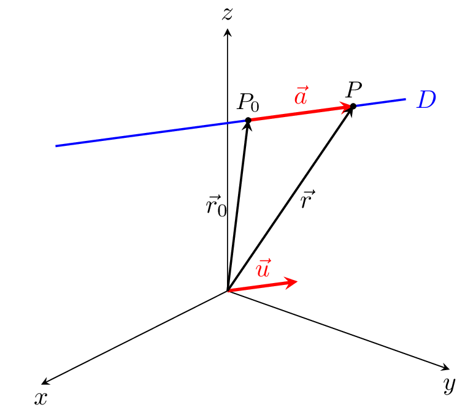

```{r setup, include=FALSE}
options(htmltools.dir.version = FALSE)
knitr::opts_chunk$set(
  cache=TRUE,
  echo=FALSE
)
```

class: center, middle

<iframe width="800" height="600" src="https://www.youtube.com/embed/m_QhY1aABsE" title="YouTube video player" frameborder="0" allow="accelerometer; autoplay; clipboard-write; encrypted-media; gyroscope; picture-in-picture" allowfullscreen></iframe>

---
class:inverse, middle, center

# Quelques rappels

---

# TODO...

- Équation de droite $\overrightarrow{\textbf{r}}=\overrightarrow{\textbf{r}_0}+t\overrightarrow{\textbf{v}}$

- Équation du plan

- Intersection droite avec plan (seulement savoir si il y a intersection et ensuite trouver l'intersection)

- Trouver distance point-droite

- Est-ce qu'un point est au-dessus ou au-dessous d'une droite?

---
class: center, middle

```{r, out.width="75%"}

```

$$
\vec r = \vec r_0 + t \vec u
$$

---
class: inverse, center, middle

# Une modélisation 3D d'un objet

---
class: center, inverse

background-image: url("https://i.stack.imgur.com/ENvMe.png")
background-size: contain
---

# STL pour STéréoLitographie

- Ce format ne comporte notamment pas d'informations concernant la couleur, la texture ou les autres paramètres habituels d'un modèle de conception assistée par ordinateur.

- Le **format de fichier STL** ne décrit que la géométrie de surface d'un objet en 3 dimensions.

- Cette surface est nécessairement fermée et définie par une série de triangles (ou de facettes). 

- Chaque triangle est défini par les coordonnées cartésiennes (x, y, z) dans un trièdre direct de son vecteur normal unitaire (n) orienté vers l'extérieur de l'objet et de ses trois sommets (vertex/vertices en anglais) ordonnés dans le sens trigonométrique. 

- Chaque triangle doit partager 2 sommets avec chacun des triangles le juxtaposant. Dit autrement, le sommet d'un triangle ne doit pas être sur l'arête d'un autre triangle. Il n'y a pas d'information d'échelle. 

- L'unité de longueur est arbitraire.

---

# Le format de fichier STL

.pull-left[
facet normal $n_x$ $n_y$ $n_z$

outer loop

vertex $v_{1_x}$ $v_{1_y}$ $v_{1_z}$

vertex $v_{2_x}$ $v_{2_y}$ $v_{2_z}$

vertex $v_{3_x}$ $v_{3_y}$ $v_{3_z}$

end loop

end facet
]

.pull-right[
```{tikz, echo=FALSE, fig.align='center', label="triangle-with-vertex-normal"}
\usetikzlibrary{calc}
\begin{tikzpicture}[font=\large, scale = 1.5]

\coordinate[label=right:{$(v_{1_x},v_{1_y},v_{1_z})$}] (A) at (0,0);
\coordinate[label=below right:{$(v_{2_x},v_{2_y},v_{2_z})$}] (B) at (1,2);
\coordinate[label=above:{$(v_{3_x},v_{3_y},v_{3_z})$}] (C) at (-2,3);
\coordinate (D) at (-0.25,1.5);
\coordinate[label=above right:{$(n_{x},n_{y},n_{z})$}] (E) at ($(D)+1.25*(0.5,1)$);

\draw[very thick, fill, color=blue, fill opacity = 0.5] (A)--(B)--(C)--cycle;
\draw[very thick,->] (D)--(E);

\foreach \pt in {A,B,C}{
	\draw[fill=black] (\pt) circle (1.25pt);
}

\end{tikzpicture}
```
]

---

# Le format de fichier STL

```
facet normal -6.123234e-17 0.000000e+00 1.000000e+00
  outer loop
    vertex -6.514841e+00 1.043095e+02 9.525001e+00
    vertex -9.595548e+00 1.042182e+02 9.525001e+00
    vertex -6.558662e+00 1.041282e+02 9.525001e+00
  endloop
endfacet

facet normal -6.123234e-17 0.000000e+00 1.000000e+00
  outer loop
    vertex -6.558662e+00 1.041282e+02 9.525001e+00
    vertex -9.595548e+00 1.042182e+02 9.525001e+00
    vertex -9.541054e+00 1.040397e+02 9.525001e+00
  endloop
endfacet
```

---
class: inverse, center, middle

# Couper le solide en polygones

---

## On veut trouver l'intersection d'un plan avec le solide

- Le solide est composé de plusieurs triangles.

- Chaque triangle est composé de trois segments de droites.

- On veut donc savoir si un segment de droite croise le plan.

---
class:middle, center

<iframe src="https://www.geogebra.org/classic/rycfkefc?embed" width="800" height="600" allowfullscreen style="border: 1px solid #e4e4e4;border-radius: 4px;" frameborder="0"></iframe>

---
class: inverse, center, middle

# Malheureusement la vie n'est jamais aussi facile...

---
class: middle, center

```{tikz, echo=FALSE}
\usetikzlibrary{calc}
\begin{tikzpicture}[scale=4]

\coordinate (pt1)  at (0.1196,0.6535);
\coordinate (pt2)  at (0.5265,0.9261);
\coordinate (pt3)  at (0.5549,0.9242);
\coordinate (pt4)  at (0.8823,0.8447);
\coordinate (pt5)  at (0.9000,0.8000);
\coordinate (pt6)  at (0.7480,0.4984);
\coordinate (pt7)  at (0.7745,0.4851);
\coordinate (pt8)  at (0.9599,0.3148);
\coordinate (pt9)  at (0.9315,0.3148);
\coordinate (pt10) at (0.7763,0.0725);
\coordinate (pt11) at (0.7498,0.0971);
\coordinate (pt12) at (0.4943,0.5135);
\coordinate (pt13) at (0.4622,0.4813);
\coordinate (pt14) at (0.2502,0.0877);
\coordinate (pt15) at (0.2275,0.1123);
\coordinate (pt16) at (0.1083,0.6176);

\draw (0,0) rectangle (1,1);

\foreach[evaluate={\finish=int(\start+1)}] \start in {1,3,5,...,15}{
	\draw[opacity=0.5] (pt\start)--(pt\finish);
}

\foreach \num in {1,2,...,16}{
	\draw[fill=green, fill opacity=0.5] (pt\num) circle (0.25pt);
}

%\draw[blue, very thick] (0.65145,0)--++(0,1);
%\draw[red, very thick] (0,0.56555)--++(0.65145,0);
%\draw[red, very thick] (0.65145,0.39995)--(1,0.39995);
%\draw[blue, very thick, opacity = 0.5] (0.3562,0)--(0.3562,0.56555);
%\draw[blue, very thick, opacity = 0.5] (0.32305,0.56555)--(0.32305,1);
%\draw[blue, very thick, opacity = 0.5] (0.8539,0.39995)--(0.8539,0);
%\draw[blue, very thick, opacity = 0.5] (0.8284,0.39995)--(0.8284,1);

\coordinate (midpt1) at (0.1139,0.6356);
\coordinate (midpt2) at (0.5407,0.9251);
\coordinate (midpt3) at (0.8912,0.8223);
\coordinate (midpt4) at (0.7612,0.4917);
\coordinate (midpt5) at (0.9457,0.3148);
\coordinate (midpt6) at (0.7631,0.0848);
\coordinate (midpt7) at (0.4783,0.4974);
\coordinate (midpt8) at (0.2388,0.1000);

\draw[fill=orange, fill opacity = 0.5] 
 	(midpt1)--
 	(midpt2)--
 	(midpt3)--
 	(midpt4)--
	(midpt5)--
 	(midpt6)--
 	(midpt7)--
 	(midpt8)--
 	cycle;

\foreach \num in {1,2,...,8}{
 	\draw[fill=orange] (midpt\num) circle (0.25pt);
}

\end{tikzpicture}
```

---
class: middle, center

```{tikz, echo=FALSE}
\usetikzlibrary{calc}
\begin{tikzpicture}[scale=4]

\coordinate (pt1)  at (0.1196,0.6535);
\coordinate (pt2)  at (0.5265,0.9261);
\coordinate (pt3)  at (0.5549,0.9242);
\coordinate (pt4)  at (0.8823,0.8447);
\coordinate (pt5)  at (0.9000,0.8000);
\coordinate (pt6)  at (0.7480,0.4984);
\coordinate (pt7)  at (0.7745,0.4851);
\coordinate (pt8)  at (0.9599,0.3148);
\coordinate (pt9)  at (0.9315,0.3148);
\coordinate (pt10) at (0.7763,0.0725);
\coordinate (pt11) at (0.7498,0.0971);
\coordinate (pt12) at (0.4943,0.5135);
\coordinate (pt13) at (0.4622,0.4813);
\coordinate (pt14) at (0.2502,0.0877);
\coordinate (pt15) at (0.2275,0.1123);
\coordinate (pt16) at (0.1083,0.6176);

\draw (0,0) rectangle (1,1);

\foreach[evaluate={\finish=int(\start+1)}] \start in {1,3,5,...,15}{
	\draw (pt\start)--(pt\finish);
}

\foreach \num in {1,2,...,16}{
	\draw[fill=green] (pt\num) circle (0.25pt);
}

% \draw[blue, very thick] (0.65145,0)--++(0,1);

% \draw[red, very thick] (0,0.56555)--++(0.65145,0);

% \draw[red, very thick] (0.65145,0.39995)--(1,0.39995);

% \draw[blue, very thick, opacity = 0.5] (0.3562,0)--(0.3562,0.56555);

% \draw[blue, very thick, opacity = 0.5] (0.32305,0.56555)--(0.32305,1);

% \draw[blue, very thick, opacity = 0.5] (0.8539,0.39995)--(0.8539,0);

% \draw[blue, very thick, opacity = 0.5] (0.8284,0.39995)--(0.8284,1);

% \coordinate (midpt1) at (0.1139,0.6356);
% \coordinate (midpt2) at (0.5407,0.9251);
% \coordinate (midpt3) at (0.8912,0.8223);
% \coordinate (midpt4) at (0.7612,0.4917);
% \coordinate (midpt5) at (0.9457,0.3148);
% \coordinate (midpt6) at (0.7631,0.0848);
% \coordinate (midpt7) at (0.4783,0.4974);
% \coordinate (midpt8) at (0.2388,0.1000);

% \draw[fill=orange, fill opacity = 0.5] 
% 	(midpt1)--
% 	(midpt2)--
% 	(midpt3)--
% 	(midpt4)--
% 	(midpt5)--
% 	(midpt6)--
% 	(midpt7)--
% 	(midpt8)--
% 	cycle;

% \foreach \num in {1,2,...,8}{
% 	\draw[fill=orange] (midpt\num) circle (0.25pt);
% }

\end{tikzpicture}
```

---
class: middle, center

```{tikz, echo=FALSE}
\usetikzlibrary{calc}
\begin{tikzpicture}[scale=4]

\coordinate (pt1)  at (0.1196,0.6535);
\coordinate (pt2)  at (0.5265,0.9261);
\coordinate (pt3)  at (0.5549,0.9242);
\coordinate (pt4)  at (0.8823,0.8447);
\coordinate (pt5)  at (0.9000,0.8000);
\coordinate (pt6)  at (0.7480,0.4984);
\coordinate (pt7)  at (0.7745,0.4851);
\coordinate (pt8)  at (0.9599,0.3148);
\coordinate (pt9)  at (0.9315,0.3148);
\coordinate (pt10) at (0.7763,0.0725);
\coordinate (pt11) at (0.7498,0.0971);
\coordinate (pt12) at (0.4943,0.5135);
\coordinate (pt13) at (0.4622,0.4813);
\coordinate (pt14) at (0.2502,0.0877);
\coordinate (pt15) at (0.2275,0.1123);
\coordinate (pt16) at (0.1083,0.6176);

\draw (0,0) rectangle (1,1);

\foreach[evaluate={\finish=int(\start+1)}] \start in {1,3,5,...,15}{
	\draw (pt\start)--(pt\finish);
}

\foreach \num in {1,2,...,16}{
	\draw[fill=green] (pt\num) circle (0.25pt);
}

\draw[blue, very thick] (0.65145,0)--++(0,1);

% \draw[red, very thick] (0,0.56555)--++(0.65145,0);

% \draw[red, very thick] (0.65145,0.39995)--(1,0.39995);

% \draw[blue, very thick, opacity = 0.5] (0.3562,0)--(0.3562,0.56555);

% \draw[blue, very thick, opacity = 0.5] (0.32305,0.56555)--(0.32305,1);

% \draw[blue, very thick, opacity = 0.5] (0.8539,0.39995)--(0.8539,0);

% \draw[blue, very thick, opacity = 0.5] (0.8284,0.39995)--(0.8284,1);

% \coordinate (midpt1) at (0.1139,0.6356);
% \coordinate (midpt2) at (0.5407,0.9251);
% \coordinate (midpt3) at (0.8912,0.8223);
% \coordinate (midpt4) at (0.7612,0.4917);
% \coordinate (midpt5) at (0.9457,0.3148);
% \coordinate (midpt6) at (0.7631,0.0848);
% \coordinate (midpt7) at (0.4783,0.4974);
% \coordinate (midpt8) at (0.2388,0.1000);

% \draw[fill=orange, fill opacity = 0.5] 
% 	(midpt1)--
% 	(midpt2)--
% 	(midpt3)--
% 	(midpt4)--
% 	(midpt5)--
% 	(midpt6)--
% 	(midpt7)--
% 	(midpt8)--
% 	cycle;

% \foreach \num in {1,2,...,8}{
% 	\draw[fill=orange] (midpt\num) circle (0.25pt);
% }

\end{tikzpicture}
```

---
class: middle, center

```{tikz, echo=FALSE}
\usetikzlibrary{calc}
\begin{tikzpicture}[scale=4]

\coordinate (pt1)  at (0.1196,0.6535);
\coordinate (pt2)  at (0.5265,0.9261);
\coordinate (pt3)  at (0.5549,0.9242);
\coordinate (pt4)  at (0.8823,0.8447);
\coordinate (pt5)  at (0.9000,0.8000);
\coordinate (pt6)  at (0.7480,0.4984);
\coordinate (pt7)  at (0.7745,0.4851);
\coordinate (pt8)  at (0.9599,0.3148);
\coordinate (pt9)  at (0.9315,0.3148);
\coordinate (pt10) at (0.7763,0.0725);
\coordinate (pt11) at (0.7498,0.0971);
\coordinate (pt12) at (0.4943,0.5135);
\coordinate (pt13) at (0.4622,0.4813);
\coordinate (pt14) at (0.2502,0.0877);
\coordinate (pt15) at (0.2275,0.1123);
\coordinate (pt16) at (0.1083,0.6176);

\draw (0,0) rectangle (1,1);

\foreach[evaluate={\finish=int(\start+1)}] \start in {1,3,5,...,15}{
	\draw (pt\start)--(pt\finish);
}

\foreach \num in {1,2,...,16}{
	\draw[fill=green] (pt\num) circle (0.25pt);
}

\draw[blue, very thick] (0.65145,0)--++(0,1);
\draw[red, very thick] (0,0.56555)--++(0.65145,0);

% \draw[red, very thick] (0.65145,0.39995)--(1,0.39995);

% \draw[blue, very thick, opacity = 0.5] (0.3562,0)--(0.3562,0.56555);

% \draw[blue, very thick, opacity = 0.5] (0.32305,0.56555)--(0.32305,1);

% \draw[blue, very thick, opacity = 0.5] (0.8539,0.39995)--(0.8539,0);

% \draw[blue, very thick, opacity = 0.5] (0.8284,0.39995)--(0.8284,1);

% \coordinate (midpt1) at (0.1139,0.6356);
% \coordinate (midpt2) at (0.5407,0.9251);
% \coordinate (midpt3) at (0.8912,0.8223);
% \coordinate (midpt4) at (0.7612,0.4917);
% \coordinate (midpt5) at (0.9457,0.3148);
% \coordinate (midpt6) at (0.7631,0.0848);
% \coordinate (midpt7) at (0.4783,0.4974);
% \coordinate (midpt8) at (0.2388,0.1000);

% \draw[fill=orange, fill opacity = 0.5] 
% 	(midpt1)--
% 	(midpt2)--
% 	(midpt3)--
% 	(midpt4)--
% 	(midpt5)--
% 	(midpt6)--
% 	(midpt7)--
% 	(midpt8)--
% 	cycle;

% \foreach \num in {1,2,...,8}{
% 	\draw[fill=orange] (midpt\num) circle (0.25pt);
% }

\end{tikzpicture}
```

---
class: middle, center

```{tikz, echo=FALSE}
\usetikzlibrary{calc}
\begin{tikzpicture}[scale=4]

\coordinate (pt1)  at (0.1196,0.6535);
\coordinate (pt2)  at (0.5265,0.9261);
\coordinate (pt3)  at (0.5549,0.9242);
\coordinate (pt4)  at (0.8823,0.8447);
\coordinate (pt5)  at (0.9000,0.8000);
\coordinate (pt6)  at (0.7480,0.4984);
\coordinate (pt7)  at (0.7745,0.4851);
\coordinate (pt8)  at (0.9599,0.3148);
\coordinate (pt9)  at (0.9315,0.3148);
\coordinate (pt10) at (0.7763,0.0725);
\coordinate (pt11) at (0.7498,0.0971);
\coordinate (pt12) at (0.4943,0.5135);
\coordinate (pt13) at (0.4622,0.4813);
\coordinate (pt14) at (0.2502,0.0877);
\coordinate (pt15) at (0.2275,0.1123);
\coordinate (pt16) at (0.1083,0.6176);

\draw (0,0) rectangle (1,1);

\foreach[evaluate={\finish=int(\start+1)}] \start in {1,3,5,...,15}{
	\draw (pt\start)--(pt\finish);
}

\foreach \num in {1,2,...,16}{
	\draw[fill=green] (pt\num) circle (0.25pt);
}

\draw[blue, very thick] (0.65145,0)--++(0,1);
\draw[red, very thick] (0,0.56555)--++(0.65145,0);
\draw[red, very thick] (0.65145,0.39995)--(1,0.39995);

% \draw[blue, very thick, opacity = 0.5] (0.3562,0)--(0.3562,0.56555);

% \draw[blue, very thick, opacity = 0.5] (0.32305,0.56555)--(0.32305,1);

% \draw[blue, very thick, opacity = 0.5] (0.8539,0.39995)--(0.8539,0);

% \draw[blue, very thick, opacity = 0.5] (0.8284,0.39995)--(0.8284,1);

% \coordinate (midpt1) at (0.1139,0.6356);
% \coordinate (midpt2) at (0.5407,0.9251);
% \coordinate (midpt3) at (0.8912,0.8223);
% \coordinate (midpt4) at (0.7612,0.4917);
% \coordinate (midpt5) at (0.9457,0.3148);
% \coordinate (midpt6) at (0.7631,0.0848);
% \coordinate (midpt7) at (0.4783,0.4974);
% \coordinate (midpt8) at (0.2388,0.1000);

% \draw[fill=orange, fill opacity = 0.5] 
% 	(midpt1)--
% 	(midpt2)--
% 	(midpt3)--
% 	(midpt4)--
% 	(midpt5)--
% 	(midpt6)--
% 	(midpt7)--
% 	(midpt8)--
% 	cycle;

% \foreach \num in {1,2,...,8}{
% 	\draw[fill=orange] (midpt\num) circle (0.25pt);
% }

\end{tikzpicture}
```

---
class: middle, center

```{tikz, echo=FALSE}
\usetikzlibrary{calc}
\begin{tikzpicture}[scale=4]

\coordinate (pt1)  at (0.1196,0.6535);
\coordinate (pt2)  at (0.5265,0.9261);
\coordinate (pt3)  at (0.5549,0.9242);
\coordinate (pt4)  at (0.8823,0.8447);
\coordinate (pt5)  at (0.9000,0.8000);
\coordinate (pt6)  at (0.7480,0.4984);
\coordinate (pt7)  at (0.7745,0.4851);
\coordinate (pt8)  at (0.9599,0.3148);
\coordinate (pt9)  at (0.9315,0.3148);
\coordinate (pt10) at (0.7763,0.0725);
\coordinate (pt11) at (0.7498,0.0971);
\coordinate (pt12) at (0.4943,0.5135);
\coordinate (pt13) at (0.4622,0.4813);
\coordinate (pt14) at (0.2502,0.0877);
\coordinate (pt15) at (0.2275,0.1123);
\coordinate (pt16) at (0.1083,0.6176);

\draw (0,0) rectangle (1,1);

\foreach[evaluate={\finish=int(\start+1)}] \start in {1,3,5,...,15}{
	\draw (pt\start)--(pt\finish);
}

\foreach \num in {1,2,...,16}{
	\draw[fill=green] (pt\num) circle (0.25pt);
}

\draw[blue, very thick] (0.65145,0)--++(0,1);
\draw[red, very thick] (0,0.56555)--++(0.65145,0);
\draw[red, very thick] (0.65145,0.39995)--(1,0.39995);
\draw[blue, very thick, opacity = 0.5] (0.3562,0)--(0.3562,0.56555);

% \draw[blue, very thick, opacity = 0.5] (0.32305,0.56555)--(0.32305,1);

% \draw[blue, very thick, opacity = 0.5] (0.8539,0.39995)--(0.8539,0);

% \draw[blue, very thick, opacity = 0.5] (0.8284,0.39995)--(0.8284,1);

% \coordinate (midpt1) at (0.1139,0.6356);
% \coordinate (midpt2) at (0.5407,0.9251);
% \coordinate (midpt3) at (0.8912,0.8223);
% \coordinate (midpt4) at (0.7612,0.4917);
% \coordinate (midpt5) at (0.9457,0.3148);
% \coordinate (midpt6) at (0.7631,0.0848);
% \coordinate (midpt7) at (0.4783,0.4974);
% \coordinate (midpt8) at (0.2388,0.1000);

% \draw[fill=orange, fill opacity = 0.5] 
% 	(midpt1)--
% 	(midpt2)--
% 	(midpt3)--
% 	(midpt4)--
% 	(midpt5)--
% 	(midpt6)--
% 	(midpt7)--
% 	(midpt8)--
% 	cycle;

% \foreach \num in {1,2,...,8}{
% 	\draw[fill=orange] (midpt\num) circle (0.25pt);
% }

\end{tikzpicture}
```

---
class: middle, center

```{tikz, echo=FALSE}
\usetikzlibrary{calc}
\begin{tikzpicture}[scale=4]

\coordinate (pt1)  at (0.1196,0.6535);
\coordinate (pt2)  at (0.5265,0.9261);
\coordinate (pt3)  at (0.5549,0.9242);
\coordinate (pt4)  at (0.8823,0.8447);
\coordinate (pt5)  at (0.9000,0.8000);
\coordinate (pt6)  at (0.7480,0.4984);
\coordinate (pt7)  at (0.7745,0.4851);
\coordinate (pt8)  at (0.9599,0.3148);
\coordinate (pt9)  at (0.9315,0.3148);
\coordinate (pt10) at (0.7763,0.0725);
\coordinate (pt11) at (0.7498,0.0971);
\coordinate (pt12) at (0.4943,0.5135);
\coordinate (pt13) at (0.4622,0.4813);
\coordinate (pt14) at (0.2502,0.0877);
\coordinate (pt15) at (0.2275,0.1123);
\coordinate (pt16) at (0.1083,0.6176);

\draw (0,0) rectangle (1,1);

\foreach[evaluate={\finish=int(\start+1)}] \start in {1,3,5,...,15}{
	\draw (pt\start)--(pt\finish);
}

\foreach \num in {1,2,...,16}{
	\draw[fill=green] (pt\num) circle (0.25pt);
}

\draw[blue, very thick] (0.65145,0)--++(0,1);
\draw[red, very thick] (0,0.56555)--++(0.65145,0);
\draw[red, very thick] (0.65145,0.39995)--(1,0.39995);
\draw[blue, very thick, opacity = 0.5] (0.3562,0)--(0.3562,0.56555);
\draw[blue, very thick, opacity = 0.5] (0.32305,0.56555)--(0.32305,1);

% \draw[blue, very thick, opacity = 0.5] (0.8539,0.39995)--(0.8539,0);

% \draw[blue, very thick, opacity = 0.5] (0.8284,0.39995)--(0.8284,1);

% \coordinate (midpt1) at (0.1139,0.6356);
% \coordinate (midpt2) at (0.5407,0.9251);
% \coordinate (midpt3) at (0.8912,0.8223);
% \coordinate (midpt4) at (0.7612,0.4917);
% \coordinate (midpt5) at (0.9457,0.3148);
% \coordinate (midpt6) at (0.7631,0.0848);
% \coordinate (midpt7) at (0.4783,0.4974);
% \coordinate (midpt8) at (0.2388,0.1000);

% \draw[fill=orange, fill opacity = 0.5] 
% 	(midpt1)--
% 	(midpt2)--
% 	(midpt3)--
% 	(midpt4)--
% 	(midpt5)--
% 	(midpt6)--
% 	(midpt7)--
% 	(midpt8)--
% 	cycle;

% \foreach \num in {1,2,...,8}{
% 	\draw[fill=orange] (midpt\num) circle (0.25pt);
% }

\end{tikzpicture}
```

---
class: middle, center

```{tikz, echo=FALSE}
\usetikzlibrary{calc}
\begin{tikzpicture}[scale=4]

\coordinate (pt1)  at (0.1196,0.6535);
\coordinate (pt2)  at (0.5265,0.9261);
\coordinate (pt3)  at (0.5549,0.9242);
\coordinate (pt4)  at (0.8823,0.8447);
\coordinate (pt5)  at (0.9000,0.8000);
\coordinate (pt6)  at (0.7480,0.4984);
\coordinate (pt7)  at (0.7745,0.4851);
\coordinate (pt8)  at (0.9599,0.3148);
\coordinate (pt9)  at (0.9315,0.3148);
\coordinate (pt10) at (0.7763,0.0725);
\coordinate (pt11) at (0.7498,0.0971);
\coordinate (pt12) at (0.4943,0.5135);
\coordinate (pt13) at (0.4622,0.4813);
\coordinate (pt14) at (0.2502,0.0877);
\coordinate (pt15) at (0.2275,0.1123);
\coordinate (pt16) at (0.1083,0.6176);

\draw (0,0) rectangle (1,1);

\foreach[evaluate={\finish=int(\start+1)}] \start in {1,3,5,...,15}{
	\draw (pt\start)--(pt\finish);
}

\foreach \num in {1,2,...,16}{
	\draw[fill=green] (pt\num) circle (0.25pt);
}

\draw[blue, very thick] (0.65145,0)--++(0,1);
\draw[red, very thick] (0,0.56555)--++(0.65145,0);
\draw[red, very thick] (0.65145,0.39995)--(1,0.39995);
\draw[blue, very thick, opacity = 0.5] (0.3562,0)--(0.3562,0.56555);
\draw[blue, very thick, opacity = 0.5] (0.32305,0.56555)--(0.32305,1);
\draw[blue, very thick, opacity = 0.5] (0.8539,0.39995)--(0.8539,0);

% \draw[blue, very thick, opacity = 0.5] (0.8284,0.39995)--(0.8284,1);

% \coordinate (midpt1) at (0.1139,0.6356);
% \coordinate (midpt2) at (0.5407,0.9251);
% \coordinate (midpt3) at (0.8912,0.8223);
% \coordinate (midpt4) at (0.7612,0.4917);
% \coordinate (midpt5) at (0.9457,0.3148);
% \coordinate (midpt6) at (0.7631,0.0848);
% \coordinate (midpt7) at (0.4783,0.4974);
% \coordinate (midpt8) at (0.2388,0.1000);

% \draw[fill=orange, fill opacity = 0.5] 
% 	(midpt1)--
% 	(midpt2)--
% 	(midpt3)--
% 	(midpt4)--
% 	(midpt5)--
% 	(midpt6)--
% 	(midpt7)--
% 	(midpt8)--
% 	cycle;

% \foreach \num in {1,2,...,8}{
% 	\draw[fill=orange] (midpt\num) circle (0.25pt);
% }

\end{tikzpicture}
```

---
class: middle, center

```{tikz, echo=FALSE}
\usetikzlibrary{calc}
\begin{tikzpicture}[scale=4]

\coordinate (pt1)  at (0.1196,0.6535);
\coordinate (pt2)  at (0.5265,0.9261);
\coordinate (pt3)  at (0.5549,0.9242);
\coordinate (pt4)  at (0.8823,0.8447);
\coordinate (pt5)  at (0.9000,0.8000);
\coordinate (pt6)  at (0.7480,0.4984);
\coordinate (pt7)  at (0.7745,0.4851);
\coordinate (pt8)  at (0.9599,0.3148);
\coordinate (pt9)  at (0.9315,0.3148);
\coordinate (pt10) at (0.7763,0.0725);
\coordinate (pt11) at (0.7498,0.0971);
\coordinate (pt12) at (0.4943,0.5135);
\coordinate (pt13) at (0.4622,0.4813);
\coordinate (pt14) at (0.2502,0.0877);
\coordinate (pt15) at (0.2275,0.1123);
\coordinate (pt16) at (0.1083,0.6176);

\draw (0,0) rectangle (1,1);

\foreach[evaluate={\finish=int(\start+1)}] \start in {1,3,5,...,15}{
	\draw (pt\start)--(pt\finish);
}

\foreach \num in {1,2,...,16}{
	\draw[fill=green] (pt\num) circle (0.25pt);
}

\draw[blue, very thick] (0.65145,0)--++(0,1);
\draw[red, very thick] (0,0.56555)--++(0.65145,0);
\draw[red, very thick] (0.65145,0.39995)--(1,0.39995);
\draw[blue, very thick, opacity = 0.5] (0.3562,0)--(0.3562,0.56555);
\draw[blue, very thick, opacity = 0.5] (0.32305,0.56555)--(0.32305,1);
\draw[blue, very thick, opacity = 0.5] (0.8539,0.39995)--(0.8539,0);
\draw[blue, very thick, opacity = 0.5] (0.8284,0.39995)--(0.8284,1);

% \coordinate (midpt1) at (0.1139,0.6356);
% \coordinate (midpt2) at (0.5407,0.9251);
% \coordinate (midpt3) at (0.8912,0.8223);
% \coordinate (midpt4) at (0.7612,0.4917);
% \coordinate (midpt5) at (0.9457,0.3148);
% \coordinate (midpt6) at (0.7631,0.0848);
% \coordinate (midpt7) at (0.4783,0.4974);
% \coordinate (midpt8) at (0.2388,0.1000);

% \draw[fill=orange, fill opacity = 0.5] 
% 	(midpt1)--
% 	(midpt2)--
% 	(midpt3)--
% 	(midpt4)--
% 	(midpt5)--
% 	(midpt6)--
% 	(midpt7)--
% 	(midpt8)--
% 	cycle;

% \foreach \num in {1,2,...,8}{
% 	\draw[fill=orange] (midpt\num) circle (0.25pt);
% }

\end{tikzpicture}
```

---
class: middle, center

```{tikz, echo=FALSE}
\usetikzlibrary{calc}
\begin{tikzpicture}[scale=4]

\coordinate (pt1)  at (0.1196,0.6535);
\coordinate (pt2)  at (0.5265,0.9261);
\coordinate (pt3)  at (0.5549,0.9242);
\coordinate (pt4)  at (0.8823,0.8447);
\coordinate (pt5)  at (0.9000,0.8000);
\coordinate (pt6)  at (0.7480,0.4984);
\coordinate (pt7)  at (0.7745,0.4851);
\coordinate (pt8)  at (0.9599,0.3148);
\coordinate (pt9)  at (0.9315,0.3148);
\coordinate (pt10) at (0.7763,0.0725);
\coordinate (pt11) at (0.7498,0.0971);
\coordinate (pt12) at (0.4943,0.5135);
\coordinate (pt13) at (0.4622,0.4813);
\coordinate (pt14) at (0.2502,0.0877);
\coordinate (pt15) at (0.2275,0.1123);
\coordinate (pt16) at (0.1083,0.6176);

\draw (0,0) rectangle (1,1);

\foreach[evaluate={\finish=int(\start+1)}] \start in {1,3,5,...,15}{
	\draw (pt\start)--(pt\finish);
}

\foreach \num in {1,2,...,16}{
	\draw[fill=green] (pt\num) circle (0.25pt);
}

\draw[blue, very thick] (0.65145,0)--++(0,1);
\draw[red, very thick] (0,0.56555)--++(0.65145,0);
\draw[red, very thick] (0.65145,0.39995)--(1,0.39995);
\draw[blue, very thick, opacity = 0.5] (0.3562,0)--(0.3562,0.56555);
\draw[blue, very thick, opacity = 0.5] (0.32305,0.56555)--(0.32305,1);
\draw[blue, very thick, opacity = 0.5] (0.8539,0.39995)--(0.8539,0);
\draw[blue, very thick, opacity = 0.5] (0.8284,0.39995)--(0.8284,1);

\coordinate (midpt1) at (0.1139,0.6356);
\coordinate (midpt2) at (0.5407,0.9251);
\coordinate (midpt3) at (0.8912,0.8223);
\coordinate (midpt4) at (0.7612,0.4917);
\coordinate (midpt5) at (0.9457,0.3148);
\coordinate (midpt6) at (0.7631,0.0848);
\coordinate (midpt7) at (0.4783,0.4974);
\coordinate (midpt8) at (0.2388,0.1000);

% \draw[fill=orange, fill opacity = 0.5] 
% 	(midpt1)--
% 	(midpt2)--
% 	(midpt3)--
% 	(midpt4)--
% 	(midpt5)--
% 	(midpt6)--
% 	(midpt7)--
% 	(midpt8)--
% 	cycle;

\foreach \num in {1,2,...,8}{
	\draw[fill=orange] (midpt\num) circle (0.25pt);
}

\end{tikzpicture}
```

---
class: middle, center

```{tikz, echo=FALSE}
\usetikzlibrary{calc}
\begin{tikzpicture}[scale=4]

\coordinate (pt1)  at (0.1196,0.6535);
\coordinate (pt2)  at (0.5265,0.9261);
\coordinate (pt3)  at (0.5549,0.9242);
\coordinate (pt4)  at (0.8823,0.8447);
\coordinate (pt5)  at (0.9000,0.8000);
\coordinate (pt6)  at (0.7480,0.4984);
\coordinate (pt7)  at (0.7745,0.4851);
\coordinate (pt8)  at (0.9599,0.3148);
\coordinate (pt9)  at (0.9315,0.3148);
\coordinate (pt10) at (0.7763,0.0725);
\coordinate (pt11) at (0.7498,0.0971);
\coordinate (pt12) at (0.4943,0.5135);
\coordinate (pt13) at (0.4622,0.4813);
\coordinate (pt14) at (0.2502,0.0877);
\coordinate (pt15) at (0.2275,0.1123);
\coordinate (pt16) at (0.1083,0.6176);

\draw (0,0) rectangle (1,1);

\foreach[evaluate={\finish=int(\start+1)}] \start in {1,3,5,...,15}{
	\draw[opacity=0.5] (pt\start)--(pt\finish);
}

\foreach \num in {1,2,...,16}{
	\draw[fill=green, fill opacity=0.5] (pt\num) circle (0.25pt);
}

%\draw[blue, very thick] (0.65145,0)--++(0,1);
%\draw[red, very thick] (0,0.56555)--++(0.65145,0);
%\draw[red, very thick] (0.65145,0.39995)--(1,0.39995);
%\draw[blue, very thick, opacity = 0.5] (0.3562,0)--(0.3562,0.56555);
%\draw[blue, very thick, opacity = 0.5] (0.32305,0.56555)--(0.32305,1);
%\draw[blue, very thick, opacity = 0.5] (0.8539,0.39995)--(0.8539,0);
%\draw[blue, very thick, opacity = 0.5] (0.8284,0.39995)--(0.8284,1);

\coordinate (midpt1) at (0.1139,0.6356);
\coordinate (midpt2) at (0.5407,0.9251);
\coordinate (midpt3) at (0.8912,0.8223);
\coordinate (midpt4) at (0.7612,0.4917);
\coordinate (midpt5) at (0.9457,0.3148);
\coordinate (midpt6) at (0.7631,0.0848);
\coordinate (midpt7) at (0.4783,0.4974);
\coordinate (midpt8) at (0.2388,0.1000);

\draw[fill=orange, fill opacity = 0.5] 
 	(midpt1)--
 	(midpt2)--
 	(midpt3)--
 	(midpt4)--
	(midpt5)--
 	(midpt6)--
 	(midpt7)--
 	(midpt8)--
 	cycle;

\foreach \num in {1,2,...,8}{
 	\draw[fill=orange] (midpt\num) circle (0.25pt);
}

\end{tikzpicture}
```

---
class: inverse, center, middle

# Simplifier des droites

---
class:middle, center
```{tikz}
\usetikzlibrary{calc}\begin{tikzpicture}[scale=4]

\def\delt{0.05}

\coordinate (pt1)  	at (0.0000,0.0000);
\coordinate (pt2)  	at (0.2810,0.1639);
\coordinate (pt3)  	at (0.4009,0.1586);
\coordinate (pt4)  	at (0.4969,0.2385);
\coordinate (pt5)  	at (0.5929,0.1346);
\coordinate (pt6)  	at (0.6489,0.0000);
\coordinate (pt7)  	at (0.7448,-0.132);
\coordinate (pt8)  	at (0.8861,-0.108);
\coordinate (pt9)  	at (0.9714,0.0000);
\coordinate (pt10)  at (1.118,0.0626);
\coordinate (pt11)  at (1.2380,0.0000);

\foreach[evaluate={\finish=int(\start+1)}] \start in {1,2,3,...,10}{
	\draw (pt\start)--(pt\finish);
}

\foreach \num in {1,2,...,11}{
	\draw[fill=orange] (pt\num) circle (0.25pt);
}
\foreach \num in {1,11}{
	\draw[fill=green] (pt\num) circle (0.25pt);
}
\useasboundingbox (-0.1,-0.25) rectangle (1.4,0.35);
\end{tikzpicture}
```
---
class:middle, center
```{tikz}
\usetikzlibrary{calc}
\begin{tikzpicture}[scale=4]


\def\delt{0.05}

\coordinate (pt1)  	at (0.0000,0.0000);
\coordinate (pt2)  	at (0.2810,0.1639);
\coordinate (pt3)  	at (0.4009,0.1586);
\coordinate (pt4)  	at (0.4969,0.2385);
\coordinate (pt5)  	at (0.5929,0.1346);
\coordinate (pt6)  	at (0.6489,0.0000);
\coordinate (pt7)  	at (0.7448,-0.132);
\coordinate (pt8)  	at (0.8861,-0.108);
\coordinate (pt9)  	at (0.9714,0.0000);
\coordinate (pt10)  at (1.118,0.0626);
\coordinate (pt11)  at (1.2380,0.0000);

\foreach[evaluate={\finish=int(\start+1)}] \start in {1,2,3,...,10}{
	\draw (pt\start)--(pt\finish);
}


\draw[blue, thick] (pt1)-|(pt4);
\draw[red, thick] (pt1)--(pt11);
\draw[red, fill opacity=0.25, fill = red] ($(pt1)-(0,\delt)$) rectangle ($(pt11)+(0,\delt)$);

\foreach \num in {1,2,...,11}{
	\draw[fill=orange] (pt\num) circle (0.25pt);
}
\foreach \num in {1,11,4}{
	\draw[fill=green] (pt\num) circle (0.25pt);
}
\useasboundingbox (-0.1,-0.25) rectangle (1.4,0.35);
\end{tikzpicture}
```
---
class:middle, center
```{tikz}
\usetikzlibrary{calc}
\begin{tikzpicture}[scale=4]


\coordinate (pt1)  	at (0.0000,0.0000);
\coordinate (pt2)  	at (0.2810,0.1639);
\coordinate (pt3)  	at (0.4009,0.1586);
\coordinate (pt4)  	at (0.4969,0.2385);
\coordinate (pt5)  	at (0.5929,0.1346);
\coordinate (pt6)  	at (0.6489,0.0000);
\coordinate (pt7)  	at (0.7448,-0.132);
\coordinate (pt8)  	at (0.8861,-0.108);
\coordinate (pt9)  	at (0.9714,0.0000);
\coordinate (pt10)  at (1.118,0.0626);
\coordinate (pt11)  at (1.2380,0.0000);

\def\delt{0.05cm}

\foreach[evaluate={\finish=int(\start+1)}] \start in {1,2,3,...,10}{
	\draw (pt\start)--(pt\finish);
}

\draw[red, thick] (pt1)--(pt4);

\draw[red, fill = red, fill opacity = 0.25] let \p{A}=(pt1), \p{B}=(pt4) in
	({\x{A}+(\delt/(1+((\x{B}-\x{A})/(\y{B}-\y{A}))^2)^(1/2))},
	 {\y{A}-(\delt/(1+((\x{B}-\x{A})/(\y{B}-\y{A}))^2)^(1/2))*((\x{B}-\x{A})/(\y{B}-\y{A}))})
	 --
	 ({\x{B}+(\delt/(1+((\x{B}-\x{A})/(\y{B}-\y{A}))^2)^(1/2))},
	 {\y{B}-(\delt/(1+((\x{B}-\x{A})/(\y{B}-\y{A}))^2)^(1/2))*((\x{B}-\x{A})/(\y{B}-\y{A}))})
	 --
	 ({\x{B}-(\delt/(1+((\x{B}-\x{A})/(\y{B}-\y{A}))^2)^(1/2))},
	 {\y{B}+(\delt/(1+((\x{B}-\x{A})/(\y{B}-\y{A}))^2)^(1/2))*((\x{B}-\x{A})/(\y{B}-\y{A}))})
	 --
	 ({\x{A}-(\delt/(1+((\x{B}-\x{A})/(\y{B}-\y{A}))^2)^(1/2))},
	 {\y{A}+(\delt/(1+((\x{B}-\x{A})/(\y{B}-\y{A}))^2)^(1/2))*((\x{B}-\x{A})/(\y{B}-\y{A}))})
	 --cycle;

\foreach \num in {1,2,...,11}{
	\draw[fill=orange] (pt\num) circle (0.25pt);
}
\foreach \num in {1,11,4}{
	\draw[fill=green] (pt\num) circle (0.25pt);
}
\foreach \num in {2,3}{
	\draw[fill=red] (pt\num) circle (0.25pt);
}
\useasboundingbox (-0.1,-0.25) rectangle (1.4,0.35);
\end{tikzpicture}
```
---
class:middle, center
```{tikz}
\usetikzlibrary{calc}
\begin{tikzpicture}[scale=4]


\coordinate (pt1)  	at (0.0000,0.0000);
\coordinate (pt2)  	at (0.2810,0.1639);
\coordinate (pt3)  	at (0.4009,0.1586);
\coordinate (pt4)  	at (0.4969,0.2385);
\coordinate (pt5)  	at (0.5929,0.1346);
\coordinate (pt6)  	at (0.6489,0.0000);
\coordinate (pt7)  	at (0.7448,-0.132);
\coordinate (pt8)  	at (0.8861,-0.108);
\coordinate (pt9)  	at (0.9714,0.0000);
\coordinate (pt10)  at (1.118,0.0626);
\coordinate (pt11)  at (1.2380,0.0000);

\def\delt{0.05cm}

\foreach[evaluate={\finish=int(\start+1)}] \start in {4,5,6,...,10}{
	\draw (pt\start)--(pt\finish);
}

\draw[thick] (pt1)--(pt4);
\draw[red, thick] (pt4)--(pt11);

\draw[blue, thick] let \p{A}=(pt4), \p{B}=(pt11), \p{P}=(pt7) in
	(pt7)--
	({\x{A}+(\x{B}-\x{A})*((\x{P}-\x{A})*(\x{B}-\x{A})+(\y{P}-\y{A})*(\y{B}-\y{A}))/((\x{B}-\x{A})^2+(\y{B}-\y{A})^2)},
	{\y{A}+(\y{B}-\y{A})*((\x{P}-\x{A})*(\x{B}-\x{A})+(\y{P}-\y{A})*(\y{B}-\y{A}))/((\x{B}-\x{A})^2+(\y{B}-\y{A})^2)});

\draw[red, fill = red, fill opacity = 0.25] let \p{A}=(pt4), \p{B}=(pt11) in
	({\x{A}+(\delt/(1+((\x{B}-\x{A})/(\y{B}-\y{A}))^2)^(1/2))},
	 {\y{A}-(\delt/(1+((\x{B}-\x{A})/(\y{B}-\y{A}))^2)^(1/2))*((\x{B}-\x{A})/(\y{B}-\y{A}))})
	 --
	 ({\x{B}+(\delt/(1+((\x{B}-\x{A})/(\y{B}-\y{A}))^2)^(1/2))},
	 {\y{B}-(\delt/(1+((\x{B}-\x{A})/(\y{B}-\y{A}))^2)^(1/2))*((\x{B}-\x{A})/(\y{B}-\y{A}))})
	 --
	 ({\x{B}-(\delt/(1+((\x{B}-\x{A})/(\y{B}-\y{A}))^2)^(1/2))},
	 {\y{B}+(\delt/(1+((\x{B}-\x{A})/(\y{B}-\y{A}))^2)^(1/2))*((\x{B}-\x{A})/(\y{B}-\y{A}))})
	 --
	 ({\x{A}-(\delt/(1+((\x{B}-\x{A})/(\y{B}-\y{A}))^2)^(1/2))},
	 {\y{A}+(\delt/(1+((\x{B}-\x{A})/(\y{B}-\y{A}))^2)^(1/2))*((\x{B}-\x{A})/(\y{B}-\y{A}))})
	 --cycle;

\foreach \num in {5,6,...,11}{
	\draw[fill=orange] (pt\num) circle (0.25pt);
}
\foreach \num in {1,11,4,7}{
	\draw[fill=green] (pt\num) circle (0.25pt);
}
\useasboundingbox (-0.1,-0.25) rectangle (1.4,0.35);
\end{tikzpicture}
```
---
class:middle, center
```{tikz}
\usetikzlibrary{calc}
\begin{tikzpicture}[scale=4]


\coordinate (pt1)  	at (0.0000,0.0000);
\coordinate (pt2)  	at (0.2810,0.1639);
\coordinate (pt3)  	at (0.4009,0.1586);
\coordinate (pt4)  	at (0.4969,0.2385);
\coordinate (pt5)  	at (0.5929,0.1346);
\coordinate (pt6)  	at (0.6489,0.0000);
\coordinate (pt7)  	at (0.7448,-0.132);
\coordinate (pt8)  	at (0.8861,-0.108);
\coordinate (pt9)  	at (0.9714,0.0000);
\coordinate (pt10)  at (1.118,0.0626);
\coordinate (pt11)  at (1.2380,0.0000);

\def\delt{0.05cm}

\foreach[evaluate={\finish=int(\start+1)}] \start in {4,5,6,...,10}{
	\draw (pt\start)--(pt\finish);
}

\draw[thick] (pt1)--(pt4);
\draw[red, thick] (pt4)--(pt7);

\draw[red, fill = red, fill opacity = 0.25] let \p{A}=(pt4), \p{B}=(pt7) in
	({\x{A}+(\delt/(1+((\x{B}-\x{A})/(\y{B}-\y{A}))^2)^(1/2))},
	 {\y{A}-(\delt/(1+((\x{B}-\x{A})/(\y{B}-\y{A}))^2)^(1/2))*((\x{B}-\x{A})/(\y{B}-\y{A}))})
	 --
	 ({\x{B}+(\delt/(1+((\x{B}-\x{A})/(\y{B}-\y{A}))^2)^(1/2))},
	 {\y{B}-(\delt/(1+((\x{B}-\x{A})/(\y{B}-\y{A}))^2)^(1/2))*((\x{B}-\x{A})/(\y{B}-\y{A}))})
	 --
	 ({\x{B}-(\delt/(1+((\x{B}-\x{A})/(\y{B}-\y{A}))^2)^(1/2))},
	 {\y{B}+(\delt/(1+((\x{B}-\x{A})/(\y{B}-\y{A}))^2)^(1/2))*((\x{B}-\x{A})/(\y{B}-\y{A}))})
	 --
	 ({\x{A}-(\delt/(1+((\x{B}-\x{A})/(\y{B}-\y{A}))^2)^(1/2))},
	 {\y{A}+(\delt/(1+((\x{B}-\x{A})/(\y{B}-\y{A}))^2)^(1/2))*((\x{B}-\x{A})/(\y{B}-\y{A}))})
	 --cycle;

\foreach \num in {5,6,...,11}{
	\draw[fill=orange] (pt\num) circle (0.25pt);
}
\foreach \num in {1,11,4,7}{
	\draw[fill=green] (pt\num) circle (0.25pt);
}
\foreach \num in {5,6}{
	\draw[fill=red] (pt\num) circle (0.25pt);
}
\useasboundingbox (-0.1,-0.25) rectangle (1.4,0.35);
\end{tikzpicture}
```
---
class:middle, center
```{tikz}
\usetikzlibrary{calc}
\begin{tikzpicture}[scale=4]


\coordinate (pt1)  	at (0.0000,0.0000);
\coordinate (pt2)  	at (0.2810,0.1639);
\coordinate (pt3)  	at (0.4009,0.1586);
\coordinate (pt4)  	at (0.4969,0.2385);
\coordinate (pt5)  	at (0.5929,0.1346);
\coordinate (pt6)  	at (0.6489,0.0000);
\coordinate (pt7)  	at (0.7448,-0.132);
\coordinate (pt8)  	at (0.8861,-0.108);
\coordinate (pt9)  	at (0.9714,0.0000);
\coordinate (pt10)  at (1.118,0.0626);
\coordinate (pt11)  at (1.2380,0.0000);

\def\delt{0.05cm}

\foreach[evaluate={\finish=int(\start+1)}] \start in {7,8,9,...,10}{
	\draw (pt\start)--(pt\finish);
}

\draw[thick] (pt1)--(pt4)--(pt7);
\draw[red, thick] (pt7)--(pt11);

\draw[blue, thick] let \p{A}=(pt7), \p{B}=(pt11), \p{P}=(pt10) in
	(\x{P},\y{P})--
	({\x{A}+(\x{B}-\x{A})*((\x{P}-\x{A})*(\x{B}-\x{A})+(\y{P}-\y{A})*(\y{B}-\y{A}))/((\x{B}-\x{A})^2+(\y{B}-\y{A})^2)},
	{\y{A}+(\y{B}-\y{A})*((\x{P}-\x{A})*(\x{B}-\x{A})+(\y{P}-\y{A})*(\y{B}-\y{A}))/((\x{B}-\x{A})^2+(\y{B}-\y{A})^2)});

\draw[red, fill = red, fill opacity = 0.25] let \p{A}=(pt7), \p{B}=(pt11) in
	({\x{A}+(\delt/(1+((\x{B}-\x{A})/(\y{B}-\y{A}))^2)^(1/2))},
	 {\y{A}-(\delt/(1+((\x{B}-\x{A})/(\y{B}-\y{A}))^2)^(1/2))*((\x{B}-\x{A})/(\y{B}-\y{A}))})
	 --
	 ({\x{B}+(\delt/(1+((\x{B}-\x{A})/(\y{B}-\y{A}))^2)^(1/2))},
	 {\y{B}-(\delt/(1+((\x{B}-\x{A})/(\y{B}-\y{A}))^2)^(1/2))*((\x{B}-\x{A})/(\y{B}-\y{A}))})
	 --
	 ({\x{B}-(\delt/(1+((\x{B}-\x{A})/(\y{B}-\y{A}))^2)^(1/2))},
	 {\y{B}+(\delt/(1+((\x{B}-\x{A})/(\y{B}-\y{A}))^2)^(1/2))*((\x{B}-\x{A})/(\y{B}-\y{A}))})
	 --
	 ({\x{A}-(\delt/(1+((\x{B}-\x{A})/(\y{B}-\y{A}))^2)^(1/2))},
	 {\y{A}+(\delt/(1+((\x{B}-\x{A})/(\y{B}-\y{A}))^2)^(1/2))*((\x{B}-\x{A})/(\y{B}-\y{A}))})
	 --cycle;

\foreach \num in {8,9,10,11}{
	\draw[fill=orange] (pt\num) circle (0.25pt);
}
\foreach \num in {1,11,4,7, 10}{
	\draw[fill=green] (pt\num) circle (0.25pt);
}
\useasboundingbox (-0.1,-0.25) rectangle (1.4,0.35);
\end{tikzpicture}
```
---
class:middle, center
```{tikz}
\usetikzlibrary{calc}
\begin{tikzpicture}[scale=4]


\coordinate (pt1)  	at (0.0000,0.0000);
\coordinate (pt2)  	at (0.2810,0.1639);
\coordinate (pt3)  	at (0.4009,0.1586);
\coordinate (pt4)  	at (0.4969,0.2385);
\coordinate (pt5)  	at (0.5929,0.1346);
\coordinate (pt6)  	at (0.6489,0.0000);
\coordinate (pt7)  	at (0.7448,-0.132);
\coordinate (pt8)  	at (0.8861,-0.108);
\coordinate (pt9)  	at (0.9714,0.0000);
\coordinate (pt10)  at (1.118,0.0626);
\coordinate (pt11)  at (1.2380,0.0000);

\def\delt{0.05cm}

\foreach[evaluate={\finish=int(\start+1)}] \start in {7,8,9,...,10}{
	\draw (pt\start)--(pt\finish);
}

\draw[thick] (pt1)--(pt4)--(pt7);
\draw[red, thick] (pt7)--(pt10);

\draw[red, fill = red, fill opacity = 0.25] let \p{A}=(pt7), \p{B}=(pt10) in
	({\x{A}+(\delt/(1+((\x{B}-\x{A})/(\y{B}-\y{A}))^2)^(1/2))},
	 {\y{A}-(\delt/(1+((\x{B}-\x{A})/(\y{B}-\y{A}))^2)^(1/2))*((\x{B}-\x{A})/(\y{B}-\y{A}))})
	 --
	 ({\x{B}+(\delt/(1+((\x{B}-\x{A})/(\y{B}-\y{A}))^2)^(1/2))},
	 {\y{B}-(\delt/(1+((\x{B}-\x{A})/(\y{B}-\y{A}))^2)^(1/2))*((\x{B}-\x{A})/(\y{B}-\y{A}))})
	 --
	 ({\x{B}-(\delt/(1+((\x{B}-\x{A})/(\y{B}-\y{A}))^2)^(1/2))},
	 {\y{B}+(\delt/(1+((\x{B}-\x{A})/(\y{B}-\y{A}))^2)^(1/2))*((\x{B}-\x{A})/(\y{B}-\y{A}))})
	 --
	 ({\x{A}-(\delt/(1+((\x{B}-\x{A})/(\y{B}-\y{A}))^2)^(1/2))},
	 {\y{A}+(\delt/(1+((\x{B}-\x{A})/(\y{B}-\y{A}))^2)^(1/2))*((\x{B}-\x{A})/(\y{B}-\y{A}))})
	 --cycle;

\foreach \num in {8,9,10,11}{
	\draw[fill=orange] (pt\num) circle (0.25pt);
}
\foreach \num in {1,11,4,7, 10}{
	\draw[fill=green] (pt\num) circle (0.25pt);
}
\foreach \num in {8,9}{
	\draw[fill=red] (pt\num) circle (0.25pt);
}
\useasboundingbox (-0.1,-0.25) rectangle (1.4,0.35);
\end{tikzpicture}
```
---
class:middle, center
```{tikz}
\usetikzlibrary{calc}
\begin{tikzpicture}[scale=4]


\coordinate (pt1)  	at (0.0000,0.0000);
\coordinate (pt2)  	at (0.2810,0.1639);
\coordinate (pt3)  	at (0.4009,0.1586);
\coordinate (pt4)  	at (0.4969,0.2385);
\coordinate (pt5)  	at (0.5929,0.1346);
\coordinate (pt6)  	at (0.6489,0.0000);
\coordinate (pt7)  	at (0.7448,-0.132);
\coordinate (pt8)  	at (0.8861,-0.108);
\coordinate (pt9)  	at (0.9714,0.0000);
\coordinate (pt10)  at (1.118,0.0626);
\coordinate (pt11)  at (1.2380,0.0000);

\def\delt{0.05cm}

\draw (pt10)--(pt11);
\draw[thick] (pt1)--(pt4)--(pt7)--(pt10);

\draw[red, fill = red, fill opacity = 0.25] let \p{A}=(pt10), \p{B}=(pt11) in
	({\x{A}+(\delt/(1+((\x{B}-\x{A})/(\y{B}-\y{A}))^2)^(1/2))},
	 {\y{A}-(\delt/(1+((\x{B}-\x{A})/(\y{B}-\y{A}))^2)^(1/2))*((\x{B}-\x{A})/(\y{B}-\y{A}))})
	 --
	 ({\x{B}+(\delt/(1+((\x{B}-\x{A})/(\y{B}-\y{A}))^2)^(1/2))},
	 {\y{B}-(\delt/(1+((\x{B}-\x{A})/(\y{B}-\y{A}))^2)^(1/2))*((\x{B}-\x{A})/(\y{B}-\y{A}))})
	 --
	 ({\x{B}-(\delt/(1+((\x{B}-\x{A})/(\y{B}-\y{A}))^2)^(1/2))},
	 {\y{B}+(\delt/(1+((\x{B}-\x{A})/(\y{B}-\y{A}))^2)^(1/2))*((\x{B}-\x{A})/(\y{B}-\y{A}))})
	 --
	 ({\x{A}-(\delt/(1+((\x{B}-\x{A})/(\y{B}-\y{A}))^2)^(1/2))},
	 {\y{A}+(\delt/(1+((\x{B}-\x{A})/(\y{B}-\y{A}))^2)^(1/2))*((\x{B}-\x{A})/(\y{B}-\y{A}))})
	 --cycle;

\foreach \num in {10,11}{
	\draw[fill=orange] (pt\num) circle (0.25pt);
}
\foreach \num in {1,11,4,7, 10}{
	\draw[fill=green] (pt\num) circle (0.25pt);
}
\useasboundingbox (-0.1,-0.25) rectangle (1.4,0.35);
\end{tikzpicture}
```
---
class:middle, center
```{tikz}
\usetikzlibrary{calc}
\begin{tikzpicture}[scale=4]


\coordinate (pt1)  	at (0.0000,0.0000);
\coordinate (pt2)  	at (0.2810,0.1639);
\coordinate (pt3)  	at (0.4009,0.1586);
\coordinate (pt4)  	at (0.4969,0.2385);
\coordinate (pt5)  	at (0.5929,0.1346);
\coordinate (pt6)  	at (0.6489,0.0000);
\coordinate (pt7)  	at (0.7448,-0.132);
\coordinate (pt8)  	at (0.8861,-0.108);
\coordinate (pt9)  	at (0.9714,0.0000);
\coordinate (pt10)  at (1.118,0.0626);
\coordinate (pt11)  at (1.2380,0.0000);

\def\delt{0.05cm}

\draw[thick] (pt1)--(pt4)--(pt7)--(pt10)--(pt11);

\foreach \num in {10,11}{
	\draw[fill=orange] (pt\num) circle (0.25pt);
}
\foreach \num in {1,11,4,7, 10}{
	\draw[fill=green] (pt\num) circle (0.25pt);
}
\useasboundingbox (-0.1,-0.25) rectangle (1.4,0.35);
\end{tikzpicture}
```

---
class:middle, center


---
class: inverse, center, middle

# Géométrie de construction de solides (ou GCS)

---

# Géométrie de construction de solides (ou GCS)

- La GCS permet de représenter simplement un ensemble de points et de travailler ensuite avec ceux-ci à l'intérieur d'un programme informatique;

- La GCS considère que tous les ensembles sont construits à partir d'ensembles **plus simples**, qui font office de blocs de construction;

- Certaines règles simples permettent ensuite d'échafauder des structures complexes.

---

# La représentation GCS d'un polygone

- Nous utiliserons des demi-plans pour représenter un polygone;

- Les règles de construction utilisées seront les mêmes que celles des ensembles:

  - Le complément;
  
  - L'union;
  
  - L'intersection

- Une droite orientée définit un demi-plan $H$ se trouvant à gauche de la droite lorsqu'on se déplace dans la direction définit par l'orientation.

---
class: center, middle

```{tikz}
\usetikzlibrary{decorations.markings}
\begin{tikzpicture}[
  scale = 4,
  decoration={
      markings,
      mark=at position 0.5 with {\arrow{>}}}
  ]

\coordinate (A) at (0,0.4);
\coordinate (B) at (1,0.6);

\fill[blue, fill opacity=0.5] (A)--(B)-|(1,1)--(0,1)--cycle;
\draw[black, very thick, postaction={decorate}] (A)--(B);
\draw[very thick] (0,0) rectangle (1,1);

\node at (0.5,0.7) {\huge $H$};

\end{tikzpicture}
```

Nous pouvons voir $H$ comme une fonction booléenne sur le plan: $H(p)=\textbf{VRAI}$ si et seulement si $p\in H$.

---

# Le complément

```{tikz}
\usetikzlibrary{decorations.markings}
\begin{tikzpicture}[
  scale = 3,
  decoration={
      markings,
      mark=at position 0.5 with {\arrow{>}}}
  ]

\coordinate (A) at (0,0.4);
\coordinate (B) at (1,0.6);

\fill[blue, fill opacity=0.5] (A)--(B)-|(1,1)--(0,1)--cycle;
\draw[black, very thick, postaction={decorate}] (A)--(B);
\draw[very thick] (0,0) rectangle (1,1);

\node at (0.5,0.8) {\Large $H(p)$};

\begin{scope}[xshift = 1.1cm]
\coordinate (A) at (0,0.4);
\coordinate (B) at (1,0.6);
\fill[blue, fill opacity=0.5] (A)--(B)-|(1,0)--(0,0)--cycle;
\draw[black, very thick, postaction={decorate}] (A)--(B);
\draw[very thick] (0,0) rectangle (1,1);

\node at (0.5,0.2) {\Large $\overline{H}(p)$};
\end{scope}

\end{tikzpicture}
```

---

# L'union

```{tikz}
\usetikzlibrary{decorations.markings}
\begin{tikzpicture}[
  scale = 4,
  decoration={
      markings,
      mark=at position 0.5 with {\arrow{>}}}
  ]

\coordinate (A) at (0,0.4);
\coordinate (B) at (1,0.6);
\fill[blue, fill opacity=0.5] (A)--(B)-|(1,1)--(0,1)--cycle;
\draw[black, very thick, postaction={decorate}] (A)--(B);
\draw[very thick] (0,0) rectangle (1,1);
\node at (0.5,0.7) {\Large $H_1(p)$};

\begin{scope}[xshift=1.1cm]
\coordinate (C) at (0,0.8);
\coordinate (D) at (1,0.2);
\fill[red, fill opacity=0.5] (C)--(D)-|(1,1)--(0,1)--cycle;
\draw[black, very thick, postaction={decorate}] (C)--(D);
\draw[very thick] (0,0) rectangle (1,1);
\node at (0.5,0.7) {\Large $H_2(p)$};
\end{scope}

\begin{scope}[xshift=2.2cm]
\coordinate (A) at (0,0.4);
\coordinate (B) at (1,0.6);
\coordinate (C) at (0,0.8);
\coordinate (D) at (1,0.2);
\coordinate (I) at (0.5,0.5);
\fill[blue!50!red, fill opacity=0.75] (A)--(I)--(D)--(1,1)--(0,1)--cycle;
\draw[black, very thick, dashed] (A)--(B);
\draw[black, very thick, dashed] (C)--(D);
\draw[black, very thick, postaction={decorate}] (A)--(I);
\draw[black, very thick, postaction={decorate}] (I)--(D);
\draw[very thick] (0,0) rectangle (1,1);
\node at (0.5,0.8) {\Large $(H_1 \cup H_2)(p)$};
\end{scope}

\end{tikzpicture}
```

---

# L'intersection

```{tikz}
\usetikzlibrary{decorations.markings}
\begin{tikzpicture}[
  scale = 4,
  decoration={
      markings,
      mark=at position 0.5 with {\arrow{>}}}
  ]

\coordinate (A) at (0,0.4);
\coordinate (B) at (1,0.6);
\fill[blue, fill opacity=0.5] (A)--(B)-|(1,1)--(0,1)--cycle;
\draw[black, very thick, postaction={decorate}] (A)--(B);
\draw[very thick] (0,0) rectangle (1,1);
\node at (0.5,0.7) {\Large $H_1(p)$};

\begin{scope}[xshift=1.1cm]
\coordinate (C) at (0,0.8);
\coordinate (D) at (1,0.2);
\fill[red, fill opacity=0.5] (C)--(D)-|(1,1)--(0,1)--cycle;
\draw[black, very thick, postaction={decorate}] (C)--(D);
\draw[very thick] (0,0) rectangle (1,1);
\node at (0.5,0.7) {\Large $H_2(p)$};
\end{scope}

\begin{scope}[xshift=2.2cm]
\coordinate (A) at (0,0.4);
\coordinate (B) at (1,0.6);
\coordinate (C) at (0,0.8);
\coordinate (D) at (1,0.2);
\coordinate (I) at (0.5,0.5);
\fill[blue!50!red, fill opacity=0.75] (C)--(I)--(B)--(1,1)--(0,1)--cycle;
\draw[black, very thick, dashed] (A)--(B);
\draw[black, very thick, dashed] (C)--(D);
\draw[black, very thick, postaction={decorate}] (C)--(I);
\draw[black, very thick, postaction={decorate}] (I)--(B);
\draw[very thick] (0,0) rectangle (1,1);
\node at (0.5,0.8) {\Large $(H_1 \cap H_2)(p)$};
\end{scope}

\end{tikzpicture}
```

---

# La différence

```{tikz}
\usetikzlibrary{decorations.markings}
\begin{tikzpicture}[
  scale = 4,
  decoration={
      markings,
      mark=at position 0.5 with {\arrow{>}}}
  ]

\coordinate (A) at (0,0.4);
\coordinate (B) at (1,0.6);
\fill[blue, fill opacity=0.5] (A)--(B)-|(1,1)--(0,1)--cycle;
\draw[black, very thick, postaction={decorate}] (A)--(B);
\draw[very thick] (0,0) rectangle (1,1);
\node at (0.5,0.7) {\Large $H_1(p)$};

\begin{scope}[xshift=1.1cm]
\coordinate (C) at (0,0.8);
\coordinate (D) at (1,0.2);
\fill[red, fill opacity=0.5] (C)--(D)-|(1,1)--(0,1)--cycle;
\draw[black, very thick, postaction={decorate}] (C)--(D);
\draw[very thick] (0,0) rectangle (1,1);
\node at (0.5,0.7) {\Large $H_2(p)$};
\end{scope}

\begin{scope}[xshift=2.2cm]
\coordinate (A) at (0,0.4);
\coordinate (B) at (1,0.6);
\coordinate (C) at (0,0.8);
\coordinate (D) at (1,0.2);
\coordinate (I) at (0.5,0.5);
\fill[blue!50!red, fill opacity=0.75] (A)--(I)--(C)--cycle;
\draw[black, very thick, dashed] (A)--(B);
\draw[black, very thick, dashed] (C)--(D);
\draw[black, very thick, postaction={decorate}] (A)--(I);
\draw[black, very thick, postaction={decorate}] (I)--(C);
\draw[very thick] (0,0) rectangle (1,1);
\node at (0.5,0.8) {\Large $(H_1 \setminus H_2)(p)$};
\node at (0.5,0.2) {\Large $(H_1 \cap \overline{H}_2)(p)$};
\end{scope}

\end{tikzpicture}
```

---

# L'expression d'une région convexe

.center[
```{tikz}
\usetikzlibrary{decorations.markings}
\begin{tikzpicture}[
  scale = 4,
  decoration={
      markings,
      mark=at position 0.5 with {\arrow{>}}}
  ]

\coordinate (A) at (0.0596,0.7658);
\coordinate (B) at (0.0050,0.3504);
\coordinate (C) at (0.7742,0.2425);
\coordinate (D) at (0.7384,0.8882);
\coordinate (E) at (0.5832,0.6812);
\coordinate (F) at (0.7530,0.2649);
\coordinate (G) at (0.1272,0.2193);
\coordinate (H) at (0.6590,0.3571);
\coordinate (I) at (0.6575,0.9572);
\coordinate (J) at (0.9776,0.4108);
\coordinate (K) at (0.7784,0.6394);
\coordinate (L) at (0.7474,0.9293);
\coordinate (M) at (0.8673,0.3549);
\coordinate (N) at (0.3368,0.0580);
\coordinate (O) at (0.1714,0.3147);
\coordinate (P) at (0.1176,0.5265);
\coordinate (Q) at (0.7435,0.1821);
\coordinate (R) at (0.1434,0.0814);
\coordinate (S) at (0.4455,0.0079);
\coordinate (T) at (0.8742,0.8670);

\draw[very thick] (B)--(R)--(S)--(Q)--(J)--(T)--(L)--(I)--(A)--cycle;
\fill[blue, fill opacity = 0.5] (B)--(R)--(S)--(Q)--(J)--(T)--(L)--(I)--(A)--cycle;
\draw[black, very thick, postaction={decorate}] (B)--(R);
\draw[black, very thick, postaction={decorate}] (R)--(S);
\draw[black, very thick, postaction={decorate}] (S)--(Q);
\draw[black, very thick, postaction={decorate}] (Q)--(J);
\draw[black, very thick, postaction={decorate}] (J)--(T);
\draw[black, very thick, postaction={decorate}] (T)--(L);
\draw[black, very thick, postaction={decorate}] (L)--(I);
\draw[black, very thick, postaction={decorate}] (I)--(A);
\draw[black, very thick, postaction={decorate}] (A)--(B);

\node at (0.5,0.5) {$P=H_1\cap H_2 \cap ... \cap H_n$};

\end{tikzpicture}
```
]

---
class: inverse, center, middle

# Enveloppe convexe

---

# L'enveloppe convexe

- L'enveloppe convexe d'un objet ou d'un regroupement d'objets géométriques est l'ensemble convexe le plus petit parmi ceux qui le contiennent.

- Dans un plan, l'enveloppe convexe peut être comparée à la région limitée par un élastique qui englobe tous les points qu'on relâche jusqu'à ce qu'il se contracte au maximum. L'idée serait la même dans l'espace avec un ballon qui se dégonflerait jusqu'à être en contact avec tous les points qui sont à la surface de l'enveloppe convexe.

---
class: center, middle

```{tikz}
\begin{tikzpicture}[scale=4]

\coordinate (A) at (0.0596,0.7658);
\coordinate (B) at (0.0050,0.3504);
\coordinate (C) at (0.7742,0.2425);
\coordinate (D) at (0.7384,0.8882);
\coordinate (E) at (0.5832,0.6812);
\coordinate (F) at (0.7530,0.2649);
\coordinate (G) at (0.1272,0.2193);
\coordinate (H) at (0.6590,0.3571);
\coordinate (I) at (0.6575,0.9572);
\coordinate (J) at (0.9776,0.4108);
\coordinate (K) at (0.7784,0.6394);
\coordinate (L) at (0.7474,0.9293);
\coordinate (M) at (0.8673,0.3549);
\coordinate (N) at (0.3368,0.0580);
\coordinate (O) at (0.1714,0.3147);
\coordinate (P) at (0.1176,0.5265);
\coordinate (Q) at (0.7435,0.1821);
\coordinate (R) at (0.1434,0.0814);
\coordinate (S) at (0.4455,0.0079);
\coordinate (T) at (0.8742,0.8670);

\foreach \pt in {A,B,C,D,E,F,G,H,I,J,K,L,M,N,O,P,Q,R,S,T}{
    \draw[fill=black] (\pt) circle (0.25pt);
}

\end{tikzpicture}
```

---
class: center, middle

```{tikz}
\begin{tikzpicture}[scale=4]

\coordinate (A) at (0.0596,0.7658);
\coordinate (B) at (0.0050,0.3504);
\coordinate (C) at (0.7742,0.2425);
\coordinate (D) at (0.7384,0.8882);
\coordinate (E) at (0.5832,0.6812);
\coordinate (F) at (0.7530,0.2649);
\coordinate (G) at (0.1272,0.2193);
\coordinate (H) at (0.6590,0.3571);
\coordinate (I) at (0.6575,0.9572);
\coordinate (J) at (0.9776,0.4108);
\coordinate (K) at (0.7784,0.6394);
\coordinate (L) at (0.7474,0.9293);
\coordinate (M) at (0.8673,0.3549);
\coordinate (N) at (0.3368,0.0580);
\coordinate (O) at (0.1714,0.3147);
\coordinate (P) at (0.1176,0.5265);
\coordinate (Q) at (0.7435,0.1821);
\coordinate (R) at (0.1434,0.0814);
\coordinate (S) at (0.4455,0.0079);
\coordinate (T) at (0.8742,0.8670);

\foreach \pt in {A,B,C,D,E,F,G,H,I,J,K,L,M,N,O,P,Q,R,S,T}{
    \draw[fill=black] (\pt) circle (0.25pt);
}

\draw[green, very thick] (B)--(A)--(I)--(L)--(T)--(J);
\draw[green, very thick] (B)--(R)--(S)--(Q)--(J);
\foreach \pt in {B,J,I,A,T,L,S,R,Q}{
    \draw[fill=green] (\pt) circle (0.25pt);
}
\foreach \pt in {E,K,P,D,F,H,M,O,N,G,C}{
    \draw[fill=red] (\pt) circle (0.25pt);
}

\end{tikzpicture}
```

---
class: center, middle

```{tikz}
\begin{tikzpicture}[scale=4]

\coordinate (A) at (0.0596,0.7658);
\coordinate (B) at (0.0050,0.3504);
\coordinate (C) at (0.7742,0.2425);
\coordinate (D) at (0.7384,0.8882);
\coordinate (E) at (0.5832,0.6812);
\coordinate (F) at (0.7530,0.2649);
\coordinate (G) at (0.1272,0.2193);
\coordinate (H) at (0.6590,0.3571);
\coordinate (I) at (0.6575,0.9572);
\coordinate (J) at (0.9776,0.4108);
\coordinate (K) at (0.7784,0.6394);
\coordinate (L) at (0.7474,0.9293);
\coordinate (M) at (0.8673,0.3549);
\coordinate (N) at (0.3368,0.0580);
\coordinate (O) at (0.1714,0.3147);
\coordinate (P) at (0.1176,0.5265);
\coordinate (Q) at (0.7435,0.1821);
\coordinate (R) at (0.1434,0.0814);
\coordinate (S) at (0.4455,0.0079);
\coordinate (T) at (0.8742,0.8670);

\foreach \pt in {A,B,C,D,E,F,G,H,I,J,K,L,M,N,O,P,Q,R,S,T}{
    \draw[fill=black] (\pt) circle (0.25pt);
}

\draw[green, very thick] (B)--(A)--(I)--(L)--(T)--(J);
\draw[green, very thick] (B)--(R)--(S)--(Q)--(J);
\fill[green, fill opacity=0.5] (B)--(A)--(I)--(L)--(T)--(J)--(Q)--(S)--(R)--cycle;
\foreach \pt in {B,J,I,A,T,L,S,R,Q}{
    \draw[fill=green] (\pt) circle (0.25pt);
}
\foreach \pt in {E,K,P,D,F,H,M,O,N,G,C}{
    \draw[fill=red] (\pt) circle (0.25pt);
}

\end{tikzpicture}
```

---
class: middle, center, inverse

# La représentation d'un polygone sous forme d'arbre

---
class: middle, center

```{tikz}
\newcommand{\PolygonInit}{
\begin{tikzpicture}[scale=4]
\coordinate (A) at (0.1802,0.8712);
\coordinate (B) at (0.2573,0.7795);
\coordinate (C) at (0.0331,0.6281);
\coordinate (D) at (0.2457,0.6223);
\coordinate (E) at (0.2806,0.5088);
\coordinate (F) at (0.3723,0.6136);
\coordinate (G) at (0.3621,0.3996);
\coordinate (H) at (0.4306,0.3297);
\coordinate (I) at (0.5266,0.3195);
\coordinate (J) at (0.5630,0.0677);
\coordinate (K) at (0.8629,0.2103);
\coordinate (L) at (0.9401,0.5189);
\coordinate (M) at (0.7086,0.4942);
\coordinate (N) at (0.5892,0.6529);
\coordinate (O) at (0.6693,0.8014);
\coordinate (P) at (0.3985,0.9382);

\coordinate (Q) at (0.6,0.4);
\coordinate (R) at (0.6,0.2);
\coordinate (S) at (0.8,0.2);
\coordinate (T) at (0.8,0.4);

\fill[blue, fill opacity = 0.5] (A)--(B)--(C)--(D)--(E)--(F)--(G)--(H)--(I)--(J)--(K)--(L)--(M)--(N)--(O)--(P)--cycle;
\draw[thick] (A)--(B)--(C)--(D)--(E)--(F)--(G)--(H)--(I)--(J)--(K)--(L)--(M)--(N)--(O)--(P)--cycle;

\fill[white] (Q)--(R)--(S)--(T)--cycle;
\draw[thick] (Q)--(R)--(S)--(T)--cycle;

\node at (0.4,0.8) {$P_1$};
\node at (0.7,0.3) {$P_2$};

\foreach \pt in {A,B,C,D,E,F,G,H,I,J,K,L,M,N,O,P,Q,R,S,T}{
	\draw[fill=black] (\pt) circle (0.25pt);
}
\useasboundingbox (0,0) rectangle (1,1);
\end{tikzpicture}
}

\begin{tikzpicture}
\node (PolygonInit){\PolygonInit};
\end{tikzpicture}
```

---
class: middle, center

```{tikz}
\newcommand{\PolygonInit}{
\begin{tikzpicture}[scale=4]
\coordinate (A) at (0.1802,0.8712);
\coordinate (B) at (0.2573,0.7795);
\coordinate (C) at (0.0331,0.6281);
\coordinate (D) at (0.2457,0.6223);
\coordinate (E) at (0.2806,0.5088);
\coordinate (F) at (0.3723,0.6136);
\coordinate (G) at (0.3621,0.3996);
\coordinate (H) at (0.4306,0.3297);
\coordinate (I) at (0.5266,0.3195);
\coordinate (J) at (0.5630,0.0677);
\coordinate (K) at (0.8629,0.2103);
\coordinate (L) at (0.9401,0.5189);
\coordinate (M) at (0.7086,0.4942);
\coordinate (N) at (0.5892,0.6529);
\coordinate (O) at (0.6693,0.8014);
\coordinate (P) at (0.3985,0.9382);

\coordinate (Q) at (0.6,0.4);
\coordinate (R) at (0.6,0.2);
\coordinate (S) at (0.8,0.2);
\coordinate (T) at (0.8,0.4);

\fill[blue, fill opacity = 0.5] (A)--(B)--(C)--(D)--(E)--(F)--(G)--(H)--(I)--(J)--(K)--(L)--(M)--(N)--(O)--(P)--cycle;
\draw[thick] (A)--(B)--(C)--(D)--(E)--(F)--(G)--(H)--(I)--(J)--(K)--(L)--(M)--(N)--(O)--(P)--cycle;

\fill[white] (Q)--(R)--(S)--(T)--cycle;
\draw[thick] (Q)--(R)--(S)--(T)--cycle;

\node at (0.4,0.8) {$P_1$};
\node at (0.7,0.3) {$P_2$};

\foreach \pt in {A,B,C,D,E,F,G,H,I,J,K,L,M,N,O,P,Q,R,S,T}{
	\draw[fill=black] (\pt) circle (0.25pt);
}
\useasboundingbox (0,0) rectangle (1,1);
\end{tikzpicture}
}

\newcommand{\ConvexHull}{
\begin{tikzpicture}[scale=4]
\coordinate (A) at (0.1802,0.8712);
\coordinate (B) at (0.2573,0.7795);
\coordinate (C) at (0.0331,0.6281);
\coordinate (D) at (0.2457,0.6223);
\coordinate (E) at (0.2806,0.5088);
\coordinate (F) at (0.3723,0.6136);
\coordinate (G) at (0.3621,0.3996);
\coordinate (H) at (0.4306,0.3297);
\coordinate (I) at (0.5266,0.3195);
\coordinate (J) at (0.5630,0.0677);
\coordinate (K) at (0.8629,0.2103);
\coordinate (L) at (0.9401,0.5189);
\coordinate (M) at (0.7086,0.4942);
\coordinate (N) at (0.5892,0.6529);
\coordinate (O) at (0.6693,0.8014);
\coordinate (P) at (0.3985,0.9382);

\coordinate (Q) at (0.6,0.4);
\coordinate (R) at (0.6,0.2);
\coordinate (S) at (0.8,0.2);
\coordinate (T) at (0.8,0.4);

\fill[green, fill opacity = 0.25] (A)--(C)--(J)--(K)--(L)--(O)--(P)--cycle;
\draw[thick] (A)--(C)--(J)--(K)--(L)--(O)--(P)--cycle;

\node at (0.5,0.5) {$A$};

\foreach \pt in {A,B,C,D,E,F,G,H,I,J,K,L,M,N,O,P,Q,R,S,T}{
	\draw[fill=black] (\pt) circle (0.25pt);
}
\useasboundingbox (0,0) rectangle (1,1);
\end{tikzpicture}
}

\newcommand{\Trous}{
\begin{tikzpicture}[scale = 4]

\coordinate (A) at (0.1802,0.8712);
\coordinate (B) at (0.2573,0.7795);
\coordinate (C) at (0.0331,0.6281);
\coordinate (D) at (0.2457,0.6223);
\coordinate (E) at (0.2806,0.5088);
\coordinate (F) at (0.3723,0.6136);
\coordinate (G) at (0.3621,0.3996);
\coordinate (H) at (0.4306,0.3297);
\coordinate (I) at (0.5266,0.3195);
\coordinate (J) at (0.5630,0.0677);
\coordinate (K) at (0.8629,0.2103);
\coordinate (L) at (0.9401,0.5189);
\coordinate (M) at (0.7086,0.4942);
\coordinate (N) at (0.5892,0.6529);
\coordinate (O) at (0.6693,0.8014);
\coordinate (P) at (0.3985,0.9382);

\coordinate (Q) at (0.6,0.4);
\coordinate (R) at (0.6,0.2);
\coordinate (S) at (0.8,0.2);
\coordinate (T) at (0.8,0.4);

\fill[blue, fill opacity = 0.25] (A)--(B)--(C)--(D)--(E)--(F)--(G)--(H)--(I)--(J)--(K)--(L)--(M)--(N)--(O)--(P)--cycle;
\draw[thick] (A)--(B)--(C)--(D)--(E)--(F)--(G)--(H)--(I)--(J)--(K)--(L)--(M)--(N)--(O)--(P)--cycle;

\fill[red, fill opacity = 0.25] (A)--(B)--(C)--cycle;
\draw[thick] (A)--(B)--(C)--cycle;

\fill[red, fill opacity = 0.25] (C)--(D)--(E)--(F)--(G)--(H)--(I)--(J)--cycle;
\draw[thick] (C)--(D)--(E)--(F)--(G)--(H)--(I)--(J)--cycle;

\fill[red, fill opacity = 0.25] (L)--(M)--(N)--(O)--cycle;
\draw[thick] (L)--(M)--(N)--(O)--cycle;

\fill[white] (Q)--(R)--(S)--(T)--cycle;
\draw[thick] (Q)--(R)--(S)--(T)--cycle;

\node at (0.1709,0.7677) {\tiny $B_1$};
\node at (0.3009,0.4416) {\tiny $B_2$};
\node at (0.7272,0.6228) {\tiny $B_3$};
\node at (0.7,0.3) {$P_2$};

\foreach \pt in {A,B,C,D,E,F,G,H,I,J,K,L,M,N,O,P,Q,R,S,T}{
	\draw[fill=black] (\pt) circle (0.25pt);
}
\useasboundingbox (0,0) rectangle (1,1);
\end{tikzpicture}
}

\begin{tikzpicture}

\node (PolygonInit){\PolygonInit};

\node[right of=PolygonInit, xshift = 1.5cm] (Egalite){$=$};

\node[right of=Egalite, xshift = 1.5cm] (ConvexHull) {\ConvexHull};

\node[right of=ConvexHull, xshift = 1.5cm] (Soustraction){$-$};

\node[right of=Soustraction, xshift = 1.5cm] (Trous) {\Trous};

\end{tikzpicture}
```

---
class:middle, center, inverse

# L'algorithme QuickHull

---
class: center, middle
```{tikz}
\begin{tikzpicture}[scale=4]

\coordinate (A) at (0.0596,0.7658);
\coordinate (B) at (0.0050,0.3504);
\coordinate (C) at (0.7742,0.2425);
\coordinate (D) at (0.7384,0.8882);
\coordinate (E) at (0.5832,0.6812);
\coordinate (F) at (0.7530,0.2649);
\coordinate (G) at (0.1272,0.2193);
\coordinate (H) at (0.6590,0.3571);
\coordinate (I) at (0.6575,0.9572);
\coordinate (J) at (0.9776,0.4108);
\coordinate (K) at (0.7784,0.6394);
\coordinate (L) at (0.7474,0.9293);
\coordinate (M) at (0.8673,0.3549);
\coordinate (N) at (0.3368,0.0580);
\coordinate (O) at (0.1714,0.3147);
\coordinate (P) at (0.1176,0.5265);
\coordinate (Q) at (0.7435,0.1821);
\coordinate (R) at (0.1434,0.0814);
\coordinate (S) at (0.4455,0.0079);
\coordinate (T) at (0.8742,0.8670);

\foreach \pt in {A,B,C,D,E,F,G,H,I,J,K,L,M,N,O,P,Q,R,S,T}{
    \draw[fill=black] (\pt) circle (0.25pt);
}

\end{tikzpicture}
```

---
class: center, middle
```{tikz}
\begin{tikzpicture}[scale=4]

\coordinate (A) at (0.0596,0.7658);
\coordinate (B) at (0.0050,0.3504);
\coordinate (C) at (0.7742,0.2425);
\coordinate (D) at (0.7384,0.8882);
\coordinate (E) at (0.5832,0.6812);
\coordinate (F) at (0.7530,0.2649);
\coordinate (G) at (0.1272,0.2193);
\coordinate (H) at (0.6590,0.3571);
\coordinate (I) at (0.6575,0.9572);
\coordinate (J) at (0.9776,0.4108);
\coordinate (K) at (0.7784,0.6394);
\coordinate (L) at (0.7474,0.9293);
\coordinate (M) at (0.8673,0.3549);
\coordinate (N) at (0.3368,0.0580);
\coordinate (O) at (0.1714,0.3147);
\coordinate (P) at (0.1176,0.5265);
\coordinate (Q) at (0.7435,0.1821);
\coordinate (R) at (0.1434,0.0814);
\coordinate (S) at (0.4455,0.0079);
\coordinate (T) at (0.8742,0.8670);

\foreach \pt in {A,B,C,D,E,F,G,H,I,J,K,L,M,N,O,P,Q,R,S,T}{
    \draw[fill=black] (\pt) circle (0.25pt);
}

\foreach \pt in {B,J}{
    \draw[fill=green] (\pt) circle (0.25pt);
}

\end{tikzpicture}
```

---
class: center, middle
```{tikz}
\begin{tikzpicture}[scale=4]

\coordinate (A) at (0.0596,0.7658);
\coordinate (B) at (0.0050,0.3504);
\coordinate (C) at (0.7742,0.2425);
\coordinate (D) at (0.7384,0.8882);
\coordinate (E) at (0.5832,0.6812);
\coordinate (F) at (0.7530,0.2649);
\coordinate (G) at (0.1272,0.2193);
\coordinate (H) at (0.6590,0.3571);
\coordinate (I) at (0.6575,0.9572);
\coordinate (J) at (0.9776,0.4108);
\coordinate (K) at (0.7784,0.6394);
\coordinate (L) at (0.7474,0.9293);
\coordinate (M) at (0.8673,0.3549);
\coordinate (N) at (0.3368,0.0580);
\coordinate (O) at (0.1714,0.3147);
\coordinate (P) at (0.1176,0.5265);
\coordinate (Q) at (0.7435,0.1821);
\coordinate (R) at (0.1434,0.0814);
\coordinate (S) at (0.4455,0.0079);
\coordinate (T) at (0.8742,0.8670);

\foreach \pt in {A,B,C,D,E,F,G,H,I,J,K,L,M,N,O,P,Q,R,S,T}{
    \draw[fill=black] (\pt) circle (0.25pt);
}

\draw[green, very thick] (B)--(J);
\foreach \pt in {B,J}{
    \draw[fill=green] (\pt) circle (0.25pt);
}

\end{tikzpicture}
```

---
class: center, middle
```{tikz}
\begin{tikzpicture}[scale=4]

\coordinate (A) at (0.0596,0.7658);
\coordinate (B) at (0.0050,0.3504);
\coordinate (C) at (0.7742,0.2425);
\coordinate (D) at (0.7384,0.8882);
\coordinate (E) at (0.5832,0.6812);
\coordinate (F) at (0.7530,0.2649);
\coordinate (G) at (0.1272,0.2193);
\coordinate (H) at (0.6590,0.3571);
\coordinate (I) at (0.6575,0.9572);
\coordinate (J) at (0.9776,0.4108);
\coordinate (K) at (0.7784,0.6394);
\coordinate (L) at (0.7474,0.9293);
\coordinate (M) at (0.8673,0.3549);
\coordinate (N) at (0.3368,0.0580);
\coordinate (O) at (0.1714,0.3147);
\coordinate (P) at (0.1176,0.5265);
\coordinate (Q) at (0.7435,0.1821);
\coordinate (R) at (0.1434,0.0814);
\coordinate (S) at (0.4455,0.0079);
\coordinate (T) at (0.8742,0.8670);

\foreach \pt in {A,B,C,D,E,F,G,H,I,J,K,L,M,N,O,P,Q,R,S,T}{
    \draw[fill=black] (\pt) circle (0.25pt);
}

\draw[green, very thick] (B)--(I)--(J)--cycle;
\foreach \pt in {B,J,I}{
    \draw[fill=green] (\pt) circle (0.25pt);
}
\foreach \pt in {E,K}{
    \draw[fill=red] (\pt) circle (0.25pt);
}

\end{tikzpicture}
```

---
class: center, middle
```{tikz}
\begin{tikzpicture}[scale=4]

\coordinate (A) at (0.0596,0.7658);
\coordinate (B) at (0.0050,0.3504);
\coordinate (C) at (0.7742,0.2425);
\coordinate (D) at (0.7384,0.8882);
\coordinate (E) at (0.5832,0.6812);
\coordinate (F) at (0.7530,0.2649);
\coordinate (G) at (0.1272,0.2193);
\coordinate (H) at (0.6590,0.3571);
\coordinate (I) at (0.6575,0.9572);
\coordinate (J) at (0.9776,0.4108);
\coordinate (K) at (0.7784,0.6394);
\coordinate (L) at (0.7474,0.9293);
\coordinate (M) at (0.8673,0.3549);
\coordinate (N) at (0.3368,0.0580);
\coordinate (O) at (0.1714,0.3147);
\coordinate (P) at (0.1176,0.5265);
\coordinate (Q) at (0.7435,0.1821);
\coordinate (R) at (0.1434,0.0814);
\coordinate (S) at (0.4455,0.0079);
\coordinate (T) at (0.8742,0.8670);

\foreach \pt in {A,B,C,D,E,F,G,H,I,J,K,L,M,N,O,P,Q,R,S,T}{
    \draw[fill=black] (\pt) circle (0.25pt);
}

\draw[green, very thick] (B)--(A)--(I)--(J)--cycle;
\foreach \pt in {B,J,I,A}{
    \draw[fill=green] (\pt) circle (0.25pt);
}
\foreach \pt in {E,K,P}{
    \draw[fill=red] (\pt) circle (0.25pt);
}

\end{tikzpicture}
```

---
class: center, middle
```{tikz}
\begin{tikzpicture}[scale=4]

\coordinate (A) at (0.0596,0.7658);
\coordinate (B) at (0.0050,0.3504);
\coordinate (C) at (0.7742,0.2425);
\coordinate (D) at (0.7384,0.8882);
\coordinate (E) at (0.5832,0.6812);
\coordinate (F) at (0.7530,0.2649);
\coordinate (G) at (0.1272,0.2193);
\coordinate (H) at (0.6590,0.3571);
\coordinate (I) at (0.6575,0.9572);
\coordinate (J) at (0.9776,0.4108);
\coordinate (K) at (0.7784,0.6394);
\coordinate (L) at (0.7474,0.9293);
\coordinate (M) at (0.8673,0.3549);
\coordinate (N) at (0.3368,0.0580);
\coordinate (O) at (0.1714,0.3147);
\coordinate (P) at (0.1176,0.5265);
\coordinate (Q) at (0.7435,0.1821);
\coordinate (R) at (0.1434,0.0814);
\coordinate (S) at (0.4455,0.0079);
\coordinate (T) at (0.8742,0.8670);

\foreach \pt in {A,B,C,D,E,F,G,H,I,J,K,L,M,N,O,P,Q,R,S,T}{
    \draw[fill=black] (\pt) circle (0.25pt);
}

\draw[green, very thick] (B)--(A)--(I)--(T)--(J)--cycle;
\foreach \pt in {B,J,I,A,T}{
    \draw[fill=green] (\pt) circle (0.25pt);
}
\foreach \pt in {E,K,P,D}{
    \draw[fill=red] (\pt) circle (0.25pt);
}

\end{tikzpicture}
```

---
class: center, middle
```{tikz}
\begin{tikzpicture}[scale=4]

\coordinate (A) at (0.0596,0.7658);
\coordinate (B) at (0.0050,0.3504);
\coordinate (C) at (0.7742,0.2425);
\coordinate (D) at (0.7384,0.8882);
\coordinate (E) at (0.5832,0.6812);
\coordinate (F) at (0.7530,0.2649);
\coordinate (G) at (0.1272,0.2193);
\coordinate (H) at (0.6590,0.3571);
\coordinate (I) at (0.6575,0.9572);
\coordinate (J) at (0.9776,0.4108);
\coordinate (K) at (0.7784,0.6394);
\coordinate (L) at (0.7474,0.9293);
\coordinate (M) at (0.8673,0.3549);
\coordinate (N) at (0.3368,0.0580);
\coordinate (O) at (0.1714,0.3147);
\coordinate (P) at (0.1176,0.5265);
\coordinate (Q) at (0.7435,0.1821);
\coordinate (R) at (0.1434,0.0814);
\coordinate (S) at (0.4455,0.0079);
\coordinate (T) at (0.8742,0.8670);

\foreach \pt in {A,B,C,D,E,F,G,H,I,J,K,L,M,N,O,P,Q,R,S,T}{
    \draw[fill=black] (\pt) circle (0.25pt);
}

\draw[green, very thick] (B)--(A)--(I)--(L)--(T)--(J)--cycle;
\foreach \pt in {B,J,I,A,T,L}{
    \draw[fill=green] (\pt) circle (0.25pt);
}
\foreach \pt in {E,K,P,D}{
    \draw[fill=red] (\pt) circle (0.25pt);
}

\end{tikzpicture}
```

---
class: center, middle
```{tikz}
\begin{tikzpicture}[scale=4]

\coordinate (A) at (0.0596,0.7658);
\coordinate (B) at (0.0050,0.3504);
\coordinate (C) at (0.7742,0.2425);
\coordinate (D) at (0.7384,0.8882);
\coordinate (E) at (0.5832,0.6812);
\coordinate (F) at (0.7530,0.2649);
\coordinate (G) at (0.1272,0.2193);
\coordinate (H) at (0.6590,0.3571);
\coordinate (I) at (0.6575,0.9572);
\coordinate (J) at (0.9776,0.4108);
\coordinate (K) at (0.7784,0.6394);
\coordinate (L) at (0.7474,0.9293);
\coordinate (M) at (0.8673,0.3549);
\coordinate (N) at (0.3368,0.0580);
\coordinate (O) at (0.1714,0.3147);
\coordinate (P) at (0.1176,0.5265);
\coordinate (Q) at (0.7435,0.1821);
\coordinate (R) at (0.1434,0.0814);
\coordinate (S) at (0.4455,0.0079);
\coordinate (T) at (0.8742,0.8670);

\foreach \pt in {A,B,C,D,E,F,G,H,I,J,K,L,M,N,O,P,Q,R,S,T}{
    \draw[fill=black] (\pt) circle (0.25pt);
}

\draw[green, very thick] (B)--(A)--(I)--(L)--(T)--(J)--cycle;
\draw[green, very thick] (B)--(S)--(J)--cycle;
\foreach \pt in {B,J,I,A,T,L,S}{
    \draw[fill=green] (\pt) circle (0.25pt);
}
\foreach \pt in {E,K,P,D,F,H,M,O}{
    \draw[fill=red] (\pt) circle (0.25pt);
}

\end{tikzpicture}
```

---
class: center, middle
```{tikz}
\begin{tikzpicture}[scale=4]

\coordinate (A) at (0.0596,0.7658);
\coordinate (B) at (0.0050,0.3504);
\coordinate (C) at (0.7742,0.2425);
\coordinate (D) at (0.7384,0.8882);
\coordinate (E) at (0.5832,0.6812);
\coordinate (F) at (0.7530,0.2649);
\coordinate (G) at (0.1272,0.2193);
\coordinate (H) at (0.6590,0.3571);
\coordinate (I) at (0.6575,0.9572);
\coordinate (J) at (0.9776,0.4108);
\coordinate (K) at (0.7784,0.6394);
\coordinate (L) at (0.7474,0.9293);
\coordinate (M) at (0.8673,0.3549);
\coordinate (N) at (0.3368,0.0580);
\coordinate (O) at (0.1714,0.3147);
\coordinate (P) at (0.1176,0.5265);
\coordinate (Q) at (0.7435,0.1821);
\coordinate (R) at (0.1434,0.0814);
\coordinate (S) at (0.4455,0.0079);
\coordinate (T) at (0.8742,0.8670);

\foreach \pt in {A,B,C,D,E,F,G,H,I,J,K,L,M,N,O,P,Q,R,S,T}{
    \draw[fill=black] (\pt) circle (0.25pt);
}

\draw[green, very thick] (B)--(A)--(I)--(L)--(T)--(J)--cycle;
\draw[green, very thick] (B)--(R)--(S)--(J)--cycle;
\foreach \pt in {B,J,I,A,T,L,S,R}{
    \draw[fill=green] (\pt) circle (0.25pt);
}
\foreach \pt in {E,K,P,D,F,H,M,O,N,G}{
    \draw[fill=red] (\pt) circle (0.25pt);
}

\end{tikzpicture}
```

---
class: center, middle
```{tikz}
\begin{tikzpicture}[scale=4]

\coordinate (A) at (0.0596,0.7658);
\coordinate (B) at (0.0050,0.3504);
\coordinate (C) at (0.7742,0.2425);
\coordinate (D) at (0.7384,0.8882);
\coordinate (E) at (0.5832,0.6812);
\coordinate (F) at (0.7530,0.2649);
\coordinate (G) at (0.1272,0.2193);
\coordinate (H) at (0.6590,0.3571);
\coordinate (I) at (0.6575,0.9572);
\coordinate (J) at (0.9776,0.4108);
\coordinate (K) at (0.7784,0.6394);
\coordinate (L) at (0.7474,0.9293);
\coordinate (M) at (0.8673,0.3549);
\coordinate (N) at (0.3368,0.0580);
\coordinate (O) at (0.1714,0.3147);
\coordinate (P) at (0.1176,0.5265);
\coordinate (Q) at (0.7435,0.1821);
\coordinate (R) at (0.1434,0.0814);
\coordinate (S) at (0.4455,0.0079);
\coordinate (T) at (0.8742,0.8670);

\foreach \pt in {A,B,C,D,E,F,G,H,I,J,K,L,M,N,O,P,Q,R,S,T}{
    \draw[fill=black] (\pt) circle (0.25pt);
}

\draw[green, very thick] (B)--(A)--(I)--(L)--(T)--(J)--cycle;
\draw[green, very thick] (B)--(R)--(S)--(Q)--(J)--cycle;
\foreach \pt in {B,J,I,A,T,L,S,R,Q}{
    \draw[fill=green] (\pt) circle (0.25pt);
}
\foreach \pt in {E,K,P,D,F,H,M,O,N,G,C}{
    \draw[fill=red] (\pt) circle (0.25pt);
}

\end{tikzpicture}
```

---
class: center, middle
```{tikz}
\begin{tikzpicture}[scale=4]

\coordinate (A) at (0.0596,0.7658);
\coordinate (B) at (0.0050,0.3504);
\coordinate (C) at (0.7742,0.2425);
\coordinate (D) at (0.7384,0.8882);
\coordinate (E) at (0.5832,0.6812);
\coordinate (F) at (0.7530,0.2649);
\coordinate (G) at (0.1272,0.2193);
\coordinate (H) at (0.6590,0.3571);
\coordinate (I) at (0.6575,0.9572);
\coordinate (J) at (0.9776,0.4108);
\coordinate (K) at (0.7784,0.6394);
\coordinate (L) at (0.7474,0.9293);
\coordinate (M) at (0.8673,0.3549);
\coordinate (N) at (0.3368,0.0580);
\coordinate (O) at (0.1714,0.3147);
\coordinate (P) at (0.1176,0.5265);
\coordinate (Q) at (0.7435,0.1821);
\coordinate (R) at (0.1434,0.0814);
\coordinate (S) at (0.4455,0.0079);
\coordinate (T) at (0.8742,0.8670);

\foreach \pt in {A,B,C,D,E,F,G,H,I,J,K,L,M,N,O,P,Q,R,S,T}{
    \draw[fill=black] (\pt) circle (0.25pt);
}

\draw[green, very thick] (B)--(A)--(I)--(L)--(T)--(J);
\draw[green, very thick] (B)--(R)--(S)--(Q)--(J);
\foreach \pt in {B,J,I,A,T,L,S,R,Q}{
    \draw[fill=green] (\pt) circle (0.25pt);
}
\foreach \pt in {E,K,P,D,F,H,M,O,N,G,C}{
    \draw[fill=red] (\pt) circle (0.25pt);
}

\end{tikzpicture}
```

---
class: middle, center

```{r, out.width="75%"}
knitr::include_graphics("quickhull.gif")
```


