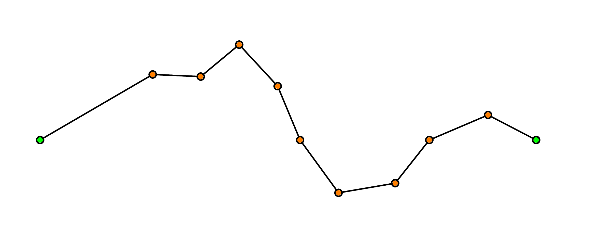
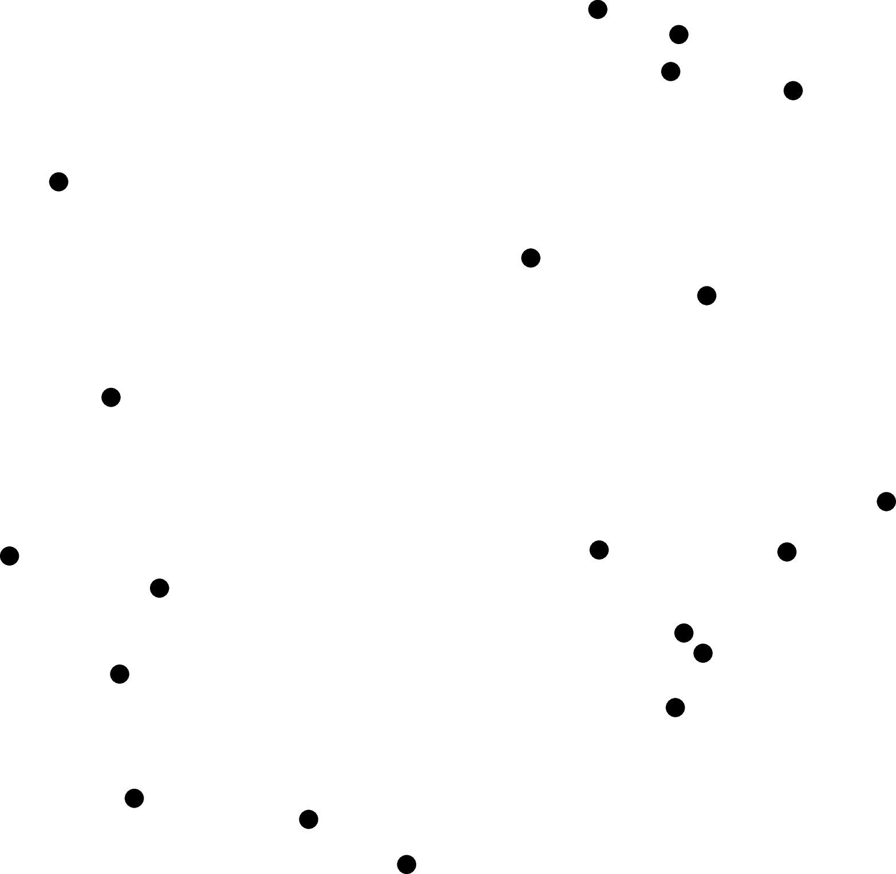

```{r setup, include=FALSE}
options(htmltools.dir.version = FALSE)
knitr::opts_chunk$set(
  cache=TRUE,
  warning = FALSE,
  echo=FALSE
)
library(flipbookr)
library(tidyverse)
library(latex2exp)
library(ggpattern)
library(ggpubr)
library(sp)

poly <- tribble(
  ~x, ~y, ~holes, ~id,
  0.1802,0.8712, 1L, 1L,
  0.2573,0.7795, 1L, 2L,
  0.0331,0.6281, 1L, 3L,
  0.2457,0.6223, 1L, 4L,
  0.2806,0.5088, 1L, 5L,
  0.3723,0.6136, 1L, 6L,
  0.3621,0.3996, 1L, 7L,
  0.4306,0.3297, 1L, 8L,
  0.5266,0.3195, 1L, 9L,
  0.5630,0.0677, 1L, 10L,
  0.8629,0.2103, 1L, 11L,
  0.9401,0.5189, 1L, 12L,
  0.7086,0.4942, 1L, 13L,
  0.5892,0.6529, 1L, 14L,
  0.6693,0.8014, 1L, 15L,
  0.3985,0.9382, 1L, 16L,
  0.6000,0.4000, 2L, 17L,
  0.6000,0.2000, 2L, 18L,
  0.8000,0.2000, 2L, 19L,
  0.8000,0.4000, 2L, 20L
)

poly_plein <- tribble(
  ~x, ~y, ~holes, ~id,
  0.1802,0.8712, 1L, 1L,
  0.2573,0.7795, 1L, 2L,
  0.0331,0.6281, 1L, 3L,
  0.2457,0.6223, 1L, 4L,
  0.2806,0.5088, 1L, 5L,
  0.3723,0.6136, 1L, 6L,
  0.3621,0.3996, 1L, 7L,
  0.4306,0.3297, 1L, 8L,
  0.5266,0.3195, 1L, 9L,
  0.5630,0.0677, 1L, 10L,
  0.8629,0.2103, 1L, 11L,
  0.9401,0.5189, 1L, 12L,
  0.7086,0.4942, 1L, 13L,
  0.5892,0.6529, 1L, 14L,
  0.6693,0.8014, 1L, 15L,
  0.3985,0.9382, 1L, 16L
)

poly_trou <- tribble(
  ~x, ~y, ~holes, ~id,
  0.6000,0.4000, 2L, 17L,
  0.6000,0.2000, 2L, 18L,
  0.8000,0.2000, 2L, 19L,
  0.8000,0.4000, 2L, 20L
)

poly_small <- tribble(
  ~x, ~y,
  0.84578829, 0.22430933,
  0.91374870, 0.49597492,
  0.69943962, 0.47310911,
  0.56551379, 0.65111605,
  0.64194392, 0.79281236,
  0.39666975, 0.91671748,
  0.21495193, 0.86094518,
  0.28690924, 0.77536172,
  0.09592715, 0.64639344,
  0.26059704, 0.64190103,
  0.28917259, 0.54896909,
  0.36660303, 0.63746102,
  0.39295365, 0.62683747,
  0.38249282, 0.40736516,
  0.43985652, 0.34882907,
  0.54417031, 0.33774573,
  0.57891272, 0.09741218,
  0.75260197, 0.18000000,
  0.58000000, 0.18000000,
  0.58000000, 0.42000000,
  0.82000000, 0.42000000,
  0.82000000, 0.21204721,
)

c_poly_plein <- poly_plein %>% 
  slice(chull(x,y))

b1 <- poly[c(1:3),]
b3 <- poly[c(3:10),]
b2 <- poly[c(12,13,14,15),]

c1 <- poly[c(4,5,6),]
c2 <- poly[c(6,7,8,9),]

c_b3 <- b3 %>% 
  slice(chull(x,y))
```

```{r xaringanExtra}
xaringanExtra::use_xaringan_extra(c("tile_view", "animate_css", "tachyons"))
```


class: center, middle

<iframe width="800" height="600" src="https://www.youtube.com/embed/m_QhY1aABsE" title="YouTube video player" frameborder="0" allow="accelerometer; autoplay; clipboard-write; encrypted-media; gyroscope; picture-in-picture" allowfullscreen></iframe>

---
class:inverse, middle, center

# Quelques rappels

---

# TODO...

- Équation de droite $\overrightarrow{\textbf{r}}=\overrightarrow{\textbf{r}_0}+t\overrightarrow{\textbf{v}}$

- Équation du plan

- Intersection droite avec plan (seulement savoir si il y a intersection et ensuite trouver l'intersection)

- Trouver distance point-droite

- Est-ce qu'un point est au-dessus ou au-dessous d'une droite?

---
class:inverse, center, middle

# L'équation d'une droite dans le plan

---
class: center, middle

```{tikz}
\usetikzlibrary{calc}
\begin{tikzpicture}[scale=1]

\draw[-stealth] (-0.5,0)--++(4,0) node[below] {$x$};
\draw[-stealth] (0,-0.5)--++(0,3) node[left] {$y$};
\draw[thick, blue] (-0.25,1.75)--(3.25,-0.25);

\draw (0.6,{-0.6*4/7+45/28})--++($0.015*(4,7)$)--++($0.015*(-7,4)$);
\draw[-stealth, thick, red] (0.5,{-0.5*4/7+45/28}) --++($0.1*(4,7)$) node[right] {\small{$\vec n = (a;b)$}};
\draw[fill=black] (0.5,{-0.5*4/7+45/28}) circle (1pt) node[below] {\small{$(x_0;y_0)$}};
\draw[fill=black] (0,{45/28}) circle (1pt) node[below left] {\small{$-c$}};

\draw[-stealth, thick, black] (0.5,{-0.5*4/7+45/28}) --++($-0.2*(-7,4)$) node[above right] {\small{$(x;y)$}};
\draw[fill=black] (1.9,{-1.9*4/7+45/28}) circle (1pt);

\node at (2,-0.75) {\small{$\vec n \cdot (x-x_0;y-y_0)=0$}};
\node at (2,-1.5) {\small{$ax+by+\underbrace{(-ax_0-by_0)}_{=c}=0$}};

\end{tikzpicture}
```

---
class:inverse, center, middle

# L'équation d'une droite dans l'espace

---
class: center, middle

```{tikz}
\usetikzlibrary{calc}
\begin{tikzpicture}[scale=0.8]

\coordinate (O)  at (0,0);
\coordinate (D1) at (-2.,1.5);
\coordinate (D2) at (3.5,3);
\coordinate (P0) at ($(D1)+0.55*(D2)-0.55*(D1)$);
\coordinate (P) at ($(D1)+0.85*(D2)-0.85*(D1)$);
\coordinate (U) at ($(O)+0.28*(D2)-0.28*(D1)$);

\draw[-stealth] (O)--++(-1,-1) node[below] {$x$};
\draw[-stealth] (O)--++(4,0) node[below] {$y$};
\draw[-stealth] (O)--++(0,4) node[above] {$z$};

\draw[thick, blue] (D1)--(D2) node[right] {$D$};
\draw[-stealth, very thick, red] (P0)--(P) node[midway, above] {$\vec a$};
\draw[-stealth, very thick, red] (O)--(U) node[midway, above] {$\vec u$};
\draw[-stealth, thick] (O)--(P0) node[midway, left] {$\vec r_0$};
\draw[-stealth, thick] (O)--(P) node[midway, right] {$\vec r$};

\draw[fill=black] (P0) circle (1pt) node[above] {\small$P_0$};
\draw[fill=black] (P) circle (1pt) node[above] {\small$P$};

\node at (1.5,-1) {\large$\vec r = \vec r_0 + t \vec u$};

\end{tikzpicture}
```

---
class:inverse, center, middle

# L'équation d'un plan dans l'espace

---
class: middle, center

```{tikz}
\usetikzlibrary{calc}
\begin{tikzpicture}[scale=0.8]

\coordinate (O)  at (0,0);
\coordinate (P1) at (-1,1);
\coordinate (P2) at (0.25,3);
\coordinate (P3) at (3.75,2.5);
\coordinate (P4) at (2.5,0.5);
\coordinate (N1) at (-0.5,1.25);
\coordinate (N2) at ($(N1)+(0,1.5)$);
\coordinate (Q1) at (1.25,1.75);
\coordinate (Q2) at ($(Q1)+(1.5,0.25)$);

\draw[-stealth] (O)--++(-1,-1) node[below] {$x$};
\draw[-stealth] (O)--++(4,0) node[below] {$y$};
\draw[-stealth] (O)--++(0,4) node[above] {$z$};

\filldraw[black, fill=blue, fill opacity=0.5] (P1)--(P2)--(P3)--(P4)--cycle;
\draw ($(N1)+(0.25,0)$)--++(0,0.25)--++(-0.25,0);
\draw[-stealth, red, thick] (N1)--(N2) node[left] {$\vec n$};
\draw[-stealth, thick] (O)--(Q1) node[midway, left] {$\vec r_0$};
\draw[-stealth, thick] (O)--(Q2) node[midway, right] {$\vec r$};
\draw[densely dashed, thick] (N1)--++(0.75,0);
\draw[-stealth, thick] (Q1)--(Q2);
\draw[fill=black] (Q1) circle (1pt) node[above] {\small$P_0$};
\draw[fill=black] (Q2) circle (1pt) node[above] {\small$P$};

\node at (1.5,-1) {\large$\vec n \cdot \left(\vec r - \vec r_0\right)=0$};

\end{tikzpicture}
```

---
class: inverse, center, middle

# Une modélisation 3D d'un objet

---
class: center, inverse

background-image: url("https://i.stack.imgur.com/ENvMe.png")
background-size: contain
---

# STL pour STéréoLitographie

- Ce format ne comporte pas d'informations concernant la couleur, la texture.

- Le **format de fichier STL** ne décrit que la géométrie de surface d'un objet en 3 dimensions.

- Cette surface est nécessairement fermée et définie par une série de triangles (ou de facettes). 

- Chaque triangle est défini par les coordonnées cartésiennes (x, y, z) dans un trièdre direct de son vecteur normal unitaire (n) orienté vers l'extérieur de l'objet et de ses trois sommets ordonnés dans le sens trigonométrique. 

- Chaque triangle doit partager 2 sommets avec chacun des triangles le juxtaposant. Dit autrement, le sommet d'un triangle ne doit pas être sur l'arête d'un autre triangle. 

- L'unité de longueur est arbitraire.

---

# Le format de fichier STL

.pull-left[
facet normal $n_x$ $n_y$ $n_z$

outer loop

vertex $v_{1_x}$ $v_{1_y}$ $v_{1_z}$

vertex $v_{2_x}$ $v_{2_y}$ $v_{2_z}$

vertex $v_{3_x}$ $v_{3_y}$ $v_{3_z}$

end loop

end facet
]

.pull-right[
```{tikz, echo=FALSE, fig.align='center', label="triangle-with-vertex-normal"}
\usetikzlibrary{calc}
\begin{tikzpicture}[font=\large, scale = 1.5]

\coordinate[label=right:{$(v_{1_x},v_{1_y},v_{1_z})$}] (A) at (0,0);
\coordinate[label=below right:{$(v_{2_x},v_{2_y},v_{2_z})$}] (B) at (1,2);
\coordinate[label=above:{$(v_{3_x},v_{3_y},v_{3_z})$}] (C) at (-2,3);
\coordinate (D) at (-0.25,1.5);
\coordinate[label=above right:{$(n_{x},n_{y},n_{z})$}] (E) at ($(D)+1.25*(0.5,1)$);

\draw[very thick, fill, color=blue, fill opacity = 0.5] (A)--(B)--(C)--cycle;
\draw[very thick,->] (D)--(E);

\foreach \pt in {A,B,C}{
	\draw[fill=black] (\pt) circle (1.25pt);
}

\end{tikzpicture}
```
]

---

# Le format de fichier STL : Un exemple

```
facet normal -6.123234e-17 0.000000e+00 1.000000e+00
  outer loop
    vertex -6.514841e+00 1.043095e+02 9.525001e+00
    vertex -9.595548e+00 1.042182e+02 9.525001e+00
    vertex -6.558662e+00 1.041282e+02 9.525001e+00
  endloop
endfacet

facet normal -6.123234e-17 0.000000e+00 1.000000e+00
  outer loop
    vertex -6.558662e+00 1.041282e+02 9.525001e+00
    vertex -9.595548e+00 1.042182e+02 9.525001e+00
    vertex -9.541054e+00 1.040397e+02 9.525001e+00
  endloop
endfacet
```

---
class: inverse, center, middle

# Couper le solide en polygones

---

## On veut trouver l'intersection d'un plan avec le solide

- Le solide est composé de plusieurs triangles.

- Chaque triangle est composé de trois points.

    - Étape 1 : Est-ce que les trois points sont du même côté du plan?
    
    - Étape 2 : Si oui, alors on ne fait rien.
    
    - Étape 3 : Si non, on trouve l'intersection des deux segments de droites formés avec le plan.

---
class:middle, center

<iframe src="https://www.geogebra.org/classic/rycfkefc?embed" width="800" height="600" allowfullscreen style="border: 1px solid #e4e4e4;border-radius: 4px;" frameborder="0"></iframe>

---
class: inverse, center, middle

# Est-ce qu'un triangle croise le plan?

---

## Intersection Triangle - Plan

- Avant de trouver l'intersection d'un triangle avec un plan, on va trouver *SI* le triangle intersecte le plan.

- Il intersecte le plan si tous les points du triangle ne sont pas du même côté du plan.

- Comment s'y prendre?

- En pratique, c'est facile car le plan de coupe est toujours parfaitement horizontal et donné par une valeur de $z$ constante.

---

## Intersection Triangle - Plan

- On translate nos points selon la hauteur de la coupe;
  
- Il y a intersection si nous avons un ou deux points qui ont une coordonnée en $z$ de signe différent de l'autre coordonnée.

```{tikz}
\usetikzlibrary{calc}
\begin{tikzpicture}[scale=0.8]

\begin{scope}
\coordinate (O)  at (0,0);
\coordinate (P1) at (-3,-0.5);
\coordinate (P2) at ($(P1)+(2,1)$);
\coordinate (P3) at ($(P2)+(4,0)$);
\coordinate (P4) at ($(P3)+(-2,-1)$);
\coordinate (Q1) at (-2,1);
\coordinate (Q2) at (2.5,1.25);
\coordinate (Q3) at (-0.25,-1);

\draw[densely dashed] ($0.5*(Q2)+0.5*(Q3)$)--(Q3);
\draw[densely dashed] ($0.5*(Q1)+0.5*(Q3)$)--(Q3);
\filldraw[black, fill=blue!75!white, fill opacity=0.75] (P1)--(P2)--(P3)--(P4)--cycle;
\filldraw[black, fill=orange, fill opacity=0.5] (Q1)--(Q2)--($0.5*(Q2)+0.5*(Q3)$)--($0.5*(Q1)+0.5*(Q3)$)--cycle;
\filldraw[black, fill=orange, fill opacity=0.5] (Q3)--($0.25*(Q1)+0.75*(Q3)$)--($0.22*(Q2)+0.78*(Q3)$)--cycle;

\foreach \pt in {Q1,Q2,Q3}{
	\draw[fill=black] (\pt) circle (1pt);
}
\draw[fill=black] ($0.5*(Q2)+0.5*(Q3)$) circle (1pt);
\draw[fill=black] ($0.5*(Q1)+0.5*(Q3)$) circle (1pt);
\end{scope}

\begin{scope}[xshift=5cm]
\coordinate (O)  at (0,0);
\coordinate (P1) at (-3,-0.5);
\coordinate (P2) at ($(P1)+(2,1)$);
\coordinate (P3) at ($(P2)+(4,0)$);
\coordinate (P4) at ($(P3)+(-2,-1)$);
\coordinate (Q1) at (0.5,1);
\coordinate (Q2) at (2,-1.25);
\coordinate (Q3) at (-0.5,-1);

\draw[densely dashed] ($0.5*(Q1)+0.5*(Q3)$)--(Q3);
\draw[densely dashed] ($0.5*(Q1)+0.5*(Q2)$)--(Q2);
\filldraw[black, fill=blue!75!white, fill opacity=0.75] (P1)--(P2)--(P3)--(P4)--cycle;
\filldraw[black, fill=orange, fill opacity=0.5] (Q3)--(Q2)--($0.42*(Q1)+0.58*(Q2)$)--(P4)--($0.25*(Q1)+0.75*(Q3)$)--cycle;
\filldraw[black, fill=orange, fill opacity=0.5] (Q1)--($0.5*(Q1)+0.5*(Q2)$)--($0.5*(Q1)+0.5*(Q3)$)--cycle;

\foreach \pt/\pos in {Q1/above,Q2/right,Q3/left}{
	\draw[fill=black] (\pt) circle (1pt);
}
\draw[fill=black] ($0.5*(Q1)+0.5*(Q3)$) circle (1pt);
\draw[fill=black] ($0.5*(Q1)+0.5*(Q2)$) circle (1pt);
\end{scope}

\end{tikzpicture}
```

- Nous avons donc une collection de points que nous relions ensemble pour former un polygone.

- Le tour est donc joué! 

---
class: inverse, center, middle

# Malheureusement la vie n'est jamais aussi facile...

--

```{r, out.width="50%"}
knitr::include_graphics("https://media.giphy.com/media/ccAuVsSPSLrDq/giphy.gif")
```

---
class: middle, center

## En théorie nous obtenons ceci

```{tikz, echo=FALSE}
\usetikzlibrary{calc}
\begin{tikzpicture}[scale=4]

\coordinate (pt1)  at (0.1196,0.6535);
\coordinate (pt2)  at (0.5265,0.9261);
\coordinate (pt3)  at (0.5549,0.9242);
\coordinate (pt4)  at (0.8823,0.8447);
\coordinate (pt5)  at (0.9000,0.8000);
\coordinate (pt6)  at (0.7480,0.4984);
\coordinate (pt7)  at (0.7745,0.4851);
\coordinate (pt8)  at (0.9599,0.3148);
\coordinate (pt9)  at (0.9315,0.3148);
\coordinate (pt10) at (0.7763,0.0725);
\coordinate (pt11) at (0.7498,0.0971);
\coordinate (pt12) at (0.4943,0.5135);
\coordinate (pt13) at (0.4622,0.4813);
\coordinate (pt14) at (0.2502,0.0877);
\coordinate (pt15) at (0.2275,0.1123);
\coordinate (pt16) at (0.1083,0.6176);

\draw (0,0) rectangle (1,1);

%\foreach[evaluate={\finish=int(\start+1)}] \start in {1,3,5,...,15}{
%	\draw[opacity=0.5] (pt\start)--(pt\finish);
%}

%\foreach \num in {1,2,...,16}{
%	\draw[fill=green, fill opacity=0.5] (pt\num) circle (0.25pt);
%}

\coordinate (midpt1) at (0.1139,0.6356);
\coordinate (midpt2) at (0.5407,0.9251);
\coordinate (midpt3) at (0.8912,0.8223);
\coordinate (midpt4) at (0.7612,0.4917);
\coordinate (midpt5) at (0.9457,0.3148);
\coordinate (midpt6) at (0.7631,0.0848);
\coordinate (midpt7) at (0.4783,0.4974);
\coordinate (midpt8) at (0.2388,0.1000);

\draw[fill=orange, fill opacity = 0.5] 
 	(midpt1)--
 	(midpt2)--
 	(midpt3)--
 	(midpt4)--
	(midpt5)--
 	(midpt6)--
 	(midpt7)--
 	(midpt8)--
 	cycle;

\foreach \num in {1,2,...,8}{
 	\draw[fill=orange] (midpt\num) circle (0.25pt);
}

\end{tikzpicture}
```

---
class: middle, center

## En pratique nous obtenons plutôt cela

```{tikz, echo=FALSE}
\usetikzlibrary{calc}
\begin{tikzpicture}[scale=4]

\coordinate (pt1)  at (0.1196,0.6535);
\coordinate (pt2)  at (0.5265,0.9261);
\coordinate (pt3)  at (0.5549,0.9242);
\coordinate (pt4)  at (0.8823,0.8447);
\coordinate (pt5)  at (0.9000,0.8000);
\coordinate (pt6)  at (0.7480,0.4984);
\coordinate (pt7)  at (0.7745,0.4851);
\coordinate (pt8)  at (0.9599,0.3148);
\coordinate (pt9)  at (0.9315,0.3148);
\coordinate (pt10) at (0.7763,0.0725);
\coordinate (pt11) at (0.7498,0.0971);
\coordinate (pt12) at (0.4943,0.5135);
\coordinate (pt13) at (0.4622,0.4813);
\coordinate (pt14) at (0.2502,0.0877);
\coordinate (pt15) at (0.2275,0.1123);
\coordinate (pt16) at (0.1083,0.6176);

\draw (0,0) rectangle (1,1);

\foreach[evaluate={\finish=int(\start+1)}] \start in {1,3,5,...,15}{
	\draw (pt\start)--(pt\finish);
}

\foreach \num in {1,2,...,16}{
	\draw[fill=green] (pt\num) circle (0.25pt);
}

% \draw[blue, very thick] (0.65145,0)--++(0,1);

% \draw[red, very thick] (0,0.56555)--++(0.65145,0);

% \draw[red, very thick] (0.65145,0.39995)--(1,0.39995);

% \draw[blue, very thick, opacity = 0.5] (0.3562,0)--(0.3562,0.56555);

% \draw[blue, very thick, opacity = 0.5] (0.32305,0.56555)--(0.32305,1);

% \draw[blue, very thick, opacity = 0.5] (0.8539,0.39995)--(0.8539,0);

% \draw[blue, very thick, opacity = 0.5] (0.8284,0.39995)--(0.8284,1);

% \coordinate (midpt1) at (0.1139,0.6356);
% \coordinate (midpt2) at (0.5407,0.9251);
% \coordinate (midpt3) at (0.8912,0.8223);
% \coordinate (midpt4) at (0.7612,0.4917);
% \coordinate (midpt5) at (0.9457,0.3148);
% \coordinate (midpt6) at (0.7631,0.0848);
% \coordinate (midpt7) at (0.4783,0.4974);
% \coordinate (midpt8) at (0.2388,0.1000);

% \draw[fill=orange, fill opacity = 0.5] 
% 	(midpt1)--
% 	(midpt2)--
% 	(midpt3)--
% 	(midpt4)--
% 	(midpt5)--
% 	(midpt6)--
% 	(midpt7)--
% 	(midpt8)--
% 	cycle;

% \foreach \num in {1,2,...,8}{
% 	\draw[fill=orange] (midpt\num) circle (0.25pt);
% }

\end{tikzpicture}
```

---

## Comment passer de l'un à l'autre?

.pull-left[
```{tikz, echo=FALSE}
\usetikzlibrary{calc}
\begin{tikzpicture}[scale=4]

\coordinate (pt1)  at (0.1196,0.6535);
\coordinate (pt2)  at (0.5265,0.9261);
\coordinate (pt3)  at (0.5549,0.9242);
\coordinate (pt4)  at (0.8823,0.8447);
\coordinate (pt5)  at (0.9000,0.8000);
\coordinate (pt6)  at (0.7480,0.4984);
\coordinate (pt7)  at (0.7745,0.4851);
\coordinate (pt8)  at (0.9599,0.3148);
\coordinate (pt9)  at (0.9315,0.3148);
\coordinate (pt10) at (0.7763,0.0725);
\coordinate (pt11) at (0.7498,0.0971);
\coordinate (pt12) at (0.4943,0.5135);
\coordinate (pt13) at (0.4622,0.4813);
\coordinate (pt14) at (0.2502,0.0877);
\coordinate (pt15) at (0.2275,0.1123);
\coordinate (pt16) at (0.1083,0.6176);

\draw (0,0) rectangle (1,1);

\foreach[evaluate={\finish=int(\start+1)}] \start in {1,3,5,...,15}{
	\draw (pt\start)--(pt\finish);
}

\foreach \num in {1,2,...,16}{
	\draw[fill=green] (pt\num) circle (0.25pt);
}

% \draw[blue, very thick] (0.65145,0)--++(0,1);

% \draw[red, very thick] (0,0.56555)--++(0.65145,0);

% \draw[red, very thick] (0.65145,0.39995)--(1,0.39995);

% \draw[blue, very thick, opacity = 0.5] (0.3562,0)--(0.3562,0.56555);

% \draw[blue, very thick, opacity = 0.5] (0.32305,0.56555)--(0.32305,1);

% \draw[blue, very thick, opacity = 0.5] (0.8539,0.39995)--(0.8539,0);

% \draw[blue, very thick, opacity = 0.5] (0.8284,0.39995)--(0.8284,1);

% \coordinate (midpt1) at (0.1139,0.6356);
% \coordinate (midpt2) at (0.5407,0.9251);
% \coordinate (midpt3) at (0.8912,0.8223);
% \coordinate (midpt4) at (0.7612,0.4917);
% \coordinate (midpt5) at (0.9457,0.3148);
% \coordinate (midpt6) at (0.7631,0.0848);
% \coordinate (midpt7) at (0.4783,0.4974);
% \coordinate (midpt8) at (0.2388,0.1000);

% \draw[fill=orange, fill opacity = 0.5] 
% 	(midpt1)--
% 	(midpt2)--
% 	(midpt3)--
% 	(midpt4)--
% 	(midpt5)--
% 	(midpt6)--
% 	(midpt7)--
% 	(midpt8)--
% 	cycle;

% \foreach \num in {1,2,...,8}{
% 	\draw[fill=orange] (midpt\num) circle (0.25pt);
% }

\end{tikzpicture}
```
]

.pull-right[
```{tikz, echo=FALSE}
\usetikzlibrary{calc}
\begin{tikzpicture}[scale=4]

\coordinate (pt1)  at (0.1196,0.6535);
\coordinate (pt2)  at (0.5265,0.9261);
\coordinate (pt3)  at (0.5549,0.9242);
\coordinate (pt4)  at (0.8823,0.8447);
\coordinate (pt5)  at (0.9000,0.8000);
\coordinate (pt6)  at (0.7480,0.4984);
\coordinate (pt7)  at (0.7745,0.4851);
\coordinate (pt8)  at (0.9599,0.3148);
\coordinate (pt9)  at (0.9315,0.3148);
\coordinate (pt10) at (0.7763,0.0725);
\coordinate (pt11) at (0.7498,0.0971);
\coordinate (pt12) at (0.4943,0.5135);
\coordinate (pt13) at (0.4622,0.4813);
\coordinate (pt14) at (0.2502,0.0877);
\coordinate (pt15) at (0.2275,0.1123);
\coordinate (pt16) at (0.1083,0.6176);

\draw (0,0) rectangle (1,1);

%\foreach[evaluate={\finish=int(\start+1)}] \start in {1,3,5,...,15}{
%	\draw[opacity=0.5] (pt\start)--(pt\finish);
%}

%\foreach \num in {1,2,...,16}{
%	\draw[fill=green, fill opacity=0.5] (pt\num) circle (0.25pt);
%}

\coordinate (midpt1) at (0.1139,0.6356);
\coordinate (midpt2) at (0.5407,0.9251);
\coordinate (midpt3) at (0.8912,0.8223);
\coordinate (midpt4) at (0.7612,0.4917);
\coordinate (midpt5) at (0.9457,0.3148);
\coordinate (midpt6) at (0.7631,0.0848);
\coordinate (midpt7) at (0.4783,0.4974);
\coordinate (midpt8) at (0.2388,0.1000);

\draw[fill=orange, fill opacity = 0.5] 
 	(midpt1)--
 	(midpt2)--
 	(midpt3)--
 	(midpt4)--
	(midpt5)--
 	(midpt6)--
 	(midpt7)--
 	(midpt8)--
 	cycle;

\foreach \num in {1,2,...,8}{
 	\draw[fill=orange] (midpt\num) circle (0.25pt);
}

\end{tikzpicture}
```
]

---

## Trouver le plus proche voisin?

```{tikz, fig.align="center"}
\usetikzlibrary{calc}
\begin{tikzpicture}[scale=1]

\coordinate (A1)  at (0,0);
\coordinate (A) at ($(A1)+(1,1)$);
\coordinate (B1)  at (2.3,-0.5);
\coordinate (B) at ($(B1)+(-0.75,1.25)$);
\coordinate (C1)  at (3,1.25);
\coordinate (C) at ($(C1)+(-1.3,-0.1)$);
\coordinate (D1)  at (3.1,2.25);
\coordinate (D) at ($(D1)+(-1.3,-0.6)$);

\foreach \pt/\pos in {A/above,B/below left,C/below right,D/above}{
	\draw (\pt)--(\pt1);
	\draw[fill=black] (\pt) circle (1pt) node[\pos] {$\pt$};
}

\end{tikzpicture}
```

--

- La notion de *plus proche voisin* n'est pas réciproque!

- Le plus proche voisin de $A$ est $B$, mais le plus proche voisin de $B$ est $C$.

---
class:inverse, middle, center

# Les Quadtree ou Arbres Quaternaires

---

## Les arbres quaternaires

- Un quadtree ou arbre quaternaire est une structure de données de type arbre dans laquelle chaque noeud a quatre fils. 

- Les arbres quaternaires sont le plus souvent utilisés pour partitionner un espace bidimensionnel en le subdivisant récursivement en quatre noeuds.

--

```{r, out.width="50%", fig.align='center'}
knitr::include_graphics("https://upload.wikimedia.org/wikipedia/commons/8/8b/Point_quadtree.svg")
```

---
class: middle, center


---
class:middle, center

```{tikz, echo=FALSE}
\usetikzlibrary{calc}
\begin{tikzpicture}[scale=4]

\coordinate (pt1)  at (0.1196,0.6535);
\coordinate (pt2)  at (0.5265,0.9261);
\coordinate (pt3)  at (0.5549,0.9242);
\coordinate (pt4)  at (0.8823,0.8447);
\coordinate (pt5)  at (0.9000,0.8000);
\coordinate (pt6)  at (0.7480,0.4984);
\coordinate (pt7)  at (0.7745,0.4851);
\coordinate (pt8)  at (0.9599,0.3148);
\coordinate (pt9)  at (0.9315,0.3148);
\coordinate (pt10) at (0.7763,0.0725);
\coordinate (pt11) at (0.7498,0.0971);
\coordinate (pt12) at (0.4943,0.5135);
\coordinate (pt13) at (0.4622,0.4813);
\coordinate (pt14) at (0.2502,0.0877);
\coordinate (pt15) at (0.2275,0.1123);
\coordinate (pt16) at (0.1083,0.6176);

\draw (0,0) rectangle (1,1);

\foreach[evaluate={\finish=int(\start+1)}] \start in {1,3,5,...,15}{
	\draw (pt\start)--(pt\finish);
}

\foreach \num in {1,2,...,16}{
	\draw[fill=green] (pt\num) circle (0.25pt);
}

% \draw[blue, very thick] (0.65145,0)--++(0,1);

% \draw[red, very thick] (0,0.56555)--++(0.65145,0);

% \draw[red, very thick] (0.65145,0.39995)--(1,0.39995);

% \draw[blue, very thick, opacity = 0.5] (0.3562,0)--(0.3562,0.56555);

% \draw[blue, very thick, opacity = 0.5] (0.32305,0.56555)--(0.32305,1);

% \draw[blue, very thick, opacity = 0.5] (0.8539,0.39995)--(0.8539,0);

% \draw[blue, very thick, opacity = 0.5] (0.8284,0.39995)--(0.8284,1);

% \coordinate (midpt1) at (0.1139,0.6356);
% \coordinate (midpt2) at (0.5407,0.9251);
% \coordinate (midpt3) at (0.8912,0.8223);
% \coordinate (midpt4) at (0.7612,0.4917);
% \coordinate (midpt5) at (0.9457,0.3148);
% \coordinate (midpt6) at (0.7631,0.0848);
% \coordinate (midpt7) at (0.4783,0.4974);
% \coordinate (midpt8) at (0.2388,0.1000);

% \draw[fill=orange, fill opacity = 0.5] 
% 	(midpt1)--
% 	(midpt2)--
% 	(midpt3)--
% 	(midpt4)--
% 	(midpt5)--
% 	(midpt6)--
% 	(midpt7)--
% 	(midpt8)--
% 	cycle;

% \foreach \num in {1,2,...,8}{
% 	\draw[fill=orange] (midpt\num) circle (0.25pt);
% }

\end{tikzpicture}
```

---
class: middle, center

```{tikz, echo=FALSE}
\usetikzlibrary{calc}
\begin{tikzpicture}[scale=4]

\coordinate (pt1)  at (0.1196,0.6535);
\coordinate (pt2)  at (0.5265,0.9261);
\coordinate (pt3)  at (0.5549,0.9242);
\coordinate (pt4)  at (0.8823,0.8447);
\coordinate (pt5)  at (0.9000,0.8000);
\coordinate (pt6)  at (0.7480,0.4984);
\coordinate (pt7)  at (0.7745,0.4851);
\coordinate (pt8)  at (0.9599,0.3148);
\coordinate (pt9)  at (0.9315,0.3148);
\coordinate (pt10) at (0.7763,0.0725);
\coordinate (pt11) at (0.7498,0.0971);
\coordinate (pt12) at (0.4943,0.5135);
\coordinate (pt13) at (0.4622,0.4813);
\coordinate (pt14) at (0.2502,0.0877);
\coordinate (pt15) at (0.2275,0.1123);
\coordinate (pt16) at (0.1083,0.6176);

\draw (0,0) rectangle (1,1);

\foreach[evaluate={\finish=int(\start+1)}] \start in {1,3,5,...,15}{
	\draw (pt\start)--(pt\finish);
}

\foreach \num in {1,2,...,16}{
	\draw[fill=green] (pt\num) circle (0.25pt);
}

\draw[blue, very thick] (0.65145,0)--++(0,1);

% \draw[red, very thick] (0,0.56555)--++(0.65145,0);

% \draw[red, very thick] (0.65145,0.39995)--(1,0.39995);

% \draw[blue, very thick, opacity = 0.5] (0.3562,0)--(0.3562,0.56555);

% \draw[blue, very thick, opacity = 0.5] (0.32305,0.56555)--(0.32305,1);

% \draw[blue, very thick, opacity = 0.5] (0.8539,0.39995)--(0.8539,0);

% \draw[blue, very thick, opacity = 0.5] (0.8284,0.39995)--(0.8284,1);

% \coordinate (midpt1) at (0.1139,0.6356);
% \coordinate (midpt2) at (0.5407,0.9251);
% \coordinate (midpt3) at (0.8912,0.8223);
% \coordinate (midpt4) at (0.7612,0.4917);
% \coordinate (midpt5) at (0.9457,0.3148);
% \coordinate (midpt6) at (0.7631,0.0848);
% \coordinate (midpt7) at (0.4783,0.4974);
% \coordinate (midpt8) at (0.2388,0.1000);

% \draw[fill=orange, fill opacity = 0.5] 
% 	(midpt1)--
% 	(midpt2)--
% 	(midpt3)--
% 	(midpt4)--
% 	(midpt5)--
% 	(midpt6)--
% 	(midpt7)--
% 	(midpt8)--
% 	cycle;

% \foreach \num in {1,2,...,8}{
% 	\draw[fill=orange] (midpt\num) circle (0.25pt);
% }

\end{tikzpicture}
```

---
class: middle, center

```{tikz, echo=FALSE}
\usetikzlibrary{calc}
\begin{tikzpicture}[scale=4]

\coordinate (pt1)  at (0.1196,0.6535);
\coordinate (pt2)  at (0.5265,0.9261);
\coordinate (pt3)  at (0.5549,0.9242);
\coordinate (pt4)  at (0.8823,0.8447);
\coordinate (pt5)  at (0.9000,0.8000);
\coordinate (pt6)  at (0.7480,0.4984);
\coordinate (pt7)  at (0.7745,0.4851);
\coordinate (pt8)  at (0.9599,0.3148);
\coordinate (pt9)  at (0.9315,0.3148);
\coordinate (pt10) at (0.7763,0.0725);
\coordinate (pt11) at (0.7498,0.0971);
\coordinate (pt12) at (0.4943,0.5135);
\coordinate (pt13) at (0.4622,0.4813);
\coordinate (pt14) at (0.2502,0.0877);
\coordinate (pt15) at (0.2275,0.1123);
\coordinate (pt16) at (0.1083,0.6176);

\draw (0,0) rectangle (1,1);

\foreach[evaluate={\finish=int(\start+1)}] \start in {1,3,5,...,15}{
	\draw (pt\start)--(pt\finish);
}

\foreach \num in {1,2,...,16}{
	\draw[fill=green] (pt\num) circle (0.25pt);
}

\draw[blue, very thick] (0.65145,0)--++(0,1);
\draw[red, very thick] (0,0.56555)--++(0.65145,0);

% \draw[red, very thick] (0.65145,0.39995)--(1,0.39995);

% \draw[blue, very thick, opacity = 0.5] (0.3562,0)--(0.3562,0.56555);

% \draw[blue, very thick, opacity = 0.5] (0.32305,0.56555)--(0.32305,1);

% \draw[blue, very thick, opacity = 0.5] (0.8539,0.39995)--(0.8539,0);

% \draw[blue, very thick, opacity = 0.5] (0.8284,0.39995)--(0.8284,1);

% \coordinate (midpt1) at (0.1139,0.6356);
% \coordinate (midpt2) at (0.5407,0.9251);
% \coordinate (midpt3) at (0.8912,0.8223);
% \coordinate (midpt4) at (0.7612,0.4917);
% \coordinate (midpt5) at (0.9457,0.3148);
% \coordinate (midpt6) at (0.7631,0.0848);
% \coordinate (midpt7) at (0.4783,0.4974);
% \coordinate (midpt8) at (0.2388,0.1000);

% \draw[fill=orange, fill opacity = 0.5] 
% 	(midpt1)--
% 	(midpt2)--
% 	(midpt3)--
% 	(midpt4)--
% 	(midpt5)--
% 	(midpt6)--
% 	(midpt7)--
% 	(midpt8)--
% 	cycle;

% \foreach \num in {1,2,...,8}{
% 	\draw[fill=orange] (midpt\num) circle (0.25pt);
% }

\end{tikzpicture}
```

---
class: middle, center

```{tikz, echo=FALSE}
\usetikzlibrary{calc}
\begin{tikzpicture}[scale=4]

\coordinate (pt1)  at (0.1196,0.6535);
\coordinate (pt2)  at (0.5265,0.9261);
\coordinate (pt3)  at (0.5549,0.9242);
\coordinate (pt4)  at (0.8823,0.8447);
\coordinate (pt5)  at (0.9000,0.8000);
\coordinate (pt6)  at (0.7480,0.4984);
\coordinate (pt7)  at (0.7745,0.4851);
\coordinate (pt8)  at (0.9599,0.3148);
\coordinate (pt9)  at (0.9315,0.3148);
\coordinate (pt10) at (0.7763,0.0725);
\coordinate (pt11) at (0.7498,0.0971);
\coordinate (pt12) at (0.4943,0.5135);
\coordinate (pt13) at (0.4622,0.4813);
\coordinate (pt14) at (0.2502,0.0877);
\coordinate (pt15) at (0.2275,0.1123);
\coordinate (pt16) at (0.1083,0.6176);

\draw (0,0) rectangle (1,1);

\foreach[evaluate={\finish=int(\start+1)}] \start in {1,3,5,...,15}{
	\draw (pt\start)--(pt\finish);
}

\foreach \num in {1,2,...,16}{
	\draw[fill=green] (pt\num) circle (0.25pt);
}

\draw[blue, very thick] (0.65145,0)--++(0,1);
\draw[red, very thick] (0,0.56555)--++(0.65145,0);
\draw[red, very thick] (0.65145,0.39995)--(1,0.39995);

% \draw[blue, very thick, opacity = 0.5] (0.3562,0)--(0.3562,0.56555);

% \draw[blue, very thick, opacity = 0.5] (0.32305,0.56555)--(0.32305,1);

% \draw[blue, very thick, opacity = 0.5] (0.8539,0.39995)--(0.8539,0);

% \draw[blue, very thick, opacity = 0.5] (0.8284,0.39995)--(0.8284,1);

% \coordinate (midpt1) at (0.1139,0.6356);
% \coordinate (midpt2) at (0.5407,0.9251);
% \coordinate (midpt3) at (0.8912,0.8223);
% \coordinate (midpt4) at (0.7612,0.4917);
% \coordinate (midpt5) at (0.9457,0.3148);
% \coordinate (midpt6) at (0.7631,0.0848);
% \coordinate (midpt7) at (0.4783,0.4974);
% \coordinate (midpt8) at (0.2388,0.1000);

% \draw[fill=orange, fill opacity = 0.5] 
% 	(midpt1)--
% 	(midpt2)--
% 	(midpt3)--
% 	(midpt4)--
% 	(midpt5)--
% 	(midpt6)--
% 	(midpt7)--
% 	(midpt8)--
% 	cycle;

% \foreach \num in {1,2,...,8}{
% 	\draw[fill=orange] (midpt\num) circle (0.25pt);
% }

\end{tikzpicture}
```

---
class: middle, center

```{tikz, echo=FALSE}
\usetikzlibrary{calc}
\begin{tikzpicture}[scale=4]

\coordinate (pt1)  at (0.1196,0.6535);
\coordinate (pt2)  at (0.5265,0.9261);
\coordinate (pt3)  at (0.5549,0.9242);
\coordinate (pt4)  at (0.8823,0.8447);
\coordinate (pt5)  at (0.9000,0.8000);
\coordinate (pt6)  at (0.7480,0.4984);
\coordinate (pt7)  at (0.7745,0.4851);
\coordinate (pt8)  at (0.9599,0.3148);
\coordinate (pt9)  at (0.9315,0.3148);
\coordinate (pt10) at (0.7763,0.0725);
\coordinate (pt11) at (0.7498,0.0971);
\coordinate (pt12) at (0.4943,0.5135);
\coordinate (pt13) at (0.4622,0.4813);
\coordinate (pt14) at (0.2502,0.0877);
\coordinate (pt15) at (0.2275,0.1123);
\coordinate (pt16) at (0.1083,0.6176);

\draw (0,0) rectangle (1,1);

\foreach[evaluate={\finish=int(\start+1)}] \start in {1,3,5,...,15}{
	\draw (pt\start)--(pt\finish);
}

\foreach \num in {1,2,...,16}{
	\draw[fill=green] (pt\num) circle (0.25pt);
}

\draw[blue, very thick] (0.65145,0)--++(0,1);
\draw[red, very thick] (0,0.56555)--++(0.65145,0);
\draw[red, very thick] (0.65145,0.39995)--(1,0.39995);
\draw[blue, very thick, opacity = 0.5] (0.3562,0)--(0.3562,0.56555);

% \draw[blue, very thick, opacity = 0.5] (0.32305,0.56555)--(0.32305,1);

% \draw[blue, very thick, opacity = 0.5] (0.8539,0.39995)--(0.8539,0);

% \draw[blue, very thick, opacity = 0.5] (0.8284,0.39995)--(0.8284,1);

% \coordinate (midpt1) at (0.1139,0.6356);
% \coordinate (midpt2) at (0.5407,0.9251);
% \coordinate (midpt3) at (0.8912,0.8223);
% \coordinate (midpt4) at (0.7612,0.4917);
% \coordinate (midpt5) at (0.9457,0.3148);
% \coordinate (midpt6) at (0.7631,0.0848);
% \coordinate (midpt7) at (0.4783,0.4974);
% \coordinate (midpt8) at (0.2388,0.1000);

% \draw[fill=orange, fill opacity = 0.5] 
% 	(midpt1)--
% 	(midpt2)--
% 	(midpt3)--
% 	(midpt4)--
% 	(midpt5)--
% 	(midpt6)--
% 	(midpt7)--
% 	(midpt8)--
% 	cycle;

% \foreach \num in {1,2,...,8}{
% 	\draw[fill=orange] (midpt\num) circle (0.25pt);
% }

\end{tikzpicture}
```

---
class: middle, center

```{tikz, echo=FALSE}
\usetikzlibrary{calc}
\begin{tikzpicture}[scale=4]

\coordinate (pt1)  at (0.1196,0.6535);
\coordinate (pt2)  at (0.5265,0.9261);
\coordinate (pt3)  at (0.5549,0.9242);
\coordinate (pt4)  at (0.8823,0.8447);
\coordinate (pt5)  at (0.9000,0.8000);
\coordinate (pt6)  at (0.7480,0.4984);
\coordinate (pt7)  at (0.7745,0.4851);
\coordinate (pt8)  at (0.9599,0.3148);
\coordinate (pt9)  at (0.9315,0.3148);
\coordinate (pt10) at (0.7763,0.0725);
\coordinate (pt11) at (0.7498,0.0971);
\coordinate (pt12) at (0.4943,0.5135);
\coordinate (pt13) at (0.4622,0.4813);
\coordinate (pt14) at (0.2502,0.0877);
\coordinate (pt15) at (0.2275,0.1123);
\coordinate (pt16) at (0.1083,0.6176);

\draw (0,0) rectangle (1,1);

\foreach[evaluate={\finish=int(\start+1)}] \start in {1,3,5,...,15}{
	\draw (pt\start)--(pt\finish);
}

\foreach \num in {1,2,...,16}{
	\draw[fill=green] (pt\num) circle (0.25pt);
}

\draw[blue, very thick] (0.65145,0)--++(0,1);
\draw[red, very thick] (0,0.56555)--++(0.65145,0);
\draw[red, very thick] (0.65145,0.39995)--(1,0.39995);
\draw[blue, very thick, opacity = 0.5] (0.3562,0)--(0.3562,0.56555);
\draw[blue, very thick, opacity = 0.5] (0.32305,0.56555)--(0.32305,1);

% \draw[blue, very thick, opacity = 0.5] (0.8539,0.39995)--(0.8539,0);

% \draw[blue, very thick, opacity = 0.5] (0.8284,0.39995)--(0.8284,1);

% \coordinate (midpt1) at (0.1139,0.6356);
% \coordinate (midpt2) at (0.5407,0.9251);
% \coordinate (midpt3) at (0.8912,0.8223);
% \coordinate (midpt4) at (0.7612,0.4917);
% \coordinate (midpt5) at (0.9457,0.3148);
% \coordinate (midpt6) at (0.7631,0.0848);
% \coordinate (midpt7) at (0.4783,0.4974);
% \coordinate (midpt8) at (0.2388,0.1000);

% \draw[fill=orange, fill opacity = 0.5] 
% 	(midpt1)--
% 	(midpt2)--
% 	(midpt3)--
% 	(midpt4)--
% 	(midpt5)--
% 	(midpt6)--
% 	(midpt7)--
% 	(midpt8)--
% 	cycle;

% \foreach \num in {1,2,...,8}{
% 	\draw[fill=orange] (midpt\num) circle (0.25pt);
% }

\end{tikzpicture}
```

---
class: middle, center

```{tikz, echo=FALSE}
\usetikzlibrary{calc}
\begin{tikzpicture}[scale=4]

\coordinate (pt1)  at (0.1196,0.6535);
\coordinate (pt2)  at (0.5265,0.9261);
\coordinate (pt3)  at (0.5549,0.9242);
\coordinate (pt4)  at (0.8823,0.8447);
\coordinate (pt5)  at (0.9000,0.8000);
\coordinate (pt6)  at (0.7480,0.4984);
\coordinate (pt7)  at (0.7745,0.4851);
\coordinate (pt8)  at (0.9599,0.3148);
\coordinate (pt9)  at (0.9315,0.3148);
\coordinate (pt10) at (0.7763,0.0725);
\coordinate (pt11) at (0.7498,0.0971);
\coordinate (pt12) at (0.4943,0.5135);
\coordinate (pt13) at (0.4622,0.4813);
\coordinate (pt14) at (0.2502,0.0877);
\coordinate (pt15) at (0.2275,0.1123);
\coordinate (pt16) at (0.1083,0.6176);

\draw (0,0) rectangle (1,1);

\foreach[evaluate={\finish=int(\start+1)}] \start in {1,3,5,...,15}{
	\draw (pt\start)--(pt\finish);
}

\foreach \num in {1,2,...,16}{
	\draw[fill=green] (pt\num) circle (0.25pt);
}

\draw[blue, very thick] (0.65145,0)--++(0,1);
\draw[red, very thick] (0,0.56555)--++(0.65145,0);
\draw[red, very thick] (0.65145,0.39995)--(1,0.39995);
\draw[blue, very thick, opacity = 0.5] (0.3562,0)--(0.3562,0.56555);
\draw[blue, very thick, opacity = 0.5] (0.32305,0.56555)--(0.32305,1);
\draw[blue, very thick, opacity = 0.5] (0.8539,0.39995)--(0.8539,0);

% \draw[blue, very thick, opacity = 0.5] (0.8284,0.39995)--(0.8284,1);

% \coordinate (midpt1) at (0.1139,0.6356);
% \coordinate (midpt2) at (0.5407,0.9251);
% \coordinate (midpt3) at (0.8912,0.8223);
% \coordinate (midpt4) at (0.7612,0.4917);
% \coordinate (midpt5) at (0.9457,0.3148);
% \coordinate (midpt6) at (0.7631,0.0848);
% \coordinate (midpt7) at (0.4783,0.4974);
% \coordinate (midpt8) at (0.2388,0.1000);

% \draw[fill=orange, fill opacity = 0.5] 
% 	(midpt1)--
% 	(midpt2)--
% 	(midpt3)--
% 	(midpt4)--
% 	(midpt5)--
% 	(midpt6)--
% 	(midpt7)--
% 	(midpt8)--
% 	cycle;

% \foreach \num in {1,2,...,8}{
% 	\draw[fill=orange] (midpt\num) circle (0.25pt);
% }

\end{tikzpicture}
```

---
class: middle, center

```{tikz, echo=FALSE}
\usetikzlibrary{calc}
\begin{tikzpicture}[scale=4]

\coordinate (pt1)  at (0.1196,0.6535);
\coordinate (pt2)  at (0.5265,0.9261);
\coordinate (pt3)  at (0.5549,0.9242);
\coordinate (pt4)  at (0.8823,0.8447);
\coordinate (pt5)  at (0.9000,0.8000);
\coordinate (pt6)  at (0.7480,0.4984);
\coordinate (pt7)  at (0.7745,0.4851);
\coordinate (pt8)  at (0.9599,0.3148);
\coordinate (pt9)  at (0.9315,0.3148);
\coordinate (pt10) at (0.7763,0.0725);
\coordinate (pt11) at (0.7498,0.0971);
\coordinate (pt12) at (0.4943,0.5135);
\coordinate (pt13) at (0.4622,0.4813);
\coordinate (pt14) at (0.2502,0.0877);
\coordinate (pt15) at (0.2275,0.1123);
\coordinate (pt16) at (0.1083,0.6176);

\draw (0,0) rectangle (1,1);

\foreach[evaluate={\finish=int(\start+1)}] \start in {1,3,5,...,15}{
	\draw (pt\start)--(pt\finish);
}

\foreach \num in {1,2,...,16}{
	\draw[fill=green] (pt\num) circle (0.25pt);
}

\draw[blue, very thick] (0.65145,0)--++(0,1);
\draw[red, very thick] (0,0.56555)--++(0.65145,0);
\draw[red, very thick] (0.65145,0.39995)--(1,0.39995);
\draw[blue, very thick, opacity = 0.5] (0.3562,0)--(0.3562,0.56555);
\draw[blue, very thick, opacity = 0.5] (0.32305,0.56555)--(0.32305,1);
\draw[blue, very thick, opacity = 0.5] (0.8539,0.39995)--(0.8539,0);
\draw[blue, very thick, opacity = 0.5] (0.8284,0.39995)--(0.8284,1);

% \coordinate (midpt1) at (0.1139,0.6356);
% \coordinate (midpt2) at (0.5407,0.9251);
% \coordinate (midpt3) at (0.8912,0.8223);
% \coordinate (midpt4) at (0.7612,0.4917);
% \coordinate (midpt5) at (0.9457,0.3148);
% \coordinate (midpt6) at (0.7631,0.0848);
% \coordinate (midpt7) at (0.4783,0.4974);
% \coordinate (midpt8) at (0.2388,0.1000);

% \draw[fill=orange, fill opacity = 0.5] 
% 	(midpt1)--
% 	(midpt2)--
% 	(midpt3)--
% 	(midpt4)--
% 	(midpt5)--
% 	(midpt6)--
% 	(midpt7)--
% 	(midpt8)--
% 	cycle;

% \foreach \num in {1,2,...,8}{
% 	\draw[fill=orange] (midpt\num) circle (0.25pt);
% }

\end{tikzpicture}
```

---
class: middle, center

```{tikz, echo=FALSE}
\usetikzlibrary{calc}
\begin{tikzpicture}[scale=4]

\coordinate (pt1)  at (0.1196,0.6535);
\coordinate (pt2)  at (0.5265,0.9261);
\coordinate (pt3)  at (0.5549,0.9242);
\coordinate (pt4)  at (0.8823,0.8447);
\coordinate (pt5)  at (0.9000,0.8000);
\coordinate (pt6)  at (0.7480,0.4984);
\coordinate (pt7)  at (0.7745,0.4851);
\coordinate (pt8)  at (0.9599,0.3148);
\coordinate (pt9)  at (0.9315,0.3148);
\coordinate (pt10) at (0.7763,0.0725);
\coordinate (pt11) at (0.7498,0.0971);
\coordinate (pt12) at (0.4943,0.5135);
\coordinate (pt13) at (0.4622,0.4813);
\coordinate (pt14) at (0.2502,0.0877);
\coordinate (pt15) at (0.2275,0.1123);
\coordinate (pt16) at (0.1083,0.6176);

\draw (0,0) rectangle (1,1);

\foreach[evaluate={\finish=int(\start+1)}] \start in {1,3,5,...,15}{
	\draw (pt\start)--(pt\finish);
}

\foreach \num in {1,2,...,16}{
	\draw[fill=green] (pt\num) circle (0.25pt);
}

\draw[blue, very thick] (0.65145,0)--++(0,1);
\draw[red, very thick] (0,0.56555)--++(0.65145,0);
\draw[red, very thick] (0.65145,0.39995)--(1,0.39995);
\draw[blue, very thick, opacity = 0.5] (0.3562,0)--(0.3562,0.56555);
\draw[blue, very thick, opacity = 0.5] (0.32305,0.56555)--(0.32305,1);
\draw[blue, very thick, opacity = 0.5] (0.8539,0.39995)--(0.8539,0);
\draw[blue, very thick, opacity = 0.5] (0.8284,0.39995)--(0.8284,1);

\coordinate (midpt1) at (0.1139,0.6356);
\coordinate (midpt2) at (0.5407,0.9251);
\coordinate (midpt3) at (0.8912,0.8223);
\coordinate (midpt4) at (0.7612,0.4917);
\coordinate (midpt5) at (0.9457,0.3148);
\coordinate (midpt6) at (0.7631,0.0848);
\coordinate (midpt7) at (0.4783,0.4974);
\coordinate (midpt8) at (0.2388,0.1000);

% \draw[fill=orange, fill opacity = 0.5] 
% 	(midpt1)--
% 	(midpt2)--
% 	(midpt3)--
% 	(midpt4)--
% 	(midpt5)--
% 	(midpt6)--
% 	(midpt7)--
% 	(midpt8)--
% 	cycle;

\foreach \num in {1,2,...,8}{
	\draw[fill=orange] (midpt\num) circle (0.25pt);
}

\end{tikzpicture}
```

---
class: middle, center

```{tikz, echo=FALSE}
\usetikzlibrary{calc}
\begin{tikzpicture}[scale=4]

\coordinate (pt1)  at (0.1196,0.6535);
\coordinate (pt2)  at (0.5265,0.9261);
\coordinate (pt3)  at (0.5549,0.9242);
\coordinate (pt4)  at (0.8823,0.8447);
\coordinate (pt5)  at (0.9000,0.8000);
\coordinate (pt6)  at (0.7480,0.4984);
\coordinate (pt7)  at (0.7745,0.4851);
\coordinate (pt8)  at (0.9599,0.3148);
\coordinate (pt9)  at (0.9315,0.3148);
\coordinate (pt10) at (0.7763,0.0725);
\coordinate (pt11) at (0.7498,0.0971);
\coordinate (pt12) at (0.4943,0.5135);
\coordinate (pt13) at (0.4622,0.4813);
\coordinate (pt14) at (0.2502,0.0877);
\coordinate (pt15) at (0.2275,0.1123);
\coordinate (pt16) at (0.1083,0.6176);

\draw (0,0) rectangle (1,1);

\foreach[evaluate={\finish=int(\start+1)}] \start in {1,3,5,...,15}{
	\draw[opacity=0.5] (pt\start)--(pt\finish);
}

\foreach \num in {1,2,...,16}{
	\draw[fill=green, fill opacity=0.5] (pt\num) circle (0.25pt);
}

%\draw[blue, very thick] (0.65145,0)--++(0,1);
%\draw[red, very thick] (0,0.56555)--++(0.65145,0);
%\draw[red, very thick] (0.65145,0.39995)--(1,0.39995);
%\draw[blue, very thick, opacity = 0.5] (0.3562,0)--(0.3562,0.56555);
%\draw[blue, very thick, opacity = 0.5] (0.32305,0.56555)--(0.32305,1);
%\draw[blue, very thick, opacity = 0.5] (0.8539,0.39995)--(0.8539,0);
%\draw[blue, very thick, opacity = 0.5] (0.8284,0.39995)--(0.8284,1);

\coordinate (midpt1) at (0.1139,0.6356);
\coordinate (midpt2) at (0.5407,0.9251);
\coordinate (midpt3) at (0.8912,0.8223);
\coordinate (midpt4) at (0.7612,0.4917);
\coordinate (midpt5) at (0.9457,0.3148);
\coordinate (midpt6) at (0.7631,0.0848);
\coordinate (midpt7) at (0.4783,0.4974);
\coordinate (midpt8) at (0.2388,0.1000);

\draw[fill=orange, fill opacity = 0.5] 
 	(midpt1)--
 	(midpt2)--
 	(midpt3)--
 	(midpt4)--
	(midpt5)--
 	(midpt6)--
 	(midpt7)--
 	(midpt8)--
 	cycle;

\foreach \num in {1,2,...,8}{
 	\draw[fill=orange] (midpt\num) circle (0.25pt);
}

\end{tikzpicture}
```

---
class: inverse, center, middle

# Simplifier des droites

---

## La distance entre un point et une droite

.pull-left[
\begin{align*}
d &= \frac{\left|\overrightarrow{QP}\cdot \vec n \right|}{\left\lVert\vec n\right\rVert} \\
&= \frac{\left|(x_P-x_0;y_P-y_0)\cdot(a;b) \right|}{\sqrt{a^2+b^2}} \\
&= \frac{\left|a(x_P-x_0)+b(y_P-y_0) \right|}{\sqrt{a^2+b^2}} \\
&= \frac{\left|ax_P+by_P+(-ax_0-by_0) \right|}{\sqrt{a^2+b^2}} \\
&= \frac{\left|ax_P+by_P+c \right|}{\sqrt{a^2+b^2}} \\
\end{align*}
]

.pull-right[
```{tikz}
\usetikzlibrary{calc}
\begin{tikzpicture}[scale=1]

\draw[-stealth] (-0.5,0)--++(4,0) node[below] {$x$};
\draw[-stealth] (0,-0.5)--++(0,3) node[left] {$y$};
\draw[thick, blue] (-0.25,1.75)--(3.25,-0.25);

\draw[-stealth, thick, red] (0.5,{-0.5*4/7+45/28}) --++($0.15*(4,7)$) node[right] {\small{$\vec n = (a;b)$}};
\draw[fill=black] (0.5,{-0.5*4/7+45/28}) circle (1pt) node[below] {\small{Q=$(x_0;y_0)$}};

\node[above left] at ($(0.75,1.9)!0.5!(0.5,{-0.5*4/7+45/28})$) {$d$};

\draw[-stealth, thick, black] (0.5,{-0.5*4/7+45/28}) --(2.75,0.75) node[right] {\small{$P=(x_P;y_P)$}};
\draw[fill=black] (2.75,0.75) circle (1pt);
\draw[dashed] (2.75,0.75)--(0.75,1.9);

\end{tikzpicture}
```
]

--

- De plus, le signe du produit scalaire indique si le point est **au-dessus** ou **en-dessous** de la droite.

---
class:middle, center
```{tikz}
\usetikzlibrary{calc}\begin{tikzpicture}[scale=4]

\def\delt{0.05}

\coordinate (pt1)  	at (0.0000,0.0000);
\coordinate (pt2)  	at (0.2810,0.1639);
\coordinate (pt3)  	at (0.4009,0.1586);
\coordinate (pt4)  	at (0.4969,0.2385);
\coordinate (pt5)  	at (0.5929,0.1346);
\coordinate (pt6)  	at (0.6489,0.0000);
\coordinate (pt7)  	at (0.7448,-0.132);
\coordinate (pt8)  	at (0.8861,-0.108);
\coordinate (pt9)  	at (0.9714,0.0000);
\coordinate (pt10)  at (1.118,0.0626);
\coordinate (pt11)  at (1.2380,0.0000);

\foreach[evaluate={\finish=int(\start+1)}] \start in {1,2,3,...,10}{
	\draw (pt\start)--(pt\finish);
}

\foreach \num in {1,2,...,11}{
	\draw[fill=orange] (pt\num) circle (0.25pt);
}
\foreach \num in {1,11}{
	\draw[fill=green] (pt\num) circle (0.25pt);
}
\useasboundingbox (-0.1,-0.25) rectangle (1.4,0.35);
\end{tikzpicture}
```
---
class:middle, center
```{tikz}
\usetikzlibrary{calc}
\begin{tikzpicture}[scale=4]


\def\delt{0.05}

\coordinate (pt1)  	at (0.0000,0.0000);
\coordinate (pt2)  	at (0.2810,0.1639);
\coordinate (pt3)  	at (0.4009,0.1586);
\coordinate (pt4)  	at (0.4969,0.2385);
\coordinate (pt5)  	at (0.5929,0.1346);
\coordinate (pt6)  	at (0.6489,0.0000);
\coordinate (pt7)  	at (0.7448,-0.132);
\coordinate (pt8)  	at (0.8861,-0.108);
\coordinate (pt9)  	at (0.9714,0.0000);
\coordinate (pt10)  at (1.118,0.0626);
\coordinate (pt11)  at (1.2380,0.0000);

\foreach[evaluate={\finish=int(\start+1)}] \start in {1,2,3,...,10}{
	\draw (pt\start)--(pt\finish);
}


\draw[blue, thick] (pt1)-|(pt4);
\draw[red, thick] (pt1)--(pt11);
\draw[red, fill opacity=0.25, fill = red] ($(pt1)-(0,\delt)$) rectangle ($(pt11)+(0,\delt)$);

\foreach \num in {1,2,...,11}{
	\draw[fill=orange] (pt\num) circle (0.25pt);
}
\foreach \num in {1,11,4}{
	\draw[fill=green] (pt\num) circle (0.25pt);
}
\useasboundingbox (-0.1,-0.25) rectangle (1.4,0.35);
\end{tikzpicture}
```
---
class:middle, center
```{tikz}
\usetikzlibrary{calc}
\begin{tikzpicture}[scale=4]


\coordinate (pt1)  	at (0.0000,0.0000);
\coordinate (pt2)  	at (0.2810,0.1639);
\coordinate (pt3)  	at (0.4009,0.1586);
\coordinate (pt4)  	at (0.4969,0.2385);
\coordinate (pt5)  	at (0.5929,0.1346);
\coordinate (pt6)  	at (0.6489,0.0000);
\coordinate (pt7)  	at (0.7448,-0.132);
\coordinate (pt8)  	at (0.8861,-0.108);
\coordinate (pt9)  	at (0.9714,0.0000);
\coordinate (pt10)  at (1.118,0.0626);
\coordinate (pt11)  at (1.2380,0.0000);

\def\delt{0.05cm}

\foreach[evaluate={\finish=int(\start+1)}] \start in {1,2,3,...,10}{
	\draw (pt\start)--(pt\finish);
}

\draw[red, thick] (pt1)--(pt4);

\draw[red, fill = red, fill opacity = 0.25] let \p{A}=(pt1), \p{B}=(pt4) in
	({\x{A}+(\delt/(1+((\x{B}-\x{A})/(\y{B}-\y{A}))^2)^(1/2))},
	 {\y{A}-(\delt/(1+((\x{B}-\x{A})/(\y{B}-\y{A}))^2)^(1/2))*((\x{B}-\x{A})/(\y{B}-\y{A}))})
	 --
	 ({\x{B}+(\delt/(1+((\x{B}-\x{A})/(\y{B}-\y{A}))^2)^(1/2))},
	 {\y{B}-(\delt/(1+((\x{B}-\x{A})/(\y{B}-\y{A}))^2)^(1/2))*((\x{B}-\x{A})/(\y{B}-\y{A}))})
	 --
	 ({\x{B}-(\delt/(1+((\x{B}-\x{A})/(\y{B}-\y{A}))^2)^(1/2))},
	 {\y{B}+(\delt/(1+((\x{B}-\x{A})/(\y{B}-\y{A}))^2)^(1/2))*((\x{B}-\x{A})/(\y{B}-\y{A}))})
	 --
	 ({\x{A}-(\delt/(1+((\x{B}-\x{A})/(\y{B}-\y{A}))^2)^(1/2))},
	 {\y{A}+(\delt/(1+((\x{B}-\x{A})/(\y{B}-\y{A}))^2)^(1/2))*((\x{B}-\x{A})/(\y{B}-\y{A}))})
	 --cycle;

\foreach \num in {1,2,...,11}{
	\draw[fill=orange] (pt\num) circle (0.25pt);
}
\foreach \num in {1,11,4}{
	\draw[fill=green] (pt\num) circle (0.25pt);
}
\foreach \num in {2,3}{
	\draw[fill=red] (pt\num) circle (0.25pt);
}
\useasboundingbox (-0.1,-0.25) rectangle (1.4,0.35);
\end{tikzpicture}
```
---
class:middle, center
```{tikz}
\usetikzlibrary{calc}
\begin{tikzpicture}[scale=4]


\coordinate (pt1)  	at (0.0000,0.0000);
\coordinate (pt2)  	at (0.2810,0.1639);
\coordinate (pt3)  	at (0.4009,0.1586);
\coordinate (pt4)  	at (0.4969,0.2385);
\coordinate (pt5)  	at (0.5929,0.1346);
\coordinate (pt6)  	at (0.6489,0.0000);
\coordinate (pt7)  	at (0.7448,-0.132);
\coordinate (pt8)  	at (0.8861,-0.108);
\coordinate (pt9)  	at (0.9714,0.0000);
\coordinate (pt10)  at (1.118,0.0626);
\coordinate (pt11)  at (1.2380,0.0000);

\def\delt{0.05cm}

\foreach[evaluate={\finish=int(\start+1)}] \start in {4,5,6,...,10}{
	\draw (pt\start)--(pt\finish);
}

\draw[thick] (pt1)--(pt4);
\draw[red, thick] (pt4)--(pt11);

\draw[blue, thick] let \p{A}=(pt4), \p{B}=(pt11), \p{P}=(pt7) in
	(pt7)--
	({\x{A}+(\x{B}-\x{A})*((\x{P}-\x{A})*(\x{B}-\x{A})+(\y{P}-\y{A})*(\y{B}-\y{A}))/((\x{B}-\x{A})^2+(\y{B}-\y{A})^2)},
	{\y{A}+(\y{B}-\y{A})*((\x{P}-\x{A})*(\x{B}-\x{A})+(\y{P}-\y{A})*(\y{B}-\y{A}))/((\x{B}-\x{A})^2+(\y{B}-\y{A})^2)});

\draw[red, fill = red, fill opacity = 0.25] let \p{A}=(pt4), \p{B}=(pt11) in
	({\x{A}+(\delt/(1+((\x{B}-\x{A})/(\y{B}-\y{A}))^2)^(1/2))},
	 {\y{A}-(\delt/(1+((\x{B}-\x{A})/(\y{B}-\y{A}))^2)^(1/2))*((\x{B}-\x{A})/(\y{B}-\y{A}))})
	 --
	 ({\x{B}+(\delt/(1+((\x{B}-\x{A})/(\y{B}-\y{A}))^2)^(1/2))},
	 {\y{B}-(\delt/(1+((\x{B}-\x{A})/(\y{B}-\y{A}))^2)^(1/2))*((\x{B}-\x{A})/(\y{B}-\y{A}))})
	 --
	 ({\x{B}-(\delt/(1+((\x{B}-\x{A})/(\y{B}-\y{A}))^2)^(1/2))},
	 {\y{B}+(\delt/(1+((\x{B}-\x{A})/(\y{B}-\y{A}))^2)^(1/2))*((\x{B}-\x{A})/(\y{B}-\y{A}))})
	 --
	 ({\x{A}-(\delt/(1+((\x{B}-\x{A})/(\y{B}-\y{A}))^2)^(1/2))},
	 {\y{A}+(\delt/(1+((\x{B}-\x{A})/(\y{B}-\y{A}))^2)^(1/2))*((\x{B}-\x{A})/(\y{B}-\y{A}))})
	 --cycle;

\foreach \num in {5,6,...,11}{
	\draw[fill=orange] (pt\num) circle (0.25pt);
}
\foreach \num in {1,11,4,7}{
	\draw[fill=green] (pt\num) circle (0.25pt);
}
\useasboundingbox (-0.1,-0.25) rectangle (1.4,0.35);
\end{tikzpicture}
```
---
class:middle, center
```{tikz}
\usetikzlibrary{calc}
\begin{tikzpicture}[scale=4]


\coordinate (pt1)  	at (0.0000,0.0000);
\coordinate (pt2)  	at (0.2810,0.1639);
\coordinate (pt3)  	at (0.4009,0.1586);
\coordinate (pt4)  	at (0.4969,0.2385);
\coordinate (pt5)  	at (0.5929,0.1346);
\coordinate (pt6)  	at (0.6489,0.0000);
\coordinate (pt7)  	at (0.7448,-0.132);
\coordinate (pt8)  	at (0.8861,-0.108);
\coordinate (pt9)  	at (0.9714,0.0000);
\coordinate (pt10)  at (1.118,0.0626);
\coordinate (pt11)  at (1.2380,0.0000);

\def\delt{0.05cm}

\foreach[evaluate={\finish=int(\start+1)}] \start in {4,5,6,...,10}{
	\draw (pt\start)--(pt\finish);
}

\draw[thick] (pt1)--(pt4);
\draw[red, thick] (pt4)--(pt7);

\draw[red, fill = red, fill opacity = 0.25] let \p{A}=(pt4), \p{B}=(pt7) in
	({\x{A}+(\delt/(1+((\x{B}-\x{A})/(\y{B}-\y{A}))^2)^(1/2))},
	 {\y{A}-(\delt/(1+((\x{B}-\x{A})/(\y{B}-\y{A}))^2)^(1/2))*((\x{B}-\x{A})/(\y{B}-\y{A}))})
	 --
	 ({\x{B}+(\delt/(1+((\x{B}-\x{A})/(\y{B}-\y{A}))^2)^(1/2))},
	 {\y{B}-(\delt/(1+((\x{B}-\x{A})/(\y{B}-\y{A}))^2)^(1/2))*((\x{B}-\x{A})/(\y{B}-\y{A}))})
	 --
	 ({\x{B}-(\delt/(1+((\x{B}-\x{A})/(\y{B}-\y{A}))^2)^(1/2))},
	 {\y{B}+(\delt/(1+((\x{B}-\x{A})/(\y{B}-\y{A}))^2)^(1/2))*((\x{B}-\x{A})/(\y{B}-\y{A}))})
	 --
	 ({\x{A}-(\delt/(1+((\x{B}-\x{A})/(\y{B}-\y{A}))^2)^(1/2))},
	 {\y{A}+(\delt/(1+((\x{B}-\x{A})/(\y{B}-\y{A}))^2)^(1/2))*((\x{B}-\x{A})/(\y{B}-\y{A}))})
	 --cycle;

\foreach \num in {5,6,...,11}{
	\draw[fill=orange] (pt\num) circle (0.25pt);
}
\foreach \num in {1,11,4,7}{
	\draw[fill=green] (pt\num) circle (0.25pt);
}
\foreach \num in {5,6}{
	\draw[fill=red] (pt\num) circle (0.25pt);
}
\useasboundingbox (-0.1,-0.25) rectangle (1.4,0.35);
\end{tikzpicture}
```
---
class:middle, center
```{tikz}
\usetikzlibrary{calc}
\begin{tikzpicture}[scale=4]


\coordinate (pt1)  	at (0.0000,0.0000);
\coordinate (pt2)  	at (0.2810,0.1639);
\coordinate (pt3)  	at (0.4009,0.1586);
\coordinate (pt4)  	at (0.4969,0.2385);
\coordinate (pt5)  	at (0.5929,0.1346);
\coordinate (pt6)  	at (0.6489,0.0000);
\coordinate (pt7)  	at (0.7448,-0.132);
\coordinate (pt8)  	at (0.8861,-0.108);
\coordinate (pt9)  	at (0.9714,0.0000);
\coordinate (pt10)  at (1.118,0.0626);
\coordinate (pt11)  at (1.2380,0.0000);

\def\delt{0.05cm}

\foreach[evaluate={\finish=int(\start+1)}] \start in {7,8,9,...,10}{
	\draw (pt\start)--(pt\finish);
}

\draw[thick] (pt1)--(pt4)--(pt7);
\draw[red, thick] (pt7)--(pt11);

\draw[blue, thick] let \p{A}=(pt7), \p{B}=(pt11), \p{P}=(pt10) in
	(\x{P},\y{P})--
	({\x{A}+(\x{B}-\x{A})*((\x{P}-\x{A})*(\x{B}-\x{A})+(\y{P}-\y{A})*(\y{B}-\y{A}))/((\x{B}-\x{A})^2+(\y{B}-\y{A})^2)},
	{\y{A}+(\y{B}-\y{A})*((\x{P}-\x{A})*(\x{B}-\x{A})+(\y{P}-\y{A})*(\y{B}-\y{A}))/((\x{B}-\x{A})^2+(\y{B}-\y{A})^2)});

\draw[red, fill = red, fill opacity = 0.25] let \p{A}=(pt7), \p{B}=(pt11) in
	({\x{A}+(\delt/(1+((\x{B}-\x{A})/(\y{B}-\y{A}))^2)^(1/2))},
	 {\y{A}-(\delt/(1+((\x{B}-\x{A})/(\y{B}-\y{A}))^2)^(1/2))*((\x{B}-\x{A})/(\y{B}-\y{A}))})
	 --
	 ({\x{B}+(\delt/(1+((\x{B}-\x{A})/(\y{B}-\y{A}))^2)^(1/2))},
	 {\y{B}-(\delt/(1+((\x{B}-\x{A})/(\y{B}-\y{A}))^2)^(1/2))*((\x{B}-\x{A})/(\y{B}-\y{A}))})
	 --
	 ({\x{B}-(\delt/(1+((\x{B}-\x{A})/(\y{B}-\y{A}))^2)^(1/2))},
	 {\y{B}+(\delt/(1+((\x{B}-\x{A})/(\y{B}-\y{A}))^2)^(1/2))*((\x{B}-\x{A})/(\y{B}-\y{A}))})
	 --
	 ({\x{A}-(\delt/(1+((\x{B}-\x{A})/(\y{B}-\y{A}))^2)^(1/2))},
	 {\y{A}+(\delt/(1+((\x{B}-\x{A})/(\y{B}-\y{A}))^2)^(1/2))*((\x{B}-\x{A})/(\y{B}-\y{A}))})
	 --cycle;

\foreach \num in {8,9,10,11}{
	\draw[fill=orange] (pt\num) circle (0.25pt);
}
\foreach \num in {1,11,4,7, 10}{
	\draw[fill=green] (pt\num) circle (0.25pt);
}
\useasboundingbox (-0.1,-0.25) rectangle (1.4,0.35);
\end{tikzpicture}
```
---
class:middle, center
```{tikz}
\usetikzlibrary{calc}
\begin{tikzpicture}[scale=4]


\coordinate (pt1)  	at (0.0000,0.0000);
\coordinate (pt2)  	at (0.2810,0.1639);
\coordinate (pt3)  	at (0.4009,0.1586);
\coordinate (pt4)  	at (0.4969,0.2385);
\coordinate (pt5)  	at (0.5929,0.1346);
\coordinate (pt6)  	at (0.6489,0.0000);
\coordinate (pt7)  	at (0.7448,-0.132);
\coordinate (pt8)  	at (0.8861,-0.108);
\coordinate (pt9)  	at (0.9714,0.0000);
\coordinate (pt10)  at (1.118,0.0626);
\coordinate (pt11)  at (1.2380,0.0000);

\def\delt{0.05cm}

\foreach[evaluate={\finish=int(\start+1)}] \start in {7,8,9,...,10}{
	\draw (pt\start)--(pt\finish);
}

\draw[thick] (pt1)--(pt4)--(pt7);
\draw[red, thick] (pt7)--(pt10);

\draw[red, fill = red, fill opacity = 0.25] let \p{A}=(pt7), \p{B}=(pt10) in
	({\x{A}+(\delt/(1+((\x{B}-\x{A})/(\y{B}-\y{A}))^2)^(1/2))},
	 {\y{A}-(\delt/(1+((\x{B}-\x{A})/(\y{B}-\y{A}))^2)^(1/2))*((\x{B}-\x{A})/(\y{B}-\y{A}))})
	 --
	 ({\x{B}+(\delt/(1+((\x{B}-\x{A})/(\y{B}-\y{A}))^2)^(1/2))},
	 {\y{B}-(\delt/(1+((\x{B}-\x{A})/(\y{B}-\y{A}))^2)^(1/2))*((\x{B}-\x{A})/(\y{B}-\y{A}))})
	 --
	 ({\x{B}-(\delt/(1+((\x{B}-\x{A})/(\y{B}-\y{A}))^2)^(1/2))},
	 {\y{B}+(\delt/(1+((\x{B}-\x{A})/(\y{B}-\y{A}))^2)^(1/2))*((\x{B}-\x{A})/(\y{B}-\y{A}))})
	 --
	 ({\x{A}-(\delt/(1+((\x{B}-\x{A})/(\y{B}-\y{A}))^2)^(1/2))},
	 {\y{A}+(\delt/(1+((\x{B}-\x{A})/(\y{B}-\y{A}))^2)^(1/2))*((\x{B}-\x{A})/(\y{B}-\y{A}))})
	 --cycle;

\foreach \num in {8,9,10,11}{
	\draw[fill=orange] (pt\num) circle (0.25pt);
}
\foreach \num in {1,11,4,7, 10}{
	\draw[fill=green] (pt\num) circle (0.25pt);
}
\foreach \num in {8,9}{
	\draw[fill=red] (pt\num) circle (0.25pt);
}
\useasboundingbox (-0.1,-0.25) rectangle (1.4,0.35);
\end{tikzpicture}
```
---
class:middle, center
```{tikz}
\usetikzlibrary{calc}
\begin{tikzpicture}[scale=4]


\coordinate (pt1)  	at (0.0000,0.0000);
\coordinate (pt2)  	at (0.2810,0.1639);
\coordinate (pt3)  	at (0.4009,0.1586);
\coordinate (pt4)  	at (0.4969,0.2385);
\coordinate (pt5)  	at (0.5929,0.1346);
\coordinate (pt6)  	at (0.6489,0.0000);
\coordinate (pt7)  	at (0.7448,-0.132);
\coordinate (pt8)  	at (0.8861,-0.108);
\coordinate (pt9)  	at (0.9714,0.0000);
\coordinate (pt10)  at (1.118,0.0626);
\coordinate (pt11)  at (1.2380,0.0000);

\def\delt{0.05cm}

\draw (pt10)--(pt11);
\draw[thick] (pt1)--(pt4)--(pt7)--(pt10);

\draw[red, fill = red, fill opacity = 0.25] let \p{A}=(pt10), \p{B}=(pt11) in
	({\x{A}+(\delt/(1+((\x{B}-\x{A})/(\y{B}-\y{A}))^2)^(1/2))},
	 {\y{A}-(\delt/(1+((\x{B}-\x{A})/(\y{B}-\y{A}))^2)^(1/2))*((\x{B}-\x{A})/(\y{B}-\y{A}))})
	 --
	 ({\x{B}+(\delt/(1+((\x{B}-\x{A})/(\y{B}-\y{A}))^2)^(1/2))},
	 {\y{B}-(\delt/(1+((\x{B}-\x{A})/(\y{B}-\y{A}))^2)^(1/2))*((\x{B}-\x{A})/(\y{B}-\y{A}))})
	 --
	 ({\x{B}-(\delt/(1+((\x{B}-\x{A})/(\y{B}-\y{A}))^2)^(1/2))},
	 {\y{B}+(\delt/(1+((\x{B}-\x{A})/(\y{B}-\y{A}))^2)^(1/2))*((\x{B}-\x{A})/(\y{B}-\y{A}))})
	 --
	 ({\x{A}-(\delt/(1+((\x{B}-\x{A})/(\y{B}-\y{A}))^2)^(1/2))},
	 {\y{A}+(\delt/(1+((\x{B}-\x{A})/(\y{B}-\y{A}))^2)^(1/2))*((\x{B}-\x{A})/(\y{B}-\y{A}))})
	 --cycle;

\foreach \num in {10,11}{
	\draw[fill=orange] (pt\num) circle (0.25pt);
}
\foreach \num in {1,11,4,7, 10}{
	\draw[fill=green] (pt\num) circle (0.25pt);
}
\useasboundingbox (-0.1,-0.25) rectangle (1.4,0.35);
\end{tikzpicture}
```
---
class:middle, center
```{tikz}
\usetikzlibrary{calc}
\begin{tikzpicture}[scale=4]


\coordinate (pt1)  	at (0.0000,0.0000);
\coordinate (pt2)  	at (0.2810,0.1639);
\coordinate (pt3)  	at (0.4009,0.1586);
\coordinate (pt4)  	at (0.4969,0.2385);
\coordinate (pt5)  	at (0.5929,0.1346);
\coordinate (pt6)  	at (0.6489,0.0000);
\coordinate (pt7)  	at (0.7448,-0.132);
\coordinate (pt8)  	at (0.8861,-0.108);
\coordinate (pt9)  	at (0.9714,0.0000);
\coordinate (pt10)  at (1.118,0.0626);
\coordinate (pt11)  at (1.2380,0.0000);

\def\delt{0.05cm}

\draw[thick] (pt1)--(pt4)--(pt7)--(pt10)--(pt11);

\foreach \num in {10,11}{
	\draw[fill=orange] (pt\num) circle (0.25pt);
}
\foreach \num in {1,11,4,7, 10}{
	\draw[fill=green] (pt\num) circle (0.25pt);
}
\useasboundingbox (-0.1,-0.25) rectangle (1.4,0.35);
\end{tikzpicture}
```

---
class:middle, center



---
class: inverse, center, middle

# La coupe de notre solide

---

## La largeur du filament

.pull-left[
```{r}
ggplot() +
  aes(x=x,y=y)+
  geom_polygon(
    data=poly,
    aes(subgroup=holes),
    color = "black", 
    fill = "#3b528b",
    alpha = 0.5,
    size=1.5
  )+
  geom_point(data=poly, size=5)+
  theme_void()
```
]

.pull-right[
- On pourrait croire qu'il suffit de "dire" à la buse d'extrusion de tracer ces courbes polygonales et de les remplir;

- Par contre, la largeur du filament causerait le plastique à déborder de la région à remplir;

- Nous ne construirions pas la coupe de notre solide convenablement;

- Il faut plutôt déplacer le chemin de la buse dans la région par la moitié de la largeur du filament.

]

---
class: middle, center

```{r}
ggplot() +
  aes(x=x,y=y)+
  geom_polygon(
    data=poly,
    aes(subgroup=holes),
    color = "black", 
    fill = "#3b528b",
    alpha = 0,
    size=1.5
  )+
  geom_polygon(
    data=poly_small,
    color = "green", 
    fill = "#3b528b",
    alpha = 0,
    size=1.5
  )+
  geom_point(data=poly, size=5)+
  theme_void()
```

---
class: middle, center

```{r}
ggplot() +
  aes(x=x,y=y)+
  geom_polygon(
    data=poly,
    aes(subgroup=holes),
    color = "black", 
    fill = "#3b528b",
    alpha = 0,
    size=1.5
  )+
  geom_polygon_pattern(
    data = poly_small,
    pattern = "crosshatch",
    pattern_angle = 45,
    pattern_spacing = 0.035,
    pattern_color = "green",
    pattern_fill = "green",
    pattern_size = 0.05,
    pattern_density = 0.05,
    fill = "white",
    color = "black"
  )+
  geom_polygon(
    data=poly_small,
    color = "green", 
    fill = "#3b528b",
    alpha = 0,
    size=1.5
  )+
  geom_point(data=poly, size=5)+
  theme_void()
```

---
class: inverse, center, middle

# Géométrie de construction de solides (ou GCS)

---

# Géométrie de construction de solides (ou GCS)

- La GCS permet de représenter simplement un ensemble de points et de travailler ensuite avec ceux-ci à l'intérieur d'un programme informatique;

- La GCS considère que tous les ensembles sont construits à partir d'ensembles **plus simples**, qui font office de blocs de construction;

- Certaines règles simples permettent ensuite d'échafauder des structures complexes.

---

# La représentation GCS d'un polygone

- Nous utiliserons des demi-plans pour représenter un polygone;

- Les règles de construction utilisées seront les mêmes que celles des ensembles:

  - Le complément;
  
  - L'union;
  
  - L'intersection

- Une droite orientée définit un demi-plan $H$ se trouvant à gauche de la droite lorsqu'on se déplace dans la direction définie par l'orientation.

---
class: center, middle

```{tikz}
\usetikzlibrary{decorations.markings}
\begin{tikzpicture}[
  scale = 4,
  decoration={
      markings,
      mark=at position 0.5 with {\arrow{>}}}
  ]

\coordinate (A) at (0,0.4);
\coordinate (B) at (1,0.6);

\fill[blue, fill opacity=0.5] (A)--(B)-|(1,1)--(0,1)--cycle;
\draw[black, very thick, postaction={decorate}] (A)--(B);
\draw[very thick] (0,0) rectangle (1,1);

\node at (0.5,0.7) {\huge $H$};

\end{tikzpicture}
```

Nous pouvons voir $H$ comme une fonction booléenne sur le plan: $H(p)=\textbf{VRAI}$ si et seulement si $p\in H$.

---
class: center, middle

```{tikz}
\usetikzlibrary{calc,decorations.markings}
\begin{tikzpicture}[
  scale = 4,
  decoration={
      markings,
      mark=at position 0.5 with {\arrow{>}}}
  ]

\coordinate (A) at (0,0.4);
\coordinate (B) at (1,0.6);
\fill[blue, fill opacity=0.5] (A)--(B)-|(1,1)--(0,1)--cycle;
\fill[red, fill opacity=0.5] (A)--(B)-|(1,0)--(0,0)--cycle;
\draw[green, very thick, postaction={decorate}] (A)--(B);
\draw[very thick, black] (0,0) rectangle (1,1);
\node at (0.5,0.75) {POSITIF};
\node at (0.5,0.25) {NÉGATIF};

\node[rotate=11.3099, below] at ($(A)!0.5!(B)$) {$ax+by+c=0$};

\end{tikzpicture}
```

---
class:middle, center

<iframe src="https://www.geogebra.org/classic/mfb2dpxf?embed" width="800" height="600" allowfullscreen style="border: 1px solid #e4e4e4;border-radius: 4px;" frameborder="0"></iframe>

---

# Le complément

```{tikz}
\usetikzlibrary{decorations.markings}
\begin{tikzpicture}[
  scale = 3,
  decoration={
      markings,
      mark=at position 0.5 with {\arrow{>}}}
  ]

\coordinate (A) at (0,0.4);
\coordinate (B) at (1,0.6);

\fill[blue, fill opacity=0.5] (A)--(B)-|(1,1)--(0,1)--cycle;
\draw[black, very thick, postaction={decorate}] (A)--(B);
\draw[very thick] (0,0) rectangle (1,1);

\node at (0.5,0.8) {\Large $H(p)$};

\begin{scope}[xshift = 1.1cm]
\coordinate (A) at (0,0.4);
\coordinate (B) at (1,0.6);
\fill[blue, fill opacity=0.5] (A)--(B)-|(1,0)--(0,0)--cycle;
\draw[black, very thick, postaction={decorate}] (A)--(B);
\draw[very thick] (0,0) rectangle (1,1);

\node at (0.5,0.2) {\Large $\overline{H}(p)$};
\end{scope}

\end{tikzpicture}
```

---

# L'union

```{tikz}
\usetikzlibrary{decorations.markings}
\begin{tikzpicture}[
  scale = 4,
  decoration={
      markings,
      mark=at position 0.5 with {\arrow{>}}}
  ]

\coordinate (A) at (0,0.4);
\coordinate (B) at (1,0.6);
\fill[blue, fill opacity=0.5] (A)--(B)-|(1,1)--(0,1)--cycle;
\draw[black, very thick, postaction={decorate}] (A)--(B);
\draw[very thick] (0,0) rectangle (1,1);
\node at (0.5,0.7) {\Large $H_1(p)$};

\begin{scope}[xshift=1.1cm]
\coordinate (C) at (0,0.8);
\coordinate (D) at (1,0.2);
\fill[red, fill opacity=0.5] (C)--(D)-|(1,1)--(0,1)--cycle;
\draw[black, very thick, postaction={decorate}] (C)--(D);
\draw[very thick] (0,0) rectangle (1,1);
\node at (0.5,0.7) {\Large $H_2(p)$};
\end{scope}

\begin{scope}[xshift=2.2cm]
\coordinate (A) at (0,0.4);
\coordinate (B) at (1,0.6);
\coordinate (C) at (0,0.8);
\coordinate (D) at (1,0.2);
\coordinate (I) at (0.5,0.5);
\fill[blue!50!red, fill opacity=0.75] (A)--(I)--(D)--(1,1)--(0,1)--cycle;
\draw[black, very thick, dashed] (A)--(B);
\draw[black, very thick, dashed] (C)--(D);
\draw[black, very thick, postaction={decorate}] (A)--(I);
\draw[black, very thick, postaction={decorate}] (I)--(D);
\draw[very thick] (0,0) rectangle (1,1);
\node at (0.5,0.8) {\Large $(H_1 \cup H_2)(p)$};
\end{scope}

\end{tikzpicture}
```

---

# L'intersection

```{tikz}
\usetikzlibrary{decorations.markings}
\begin{tikzpicture}[
  scale = 4,
  decoration={
      markings,
      mark=at position 0.5 with {\arrow{>}}}
  ]

\coordinate (A) at (0,0.4);
\coordinate (B) at (1,0.6);
\fill[blue, fill opacity=0.5] (A)--(B)-|(1,1)--(0,1)--cycle;
\draw[black, very thick, postaction={decorate}] (A)--(B);
\draw[very thick] (0,0) rectangle (1,1);
\node at (0.5,0.7) {\Large $H_1(p)$};

\begin{scope}[xshift=1.1cm]
\coordinate (C) at (0,0.8);
\coordinate (D) at (1,0.2);
\fill[red, fill opacity=0.5] (C)--(D)-|(1,1)--(0,1)--cycle;
\draw[black, very thick, postaction={decorate}] (C)--(D);
\draw[very thick] (0,0) rectangle (1,1);
\node at (0.5,0.7) {\Large $H_2(p)$};
\end{scope}

\begin{scope}[xshift=2.2cm]
\coordinate (A) at (0,0.4);
\coordinate (B) at (1,0.6);
\coordinate (C) at (0,0.8);
\coordinate (D) at (1,0.2);
\coordinate (I) at (0.5,0.5);
\fill[blue!50!red, fill opacity=0.75] (C)--(I)--(B)--(1,1)--(0,1)--cycle;
\draw[black, very thick, dashed] (A)--(B);
\draw[black, very thick, dashed] (C)--(D);
\draw[black, very thick, postaction={decorate}] (C)--(I);
\draw[black, very thick, postaction={decorate}] (I)--(B);
\draw[very thick] (0,0) rectangle (1,1);
\node at (0.5,0.8) {\Large $(H_1 \cap H_2)(p)$};
\end{scope}

\end{tikzpicture}
```

---

# La différence

```{tikz}
\usetikzlibrary{decorations.markings}
\begin{tikzpicture}[
  scale = 4,
  decoration={
      markings,
      mark=at position 0.5 with {\arrow{>}}}
  ]

\coordinate (A) at (0,0.4);
\coordinate (B) at (1,0.6);
\fill[blue, fill opacity=0.5] (A)--(B)-|(1,1)--(0,1)--cycle;
\draw[black, very thick, postaction={decorate}] (A)--(B);
\draw[very thick] (0,0) rectangle (1,1);
\node at (0.5,0.7) {\Large $H_1(p)$};

\begin{scope}[xshift=1.1cm]
\coordinate (C) at (0,0.8);
\coordinate (D) at (1,0.2);
\fill[red, fill opacity=0.5] (C)--(D)-|(1,1)--(0,1)--cycle;
\draw[black, very thick, postaction={decorate}] (C)--(D);
\draw[very thick] (0,0) rectangle (1,1);
\node at (0.5,0.7) {\Large $H_2(p)$};
\end{scope}

\begin{scope}[xshift=2.2cm]
\coordinate (A) at (0,0.4);
\coordinate (B) at (1,0.6);
\coordinate (C) at (0,0.8);
\coordinate (D) at (1,0.2);
\coordinate (I) at (0.5,0.5);
\fill[blue!50!red, fill opacity=0.75] (A)--(I)--(C)--cycle;
\draw[black, very thick, dashed] (A)--(B);
\draw[black, very thick, dashed] (C)--(D);
\draw[black, very thick, postaction={decorate}] (A)--(I);
\draw[black, very thick, postaction={decorate}] (I)--(C);
\draw[very thick] (0,0) rectangle (1,1);
\node at (0.5,0.8) {\Large $(H_1 \setminus H_2)(p)$};
\node at (0.5,0.2) {\Large $(H_1 \cap \overline{H}_2)(p)$};
\end{scope}

\end{tikzpicture}
```

---

# L'expression d'une région convexe

.center[
```{tikz}
\usetikzlibrary{decorations.markings}
\begin{tikzpicture}[
  scale = 4,
  decoration={
      markings,
      mark=at position 0.5 with {\arrow{>}}}
  ]

\coordinate (A) at (0.0596,0.7658);
\coordinate (B) at (0.0050,0.3504);
\coordinate (C) at (0.7742,0.2425);
\coordinate (D) at (0.7384,0.8882);
\coordinate (E) at (0.5832,0.6812);
\coordinate (F) at (0.7530,0.2649);
\coordinate (G) at (0.1272,0.2193);
\coordinate (H) at (0.6590,0.3571);
\coordinate (I) at (0.6575,0.9572);
\coordinate (J) at (0.9776,0.4108);
\coordinate (K) at (0.7784,0.6394);
\coordinate (L) at (0.7474,0.9293);
\coordinate (M) at (0.8673,0.3549);
\coordinate (N) at (0.3368,0.0580);
\coordinate (O) at (0.1714,0.3147);
\coordinate (P) at (0.1176,0.5265);
\coordinate (Q) at (0.7435,0.1821);
\coordinate (R) at (0.1434,0.0814);
\coordinate (S) at (0.4455,0.0079);
\coordinate (T) at (0.8742,0.8670);

\draw[very thick] (B)--(R)--(S)--(Q)--(J)--(T)--(L)--(I)--(A)--cycle;
\fill[blue, fill opacity = 0.5] (B)--(R)--(S)--(Q)--(J)--(T)--(L)--(I)--(A)--cycle;
\draw[black, very thick, postaction={decorate}] (B)--(R);
\draw[black, very thick, postaction={decorate}] (R)--(S);
\draw[black, very thick, postaction={decorate}] (S)--(Q);
\draw[black, very thick, postaction={decorate}] (Q)--(J);
\draw[black, very thick, postaction={decorate}] (J)--(T);
\draw[black, very thick, postaction={decorate}] (T)--(L);
\draw[black, very thick, postaction={decorate}] (L)--(I);
\draw[black, very thick, postaction={decorate}] (I)--(A);
\draw[black, very thick, postaction={decorate}] (A)--(B);

\node at (0.5,0.5) {$P=H_1\cap H_2 \cap ... \cap H_n$};

\end{tikzpicture}
```
]

---
class: inverse, center, middle

# Enveloppe convexe

---

# L'enveloppe convexe

- L'enveloppe convexe d'un objet ou d'un regroupement d'objets géométriques est l'ensemble convexe le plus petit parmi ceux qui le contiennent.

- Dans un plan, l'enveloppe convexe peut être comparée à la région limitée par un élastique qui englobe tous les points qu'on relâche jusqu'à ce qu'il se contracte au maximum. 

- L'idée serait la même dans l'espace avec un ballon qui se dégonflerait jusqu'à être en contact avec tous les points qui sont à la surface de l'enveloppe convexe.

---
class: center, middle

```{tikz}
\begin{tikzpicture}[scale=4]

\coordinate (A) at (0.0596,0.7658);
\coordinate (B) at (0.0050,0.3504);
\coordinate (C) at (0.7742,0.2425);
\coordinate (D) at (0.7384,0.8882);
\coordinate (E) at (0.5832,0.6812);
\coordinate (F) at (0.7530,0.2649);
\coordinate (G) at (0.1272,0.2193);
\coordinate (H) at (0.6590,0.3571);
\coordinate (I) at (0.6575,0.9572);
\coordinate (J) at (0.9776,0.4108);
\coordinate (K) at (0.7784,0.6394);
\coordinate (L) at (0.7474,0.9293);
\coordinate (M) at (0.8673,0.3549);
\coordinate (N) at (0.3368,0.0580);
\coordinate (O) at (0.1714,0.3147);
\coordinate (P) at (0.1176,0.5265);
\coordinate (Q) at (0.7435,0.1821);
\coordinate (R) at (0.1434,0.0814);
\coordinate (S) at (0.4455,0.0079);
\coordinate (T) at (0.8742,0.8670);

\foreach \pt in {A,B,C,D,E,F,G,H,I,J,K,L,M,N,O,P,Q,R,S,T}{
    \draw[fill=black] (\pt) circle (0.25pt);
}

\end{tikzpicture}
```

---
class: center, middle

```{tikz}
\begin{tikzpicture}[scale=4]

\coordinate (A) at (0.0596,0.7658);
\coordinate (B) at (0.0050,0.3504);
\coordinate (C) at (0.7742,0.2425);
\coordinate (D) at (0.7384,0.8882);
\coordinate (E) at (0.5832,0.6812);
\coordinate (F) at (0.7530,0.2649);
\coordinate (G) at (0.1272,0.2193);
\coordinate (H) at (0.6590,0.3571);
\coordinate (I) at (0.6575,0.9572);
\coordinate (J) at (0.9776,0.4108);
\coordinate (K) at (0.7784,0.6394);
\coordinate (L) at (0.7474,0.9293);
\coordinate (M) at (0.8673,0.3549);
\coordinate (N) at (0.3368,0.0580);
\coordinate (O) at (0.1714,0.3147);
\coordinate (P) at (0.1176,0.5265);
\coordinate (Q) at (0.7435,0.1821);
\coordinate (R) at (0.1434,0.0814);
\coordinate (S) at (0.4455,0.0079);
\coordinate (T) at (0.8742,0.8670);

\foreach \pt in {A,B,C,D,E,F,G,H,I,J,K,L,M,N,O,P,Q,R,S,T}{
    \draw[fill=black] (\pt) circle (0.25pt);
}

\draw[green, very thick] (B)--(A)--(I)--(L)--(T)--(J);
\draw[green, very thick] (B)--(R)--(S)--(Q)--(J);
\foreach \pt in {B,J,I,A,T,L,S,R,Q}{
    \draw[fill=green] (\pt) circle (0.25pt);
}
\foreach \pt in {E,K,P,D,F,H,M,O,N,G,C}{
    \draw[fill=red] (\pt) circle (0.25pt);
}

\end{tikzpicture}
```

---
class: center, middle

```{tikz}
\begin{tikzpicture}[scale=4]

\coordinate (A) at (0.0596,0.7658);
\coordinate (B) at (0.0050,0.3504);
\coordinate (C) at (0.7742,0.2425);
\coordinate (D) at (0.7384,0.8882);
\coordinate (E) at (0.5832,0.6812);
\coordinate (F) at (0.7530,0.2649);
\coordinate (G) at (0.1272,0.2193);
\coordinate (H) at (0.6590,0.3571);
\coordinate (I) at (0.6575,0.9572);
\coordinate (J) at (0.9776,0.4108);
\coordinate (K) at (0.7784,0.6394);
\coordinate (L) at (0.7474,0.9293);
\coordinate (M) at (0.8673,0.3549);
\coordinate (N) at (0.3368,0.0580);
\coordinate (O) at (0.1714,0.3147);
\coordinate (P) at (0.1176,0.5265);
\coordinate (Q) at (0.7435,0.1821);
\coordinate (R) at (0.1434,0.0814);
\coordinate (S) at (0.4455,0.0079);
\coordinate (T) at (0.8742,0.8670);

\foreach \pt in {A,B,C,D,E,F,G,H,I,J,K,L,M,N,O,P,Q,R,S,T}{
    \draw[fill=black] (\pt) circle (0.25pt);
}

\draw[green, very thick] (B)--(A)--(I)--(L)--(T)--(J);
\draw[green, very thick] (B)--(R)--(S)--(Q)--(J);
\fill[green, fill opacity=0.5] (B)--(A)--(I)--(L)--(T)--(J)--(Q)--(S)--(R)--cycle;
\foreach \pt in {B,J,I,A,T,L,S,R,Q}{
    \draw[fill=green] (\pt) circle (0.25pt);
}
\foreach \pt in {E,K,P,D,F,H,M,O,N,G,C}{
    \draw[fill=red] (\pt) circle (0.25pt);
}

\end{tikzpicture}
```

---
class:middle, center, inverse

# L'algorithme QuickHull

---
class: center, middle
```{tikz}
\begin{tikzpicture}[scale=4]

\coordinate (A) at (0.0596,0.7658);
\coordinate (B) at (0.0050,0.3504);
\coordinate (C) at (0.7742,0.2425);
\coordinate (D) at (0.7384,0.8882);
\coordinate (E) at (0.5832,0.6812);
\coordinate (F) at (0.7530,0.2649);
\coordinate (G) at (0.1272,0.2193);
\coordinate (H) at (0.6590,0.3571);
\coordinate (I) at (0.6575,0.9572);
\coordinate (J) at (0.9776,0.4108);
\coordinate (K) at (0.7784,0.6394);
\coordinate (L) at (0.7474,0.9293);
\coordinate (M) at (0.8673,0.3549);
\coordinate (N) at (0.3368,0.0580);
\coordinate (O) at (0.1714,0.3147);
\coordinate (P) at (0.1176,0.5265);
\coordinate (Q) at (0.7435,0.1821);
\coordinate (R) at (0.1434,0.0814);
\coordinate (S) at (0.4455,0.0079);
\coordinate (T) at (0.8742,0.8670);

\foreach \pt in {A,B,C,D,E,F,G,H,I,J,K,L,M,N,O,P,Q,R,S,T}{
    \draw[fill=black] (\pt) circle (0.25pt);
}

\end{tikzpicture}
```

---
class: center, middle
```{tikz}
\begin{tikzpicture}[scale=4]

\coordinate (A) at (0.0596,0.7658);
\coordinate (B) at (0.0050,0.3504);
\coordinate (C) at (0.7742,0.2425);
\coordinate (D) at (0.7384,0.8882);
\coordinate (E) at (0.5832,0.6812);
\coordinate (F) at (0.7530,0.2649);
\coordinate (G) at (0.1272,0.2193);
\coordinate (H) at (0.6590,0.3571);
\coordinate (I) at (0.6575,0.9572);
\coordinate (J) at (0.9776,0.4108);
\coordinate (K) at (0.7784,0.6394);
\coordinate (L) at (0.7474,0.9293);
\coordinate (M) at (0.8673,0.3549);
\coordinate (N) at (0.3368,0.0580);
\coordinate (O) at (0.1714,0.3147);
\coordinate (P) at (0.1176,0.5265);
\coordinate (Q) at (0.7435,0.1821);
\coordinate (R) at (0.1434,0.0814);
\coordinate (S) at (0.4455,0.0079);
\coordinate (T) at (0.8742,0.8670);

\foreach \pt in {A,B,C,D,E,F,G,H,I,J,K,L,M,N,O,P,Q,R,S,T}{
    \draw[fill=black] (\pt) circle (0.25pt);
}

\foreach \pt in {B,J}{
    \draw[fill=green] (\pt) circle (0.25pt);
}

\end{tikzpicture}
```

---
class: center, middle
```{tikz}
\begin{tikzpicture}[scale=4]

\coordinate (A) at (0.0596,0.7658);
\coordinate (B) at (0.0050,0.3504);
\coordinate (C) at (0.7742,0.2425);
\coordinate (D) at (0.7384,0.8882);
\coordinate (E) at (0.5832,0.6812);
\coordinate (F) at (0.7530,0.2649);
\coordinate (G) at (0.1272,0.2193);
\coordinate (H) at (0.6590,0.3571);
\coordinate (I) at (0.6575,0.9572);
\coordinate (J) at (0.9776,0.4108);
\coordinate (K) at (0.7784,0.6394);
\coordinate (L) at (0.7474,0.9293);
\coordinate (M) at (0.8673,0.3549);
\coordinate (N) at (0.3368,0.0580);
\coordinate (O) at (0.1714,0.3147);
\coordinate (P) at (0.1176,0.5265);
\coordinate (Q) at (0.7435,0.1821);
\coordinate (R) at (0.1434,0.0814);
\coordinate (S) at (0.4455,0.0079);
\coordinate (T) at (0.8742,0.8670);

\foreach \pt in {A,B,C,D,E,F,G,H,I,J,K,L,M,N,O,P,Q,R,S,T}{
    \draw[fill=black] (\pt) circle (0.25pt);
}

\draw[green, very thick] (B)--(J);
\foreach \pt in {B,J}{
    \draw[fill=green] (\pt) circle (0.25pt);
}

\end{tikzpicture}
```

---
class: center, middle
```{tikz}
\begin{tikzpicture}[scale=4]

\coordinate (A) at (0.0596,0.7658);
\coordinate (B) at (0.0050,0.3504);
\coordinate (C) at (0.7742,0.2425);
\coordinate (D) at (0.7384,0.8882);
\coordinate (E) at (0.5832,0.6812);
\coordinate (F) at (0.7530,0.2649);
\coordinate (G) at (0.1272,0.2193);
\coordinate (H) at (0.6590,0.3571);
\coordinate (I) at (0.6575,0.9572);
\coordinate (J) at (0.9776,0.4108);
\coordinate (K) at (0.7784,0.6394);
\coordinate (L) at (0.7474,0.9293);
\coordinate (M) at (0.8673,0.3549);
\coordinate (N) at (0.3368,0.0580);
\coordinate (O) at (0.1714,0.3147);
\coordinate (P) at (0.1176,0.5265);
\coordinate (Q) at (0.7435,0.1821);
\coordinate (R) at (0.1434,0.0814);
\coordinate (S) at (0.4455,0.0079);
\coordinate (T) at (0.8742,0.8670);

\foreach \pt in {A,B,C,D,E,F,G,H,I,J,K,L,M,N,O,P,Q,R,S,T}{
    \draw[fill=black] (\pt) circle (0.25pt);
}

\draw[green, very thick] (B)--(I)--(J)--cycle;
\foreach \pt in {B,J,I}{
    \draw[fill=green] (\pt) circle (0.25pt);
}
\foreach \pt in {E,K}{
    \draw[fill=red] (\pt) circle (0.25pt);
}

\end{tikzpicture}
```

---
class: center, middle
```{tikz}
\begin{tikzpicture}[scale=4]

\coordinate (A) at (0.0596,0.7658);
\coordinate (B) at (0.0050,0.3504);
\coordinate (C) at (0.7742,0.2425);
\coordinate (D) at (0.7384,0.8882);
\coordinate (E) at (0.5832,0.6812);
\coordinate (F) at (0.7530,0.2649);
\coordinate (G) at (0.1272,0.2193);
\coordinate (H) at (0.6590,0.3571);
\coordinate (I) at (0.6575,0.9572);
\coordinate (J) at (0.9776,0.4108);
\coordinate (K) at (0.7784,0.6394);
\coordinate (L) at (0.7474,0.9293);
\coordinate (M) at (0.8673,0.3549);
\coordinate (N) at (0.3368,0.0580);
\coordinate (O) at (0.1714,0.3147);
\coordinate (P) at (0.1176,0.5265);
\coordinate (Q) at (0.7435,0.1821);
\coordinate (R) at (0.1434,0.0814);
\coordinate (S) at (0.4455,0.0079);
\coordinate (T) at (0.8742,0.8670);

\foreach \pt in {A,B,C,D,E,F,G,H,I,J,K,L,M,N,O,P,Q,R,S,T}{
    \draw[fill=black] (\pt) circle (0.25pt);
}

\draw[green, very thick] (B)--(A)--(I)--(J)--cycle;
\foreach \pt in {B,J,I,A}{
    \draw[fill=green] (\pt) circle (0.25pt);
}
\foreach \pt in {E,K,P}{
    \draw[fill=red] (\pt) circle (0.25pt);
}

\end{tikzpicture}
```

---
class: center, middle
```{tikz}
\begin{tikzpicture}[scale=4]

\coordinate (A) at (0.0596,0.7658);
\coordinate (B) at (0.0050,0.3504);
\coordinate (C) at (0.7742,0.2425);
\coordinate (D) at (0.7384,0.8882);
\coordinate (E) at (0.5832,0.6812);
\coordinate (F) at (0.7530,0.2649);
\coordinate (G) at (0.1272,0.2193);
\coordinate (H) at (0.6590,0.3571);
\coordinate (I) at (0.6575,0.9572);
\coordinate (J) at (0.9776,0.4108);
\coordinate (K) at (0.7784,0.6394);
\coordinate (L) at (0.7474,0.9293);
\coordinate (M) at (0.8673,0.3549);
\coordinate (N) at (0.3368,0.0580);
\coordinate (O) at (0.1714,0.3147);
\coordinate (P) at (0.1176,0.5265);
\coordinate (Q) at (0.7435,0.1821);
\coordinate (R) at (0.1434,0.0814);
\coordinate (S) at (0.4455,0.0079);
\coordinate (T) at (0.8742,0.8670);

\foreach \pt in {A,B,C,D,E,F,G,H,I,J,K,L,M,N,O,P,Q,R,S,T}{
    \draw[fill=black] (\pt) circle (0.25pt);
}

\draw[green, very thick] (B)--(A)--(I)--(T)--(J)--cycle;
\foreach \pt in {B,J,I,A,T}{
    \draw[fill=green] (\pt) circle (0.25pt);
}
\foreach \pt in {E,K,P,D}{
    \draw[fill=red] (\pt) circle (0.25pt);
}

\end{tikzpicture}
```

---
class: center, middle
```{tikz}
\begin{tikzpicture}[scale=4]

\coordinate (A) at (0.0596,0.7658);
\coordinate (B) at (0.0050,0.3504);
\coordinate (C) at (0.7742,0.2425);
\coordinate (D) at (0.7384,0.8882);
\coordinate (E) at (0.5832,0.6812);
\coordinate (F) at (0.7530,0.2649);
\coordinate (G) at (0.1272,0.2193);
\coordinate (H) at (0.6590,0.3571);
\coordinate (I) at (0.6575,0.9572);
\coordinate (J) at (0.9776,0.4108);
\coordinate (K) at (0.7784,0.6394);
\coordinate (L) at (0.7474,0.9293);
\coordinate (M) at (0.8673,0.3549);
\coordinate (N) at (0.3368,0.0580);
\coordinate (O) at (0.1714,0.3147);
\coordinate (P) at (0.1176,0.5265);
\coordinate (Q) at (0.7435,0.1821);
\coordinate (R) at (0.1434,0.0814);
\coordinate (S) at (0.4455,0.0079);
\coordinate (T) at (0.8742,0.8670);

\foreach \pt in {A,B,C,D,E,F,G,H,I,J,K,L,M,N,O,P,Q,R,S,T}{
    \draw[fill=black] (\pt) circle (0.25pt);
}

\draw[green, very thick] (B)--(A)--(I)--(L)--(T)--(J)--cycle;
\foreach \pt in {B,J,I,A,T,L}{
    \draw[fill=green] (\pt) circle (0.25pt);
}
\foreach \pt in {E,K,P,D}{
    \draw[fill=red] (\pt) circle (0.25pt);
}

\end{tikzpicture}
```

---
class: center, middle
```{tikz}
\begin{tikzpicture}[scale=4]

\coordinate (A) at (0.0596,0.7658);
\coordinate (B) at (0.0050,0.3504);
\coordinate (C) at (0.7742,0.2425);
\coordinate (D) at (0.7384,0.8882);
\coordinate (E) at (0.5832,0.6812);
\coordinate (F) at (0.7530,0.2649);
\coordinate (G) at (0.1272,0.2193);
\coordinate (H) at (0.6590,0.3571);
\coordinate (I) at (0.6575,0.9572);
\coordinate (J) at (0.9776,0.4108);
\coordinate (K) at (0.7784,0.6394);
\coordinate (L) at (0.7474,0.9293);
\coordinate (M) at (0.8673,0.3549);
\coordinate (N) at (0.3368,0.0580);
\coordinate (O) at (0.1714,0.3147);
\coordinate (P) at (0.1176,0.5265);
\coordinate (Q) at (0.7435,0.1821);
\coordinate (R) at (0.1434,0.0814);
\coordinate (S) at (0.4455,0.0079);
\coordinate (T) at (0.8742,0.8670);

\foreach \pt in {A,B,C,D,E,F,G,H,I,J,K,L,M,N,O,P,Q,R,S,T}{
    \draw[fill=black] (\pt) circle (0.25pt);
}

\draw[green, very thick] (B)--(A)--(I)--(L)--(T)--(J)--cycle;
\draw[green, very thick] (B)--(S)--(J)--cycle;
\foreach \pt in {B,J,I,A,T,L,S}{
    \draw[fill=green] (\pt) circle (0.25pt);
}
\foreach \pt in {E,K,P,D,F,H,M,O}{
    \draw[fill=red] (\pt) circle (0.25pt);
}

\end{tikzpicture}
```

---
class: center, middle
```{tikz}
\begin{tikzpicture}[scale=4]

\coordinate (A) at (0.0596,0.7658);
\coordinate (B) at (0.0050,0.3504);
\coordinate (C) at (0.7742,0.2425);
\coordinate (D) at (0.7384,0.8882);
\coordinate (E) at (0.5832,0.6812);
\coordinate (F) at (0.7530,0.2649);
\coordinate (G) at (0.1272,0.2193);
\coordinate (H) at (0.6590,0.3571);
\coordinate (I) at (0.6575,0.9572);
\coordinate (J) at (0.9776,0.4108);
\coordinate (K) at (0.7784,0.6394);
\coordinate (L) at (0.7474,0.9293);
\coordinate (M) at (0.8673,0.3549);
\coordinate (N) at (0.3368,0.0580);
\coordinate (O) at (0.1714,0.3147);
\coordinate (P) at (0.1176,0.5265);
\coordinate (Q) at (0.7435,0.1821);
\coordinate (R) at (0.1434,0.0814);
\coordinate (S) at (0.4455,0.0079);
\coordinate (T) at (0.8742,0.8670);

\foreach \pt in {A,B,C,D,E,F,G,H,I,J,K,L,M,N,O,P,Q,R,S,T}{
    \draw[fill=black] (\pt) circle (0.25pt);
}

\draw[green, very thick] (B)--(A)--(I)--(L)--(T)--(J)--cycle;
\draw[green, very thick] (B)--(R)--(S)--(J)--cycle;
\foreach \pt in {B,J,I,A,T,L,S,R}{
    \draw[fill=green] (\pt) circle (0.25pt);
}
\foreach \pt in {E,K,P,D,F,H,M,O,N,G}{
    \draw[fill=red] (\pt) circle (0.25pt);
}

\end{tikzpicture}
```

---
class: center, middle
```{tikz}
\begin{tikzpicture}[scale=4]

\coordinate (A) at (0.0596,0.7658);
\coordinate (B) at (0.0050,0.3504);
\coordinate (C) at (0.7742,0.2425);
\coordinate (D) at (0.7384,0.8882);
\coordinate (E) at (0.5832,0.6812);
\coordinate (F) at (0.7530,0.2649);
\coordinate (G) at (0.1272,0.2193);
\coordinate (H) at (0.6590,0.3571);
\coordinate (I) at (0.6575,0.9572);
\coordinate (J) at (0.9776,0.4108);
\coordinate (K) at (0.7784,0.6394);
\coordinate (L) at (0.7474,0.9293);
\coordinate (M) at (0.8673,0.3549);
\coordinate (N) at (0.3368,0.0580);
\coordinate (O) at (0.1714,0.3147);
\coordinate (P) at (0.1176,0.5265);
\coordinate (Q) at (0.7435,0.1821);
\coordinate (R) at (0.1434,0.0814);
\coordinate (S) at (0.4455,0.0079);
\coordinate (T) at (0.8742,0.8670);

\foreach \pt in {A,B,C,D,E,F,G,H,I,J,K,L,M,N,O,P,Q,R,S,T}{
    \draw[fill=black] (\pt) circle (0.25pt);
}

\draw[green, very thick] (B)--(A)--(I)--(L)--(T)--(J)--cycle;
\draw[green, very thick] (B)--(R)--(S)--(Q)--(J)--cycle;
\foreach \pt in {B,J,I,A,T,L,S,R,Q}{
    \draw[fill=green] (\pt) circle (0.25pt);
}
\foreach \pt in {E,K,P,D,F,H,M,O,N,G,C}{
    \draw[fill=red] (\pt) circle (0.25pt);
}

\end{tikzpicture}
```

---
class: center, middle
```{tikz}
\begin{tikzpicture}[scale=4]

\coordinate (A) at (0.0596,0.7658);
\coordinate (B) at (0.0050,0.3504);
\coordinate (C) at (0.7742,0.2425);
\coordinate (D) at (0.7384,0.8882);
\coordinate (E) at (0.5832,0.6812);
\coordinate (F) at (0.7530,0.2649);
\coordinate (G) at (0.1272,0.2193);
\coordinate (H) at (0.6590,0.3571);
\coordinate (I) at (0.6575,0.9572);
\coordinate (J) at (0.9776,0.4108);
\coordinate (K) at (0.7784,0.6394);
\coordinate (L) at (0.7474,0.9293);
\coordinate (M) at (0.8673,0.3549);
\coordinate (N) at (0.3368,0.0580);
\coordinate (O) at (0.1714,0.3147);
\coordinate (P) at (0.1176,0.5265);
\coordinate (Q) at (0.7435,0.1821);
\coordinate (R) at (0.1434,0.0814);
\coordinate (S) at (0.4455,0.0079);
\coordinate (T) at (0.8742,0.8670);

\foreach \pt in {A,B,C,D,E,F,G,H,I,J,K,L,M,N,O,P,Q,R,S,T}{
    \draw[fill=black] (\pt) circle (0.25pt);
}

\draw[green, very thick] (B)--(A)--(I)--(L)--(T)--(J);
\draw[green, very thick] (B)--(R)--(S)--(Q)--(J);
\foreach \pt in {B,J,I,A,T,L,S,R,Q}{
    \draw[fill=green] (\pt) circle (0.25pt);
}
\foreach \pt in {E,K,P,D,F,H,M,O,N,G,C}{
    \draw[fill=red] (\pt) circle (0.25pt);
}

\end{tikzpicture}
```

---
class: middle, center

```{r, out.width="75%"}

```

---
class: middle, center, inverse

# La représentation d'un polygone sous forme d'arbre

---
class: middle, center

```{r, warning=FALSE}
ggplot() +
  aes(x=x,y=y)+
  geom_polygon(
    data=poly,
    aes(subgroup=holes),
    color = "black", 
    fill = "#3b528b",
    alpha = 0.5,
    size=1.5
  )+
  annotate("text", x=0.4, y=0.8, label=TeX("$P_1$"), size=12)+
  annotate("text", x=0.7, y=0.3, label=TeX("$P_2$"), size=12)+
  geom_point(data=poly, size=5)+
  theme_void()
```

---
class: middle, center

```{r, warning=FALSE}
ggplot() +
  aes(x=x,y=y)+
  geom_polygon(
    data=poly_plein,
    aes(subgroup=holes),
    color = "black", 
    fill = "#3b528b",
    alpha = 0.5,
    size=1.5
  )+
  annotate("text", x=0.4, y=0.8, label=TeX("$P_1$"), size=12)+
  geom_point(data=poly_plein, size=5)+
  theme_void()
```

---
class: middle, center

```{r, warning=FALSE}
ggplot() +
  aes(x=x,y=y)+
  geom_polygon(
    data=c_poly_plein,
    aes(subgroup=holes),
    color = "black", 
    fill = "#5ec962",
    alpha = 0.5,
    size=1.5
  )+
  annotate("text", x=0.4, y=0.8, label=TeX("$A$"), size=12)+
  geom_point(data=poly_plein, size=5)+
  theme_void()
```

---
class: middle, center

```{r, warning=FALSE}
ggplot() +
  aes(x=x,y=y)+
  geom_polygon(
    data=poly_plein,
    aes(subgroup=holes),
    color = "black", 
    fill = "#3b528b",
    alpha = 0.5,
    size=1.5
  )+
  geom_polygon(
    data=c_poly_plein,
    aes(subgroup=holes),
    color = "black", 
    fill = "#5ec962",
    alpha = 0.5,
    size=1.5
  )+
  annotate("text", x=0.4, y=0.8, label=TeX("$A$"), size=12)+
  geom_point(data=poly_plein, size=5)+
  theme_void()
```

---
class: middle, center

```{r}
ggplot() +
  aes(x=x,y=y)+
  geom_polygon(
    data=poly_plein,
    aes(subgroup=holes),
    color = "black", 
    fill = "#3b528b",
    alpha = 0.5,
    size=1.5
  )+
  geom_polygon(
    data=b1,
    color = "black", 
    fill = "#fde725",
    alpha = 0.5,
    size=1.5
  )+
  geom_polygon(
    data=b2,
    color = "black", 
    fill = "#fde725",
    alpha = 0.5,
    size=1.5
  )+
  geom_polygon(
    data=b3,
    color = "black", 
    fill = "#fde725",
    alpha = 0.5,
    size=1.5
  )+
  annotate("text", x=0.4, y=0.8, label=TeX("$P_1$"), size=12)+
  annotate("text", x=0.1709, y=0.7677, label=TeX("$B_1$"), size=6)+
  annotate("text", x=0.3009, y=0.4416, label=TeX("$B_3$"), size=12)+
  annotate("text", x=0.7272, y=0.6228, label=TeX("$B_2$"), size=12)+
  geom_point(data=poly_plein, size=5)+
  theme_void()
```

$$
P_1 = A \setminus \left( B_1 \cup B_2 \cup B_3 \right)
$$
---
class: middle, center

```{r}
ggplot() +
  aes(x=x,y=y)+
  geom_polygon(
    data=poly_plein,
    aes(subgroup=holes),
    color = "gray", 
    fill = "#3b528b",
    alpha = 0,
    size=1.5
  )+
  geom_polygon(
    data=b1,
    color = "black", 
    fill = "#fde725",
    alpha = 0.5,
    size=1.5
  )+
  geom_polygon(
    data=b2,
    color = "black", 
    fill = "#fde725",
    alpha = 0.5,
    size=1.5
  )+
  geom_polygon(
    data=b3,
    color = "black", 
    fill = "#fde725",
    alpha = 0.5,
    size=1.5
  )+
  annotate("text", x=0.1709, y=0.7677, label=TeX("$B_1$"), size=6)+
  annotate("text", x=0.3009, y=0.4416, label=TeX("$B_3$"), size=12)+
  annotate("text", x=0.7272, y=0.6228, label=TeX("$B_2$"), size=12)+
  geom_point(data=poly_plein, size=5)+
  theme_void()
```

$$
P_1 = A \setminus \left( B_1 \cup B_2 \cup B_3 \right)
$$

---
class: middle, center

```{r}
ggplot() +
  aes(x=x,y=y)+
  geom_polygon(
    data=poly_plein,
    aes(subgroup=holes),
    color = "gray", 
    fill = "#3b528b",
    alpha = 0,
    size=1.5
  )+
  geom_polygon(
    data=b3,
    color = "black", 
    fill = "#fde725",
    alpha = 0.5,
    size=1.5
  )+
  annotate("text", x=0.3009, y=0.4416, label=TeX("$B_3$"), size=12)+
  geom_point(data=poly_plein, size=5)+
  theme_void()
```
$$
P_1 = A \setminus \left( B_1 \cup B_2 \cup B_3 \right)
$$

---
class:middle, center

```{r}
ggplot() +
  aes(x=x,y=y)+
  geom_polygon(
    data=poly_plein,
    aes(subgroup=holes),
    color = "gray", 
    fill = "#3b528b",
    alpha = 0,
    size=1.5
  )+
  geom_polygon(
    data=c_b3,
    color = "black", 
    fill = "#5ec962",
    alpha = 0.5,
    size=1.5
  )+
  annotate("text", x=0.3009, y=0.4416, label=TeX("$C$"), size=12)+
  geom_point(data=poly_plein, size=5)+
  theme_void()
```
$$
P_1 = A \setminus \left( B_1 \cup B_2 \cup B_3 \right)
$$

---
class:middle, center

```{r}
ggplot() +
  aes(x=x,y=y)+
  geom_polygon(
    data=poly_plein,
    aes(subgroup=holes),
    color = "gray", 
    fill = "#3b528b",
    alpha = 0,
    size=1.5
  )+
  geom_polygon(
    data=b3,
    color = "black", 
    fill = "#fde725",
    alpha = 0.5,
    size=1.5
  )+
  geom_polygon(
    data=c1,
    color = "black", 
    fill = "#440154",
    alpha = 0.5,
    size=1.5
  )+
  geom_polygon(
    data=c2,
    color = "black", 
    fill = "#440154",
    alpha = 0.5,
    size=1.5
  )+
  annotate("text", x=0.3009, y=0.58, label=TeX("$D_1$"), size=6)+
  annotate("text", x=0.43, y=0.4, label=TeX("$D_2$"), size=6)+
  annotate("text", x=0.3009, y=0.4416, label=TeX("$B_3$"), size=12)+
  geom_point(data=poly_plein, size=5)+
  theme_void()
```
$$
P_1 = A \setminus \left( B_1 \cup B_2 \cup (C \setminus (D_1 \cup D_2)) \right)
$$
---
class: middle

.pull-left[
```{r, warning=FALSE}
ggplot() +
  aes(x=x,y=y)+
  geom_polygon(
    data=poly_plein,
    aes(subgroup=holes),
    color = "black", 
    fill = "#3b528b",
    alpha = 0.5,
    size=1.5
  )+
  annotate("text", x=0.4, y=0.8, label=TeX("$P_1$"), size=12)+
  geom_point(data=poly_plein, size=5)+
  theme_void()
```

]

.pull-right[
```{tikz, out.width="90%"}
\usetikzlibrary{trees}
\begin{tikzpicture}[
mystyle/.style={draw, circle, minimum size = 0.8cm, fill = blue!20, font = \scriptsize},
sibling distance = 10mm,
level distance = 10mm
]
\node[mystyle] {$\setminus$}
    child {node[mystyle] {$A$}}
        child {node[mystyle] {$\cup$}
        child {node[mystyle] {$B_1$}}
            child {node[mystyle] {$\cup$}
            child {node[mystyle] {$B_2$}}
                child {node[mystyle] {$\setminus$}
                child {node[mystyle] {$C$}}
                    child {node[mystyle] {$\cup$}
                    child {node[mystyle] {$D_1$}}
                    child {node[mystyle] {$D_2$}}
                }
            }
        }
    };
\end{tikzpicture}
```

]

$$
P_1 = A \setminus \left( B_1 \cup B_2 \cup (C \setminus (D_1 \cup D_2)) \right)
$$

---
class: middle

.pull-left[
```{r, warning=FALSE}
ggplot() +
  aes(x=x,y=y)+
  geom_polygon(
    data=poly,
    aes(subgroup=holes),
    color = "black", 
    fill = "#3b528b",
    alpha = 0.5,
    size=1.5
  )+
  annotate("text", x=0.4, y=0.8, label=TeX("$P_1$"), size=12)+
  annotate("text", x=0.7, y=0.3, label=TeX("$P_2$"), size=12)+
  geom_point(data=poly, size=5)+
  theme_void()
```

]

.pull-right[
```{tikz, out.width="80%"}
\usetikzlibrary{trees}
\begin{tikzpicture}[
mystyle/.style={draw, circle, minimum size = 0.7cm, fill = blue!20, font = \scriptsize},
sibling distance = 10mm,
level distance = 10mm,
scale = 0.8
]
\node[mystyle] {$\setminus$}
	child {node[mystyle] {$\setminus$}
		child {node[mystyle] {$A$}}
		child {node[mystyle] {$\cup$}
    	child {node[mystyle] {$B_1$}}
    	child {node[mystyle] {$\cup$}
    		child {node[mystyle] {$B_2$}}
    		child {node[mystyle] {$\setminus$}
    			child {node[mystyle] {$C$}}
    			child {node[mystyle] {$\cup$}
    				child {node[mystyle] {$D_1$}}
    				child {node[mystyle] {$D_2$}}
    			}
    		}
    	}
    }
	}
    child {node[mystyle] {$P_2$}};
\end{tikzpicture}
```

]

$$
P_1 = (A \setminus \left( B_1 \cup B_2 \cup (C \setminus (D_1 \cup D_2)) \right) \setminus P_2 )
$$

---
class: inverse, center, middle

# La grille booléenne

---

Puisque la buse de l'imprimate est positionnée à l'aide de moteurs pas à pas (*stepper motors*), ceux-ci ne peuvent se trouver qu'à un nombre discret de positions. Nous représenterons ces positions par une grille de points ou de pixels dans le plan.
.center[
```{r}
delta <- 0.02
xmin <- 0
xmax <- 1
ymin <- 0
ymax <- 1
mygrid <- as_tibble(expand.grid(x = seq(xmin,xmax,delta), y = seq(ymin,ymax,delta)))
mygrid <- mygrid %>% 
        mutate(
                xbl = x - delta/2,
                ybl = y - delta/2,
                xbr = x + delta/2,
                ybr = y - delta/2,
                xtl = x - delta/2,
                ytl = y + delta/2,
                xtr = x + delta/2,
                ytr = y + delta/2,
        )

mygrid <- mygrid %>% 
        mutate(
                inblp1 = point.in.polygon(mygrid$xbl,mygrid$ybl,poly_plein$x,poly_plein$y),
                inbrp1 = point.in.polygon(mygrid$xbr,mygrid$ybr,poly_plein$x,poly_plein$y),
                intlp1 = point.in.polygon(mygrid$xtl,mygrid$ytl,poly_plein$x,poly_plein$y),
                intrp1 = point.in.polygon(mygrid$xtr,mygrid$ytr,poly_plein$x,poly_plein$y),
                inblp2 = point.in.polygon(mygrid$xbl,mygrid$ybl,poly_trou$x,poly_trou$y),
                inbrp2 = point.in.polygon(mygrid$xbr,mygrid$ybr,poly_trou$x,poly_trou$y),
                intlp2 = point.in.polygon(mygrid$xtl,mygrid$ytl,poly_trou$x,poly_trou$y),
                intrp2 = point.in.polygon(mygrid$xtr,mygrid$ytr,poly_trou$x,poly_trou$y),
                in_out = (inblp1 & !inblp2) & (inbrp1 & !inbrp2) & (intlp1 & !intlp2) & (intrp1 & !intrp2)
        )

ggplot() +
  aes(x=x,y=y)+
  geom_tile(aes(fill=in_out),data = mygrid, colour = 'gray90')+
  scale_fill_manual(breaks = c(FALSE, TRUE), 
                  values=c("white", "white"))+
  geom_polygon(
    data=poly,
    fill = "#3b528b",
    aes(subgroup=holes),
    color = "black", 
    alpha = 0,
    size=1
    )+
  geom_point(data=poly, size=3)+
  theme_void()+
  theme(legend.position="none")
```
]

---

En considérant notre représentation GSC de la région à remplir comme une fonction booléenne $F$ du plan, nous pouvons déterminer si les pixels sont à l'intérieur de notre région; c'est-à-dire $p$ est dans la région si $F(p)$ est `Vrai`.

.center[
```{r}
ggplot() +
  aes(x=x,y=y)+
  geom_tile(aes(fill=in_out),data = mygrid, colour = 'gray90')+
  scale_fill_manual(breaks = c(FALSE, TRUE), 
                  values=c("white", "#5ec962"))+
  geom_polygon(
    data=poly,
    fill = "#3b528b",
    aes(subgroup=holes),
    color = "black", 
    alpha = 0,
    size=1
    )+
  geom_point(data=poly, size=3)+
  theme_void()+
  theme(legend.position="none")
```
]
---

Pour déterminer quels pixels doivent être remplis, nous pourrions évaluer la valeur de notre expression GCS pour chaque pixel. Par contre, une alternative plus efficace utilise un autre arbre quaternaire et l'obervation suivante:

> Soit un rectangle $R$ et un demi-plan $H$, tous les points de $R$ sont dans $H$ si et seulement si les quatre sommets de $R$ sont dans $H$.

.center[
```{tikz}
\usetikzlibrary{calc,decorations.markings}
\begin{tikzpicture}[
  scale = 3,
  decoration={
      markings,
      mark=at position 0.75 with {\arrow{>}}}
  ]

\coordinate (A) at (0,0.8);
\coordinate (B) at (1,0.2);
\coordinate (C1) at (0.25,0.5);
\coordinate (C2) at ($(C1)+(0.45,0)$);
\coordinate (C3) at ($(C2)+(0,0.25)$);
\coordinate (C4) at ($(C3)+(-0.45,0)$);
\fill[blue, fill opacity=0.5] (A)--(B)-|(1,1)--(0,1)--cycle;
\draw[fill=red!50!white] (C1)--(C2)--(C3)--(C4)--cycle;
\draw[black, very thick, postaction={decorate}] (A)--(B);
\draw[very thick] (0,0) rectangle (1,1);
\foreach \pt in {C1,C2,C3,C4}{
	\draw[fill=red] (\pt) circle (0.3pt);
}

\end{tikzpicture}
```
]

---
Pour déterminer quels pixels doivent être remplis, nous pourrions évaluer la valeur de notre expression GCS pour chaque pixel. Par contre, une alternative plus efficace utilise un autre arbre quaternaire et l'obervation suivante:

> Soit un rectangle $R$ et un demi-plan $H$, tous les points de $R$ sont dans $H$ si et seulement si les quatre sommets de $R$ sont dans $H$

.center[
```{tikz}
\usetikzlibrary{calc,decorations.markings}
\begin{tikzpicture}[
  scale = 3,
  decoration={
      markings,
      mark=at position 0.5 with {\arrow{>}}}
  ]

\coordinate (A) at (0,0.2);
\coordinate (AA) at (0.4,0.6);
\coordinate (B) at (1,0.2);
\coordinate (C1) at (0.25,0.5);
\coordinate (C2) at ($(C1)+(0.45,0)$);
\coordinate (C3) at ($(C2)+(0,0.25)$);
\coordinate (C4) at ($(C3)+(-0.45,0)$);
\fill[blue, fill opacity=0.5] (A)--(AA)--(B)--(1,1)--(0,1)--cycle;
\draw[fill=red!50!white] (C1)--(C2)--(C3)--(C4)--cycle;
\draw[black, very thick] (A)--(AA)--(B);
\draw[black, very thick, postaction={decorate}] (A)--(AA);
\draw[black, very thick, postaction={decorate}] (AA)--(B);
\draw[very thick] (0,0) rectangle (1,1);
\foreach \pt in {C1,C2,C3,C4}{
	\draw[fill=red] (\pt) circle (0.3pt);
}

\end{tikzpicture}
```
]

Ça ne fonctionne que si nous avons un polygone convexe!

---

.pull-left[
Chaque noeud $A$, $B_1$, $B_2$, $C$, $D_1$, $D_2$, $D_3$ et $P_2$ de notre arbre est lui-même un sous-arbre binaire qui représente l'intersection de tous les demi-plans formant l'ensemble convexe.
]

.pull-right[
```{tikz, out.width="90%"}
\usetikzlibrary{trees}
\begin{tikzpicture}[
mystyle/.style={draw, circle, minimum size = 0.7cm, fill = blue!20, font = \scriptsize},
sibling distance = 10mm,
level distance = 10mm,
scale = 0.8
]
\node[mystyle] {$\setminus$}
	child {node[mystyle] {$\setminus$}
		child {node[mystyle] {$A$}}
		child {node[mystyle] {$\cup$}
    	child {node[mystyle] {$B_1$}}
    	child {node[mystyle] {$\cup$}
    		child {node[mystyle] {$B_2$}}
    		child {node[mystyle] {$\setminus$}
    			child {node[mystyle] {$C$}}
    			child {node[mystyle] {$\cup$}
    				child {node[mystyle] {$D_1$}}
    				child {node[mystyle] {$D_2$}}
    			}
    		}
    	}
    }
	}
    child {node[mystyle] {$P_2$}};
\end{tikzpicture}
```
]

---

.pull-left[
```{r}
ggplot() +
  geom_tile(data = mygrid,aes(x=x,y=y,fill=in_out), colour = 'gray90')+
  scale_fill_manual(breaks = c(FALSE, TRUE), 
                  values=c("white", "green"))+
  geom_polygon(
    data=poly,
    aes(x=x,y=y,subgroup=holes),
    fill = "#3b528b",
    color = "black", 
    alpha = 0,
    size=1
    )+
  geom_point(data=poly,aes(x=x,y=y,), size=3)+
  theme_void()+
  theme(legend.position="none")+ 
  geom_segment(aes(x=0,y=0,xend=1,yend=0), colour="black")+
  geom_segment(aes(x=0,y=1,xend=1,yend=1), colour="black")+ 
  geom_segment(aes(x=0,y=0,xend=0,yend=1), colour="black")+ 
  geom_segment(aes(x=1,y=0,xend=1,yend=1), colour="black")
```
]

.pull-right[
```{tikz, out.width="90%"}
\usetikzlibrary{trees}
\begin{tikzpicture}[
mystyle/.style={draw, circle, minimum size = 0.7cm, fill = blue!20, font = \scriptsize},
sibling distance = 10mm,
level distance = 10mm,
scale = 0.8
]
\node[mystyle] {$\setminus$}
	child {node[mystyle] {$\setminus$}
		child {node[mystyle] {$A$}}
		child {node[mystyle] {$\cup$}
    	child {node[mystyle] {$B_1$}}
    	child {node[mystyle] {$\cup$}
    		child {node[mystyle] {$B_2$}}
    		child {node[mystyle] {$\setminus$}
    			child {node[mystyle] {$C$}}
    			child {node[mystyle] {$\cup$}
    				child {node[mystyle] {$D_1$}}
    				child {node[mystyle] {$D_2$}}
    			}
    		}
    	}
    }
	}
    child {node[mystyle] {$P_2$}};
\end{tikzpicture}
```
]


---

.pull-left[
```{r}
ggplot() +
  geom_tile(data = mygrid,aes(x=x,y=y,fill=in_out), colour = 'gray90')+
  scale_fill_manual(breaks = c(FALSE, TRUE), 
                  values=c("white", "green"))+
  geom_polygon(
    data=poly,
    aes(x=x,y=y,subgroup=holes),
    fill = "#3b528b",
    color = "black", 
    alpha = 0,
    size=1
    )+
  geom_point(data=poly,aes(x=x,y=y,), size=3)+
  theme_void()+
  theme(legend.position="none")+ 
  geom_segment(aes(x=0,y=0,xend=1,yend=0), colour="black")+
  geom_segment(aes(x=0,y=1,xend=1,yend=1), colour="black")+ 
  geom_segment(aes(x=0,y=0,xend=0,yend=1), colour="black")+ 
  geom_segment(aes(x=1,y=0,xend=1,yend=1), colour="black")+
  geom_segment(aes(x=0,y=0.5,xend=1,yend=0.5), colour="blue", size=2)+
  geom_segment(aes(x=0.5,y=0,xend=0.5,yend=1), colour="blue", size=2)
```
On débute en divisant notre région en 4 rectangles et nous étudions chacun d'eux séparément.
]

.pull-right[
```{tikz, out.width="90%"}
\usetikzlibrary{trees}
\begin{tikzpicture}[
mystyle/.style={draw, circle, minimum size = 0.7cm, fill = blue!20, font = \scriptsize},
sibling distance = 10mm,
level distance = 10mm,
scale = 0.8
]
\node[mystyle] {$\setminus$}
	child {node[mystyle] {$\setminus$}
		child {node[mystyle] {$A$}}
		child {node[mystyle] {$\cup$}
    	child {node[mystyle] {$B_1$}}
    	child {node[mystyle] {$\cup$}
    		child {node[mystyle] {$B_2$}}
    		child {node[mystyle] {$\setminus$}
    			child {node[mystyle] {$C$}}
    			child {node[mystyle] {$\cup$}
    				child {node[mystyle] {$D_1$}}
    				child {node[mystyle] {$D_2$}}
    			}
    		}
    	}
    }
	}
    child {node[mystyle] {$P_2$}};
\end{tikzpicture}
```
]

---

.pull-left[
```{r}
ggplot() +
  geom_tile(data = mygrid,aes(x=x,y=y,fill=in_out), colour = 'gray90')+
  scale_fill_manual(breaks = c(FALSE, TRUE), 
                  values=c("white", "green"))+
  geom_polygon(
    data=poly,
    aes(x=x,y=y,subgroup=holes),
    fill = "#3b528b",
    color = "black", 
    alpha = 0,
    size=1
    )+
  geom_point(data=poly,aes(x=x,y=y,), size=3)+
  theme_void()+
  theme(legend.position="none")+ 
  geom_segment(aes(x=0,y=0,xend=1,yend=0), colour="black")+
  geom_segment(aes(x=0,y=1,xend=1,yend=1), colour="black")+ 
  geom_segment(aes(x=0,y=0,xend=0,yend=1), colour="black")+ 
  geom_segment(aes(x=1,y=0,xend=1,yend=1), colour="black")+
  geom_segment(aes(x=0,y=0.5,xend=1,yend=0.5), colour="blue", size=2)+
  geom_segment(aes(x=0.5,y=0,xend=0.5,yend=1), colour="blue", size=2)
```
Pour chacun des quatre rectangles, nous pouvons "simplifier" l'arbre en évaluant chacune des arêtes du rectangle avec les feuilles de l'arbre. Considérons les deux rectangles du haut et l'arête supérieure du trou $P_2$. En évaluant les quatre arêtes des rectangles par le demi-plan défini par l'arête supérieure du trou, nous obtenons `FAUX`.
]

.pull-right[
```{tikz, out.width="90%"}
\usetikzlibrary{trees}
\begin{tikzpicture}[
mystyle/.style={draw, circle, minimum size = 0.7cm, fill = blue!20, font = \scriptsize},
sibling distance = 10mm,
level distance = 10mm,
scale = 0.8
]
\node[mystyle] {$\setminus$}
		child {node[mystyle] {$A$}}
		child {node[mystyle] {$\cup$}
    	child {node[mystyle] {$B_1$}}
    	child {node[mystyle] {$\cup$}
    		child {node[mystyle] {$B_2$}}
    		child {node[mystyle] {$\setminus$}
    			child {node[mystyle] {$C$}}
    			child {node[mystyle] {$\cup$}
    				child {node[mystyle] {$D_1$}}
    				child {node[mystyle] {$D_2$}}
    			}
    		}
    	}
    };
\end{tikzpicture}
```
]

---

.pull-left[
```{r}
ggplot() +
  geom_tile(data = mygrid,aes(x=x,y=y,fill=in_out), colour = 'gray90')+
  scale_fill_manual(breaks = c(FALSE, TRUE), 
                  values=c("white", "green"))+
  geom_polygon(
    data=poly,
    aes(x=x,y=y,subgroup=holes),
    fill = "#3b528b",
    color = "black", 
    alpha = 0,
    size=1
    )+
  geom_point(data=poly,aes(x=x,y=y,), size=3)+
  theme_void()+
  theme(legend.position="none")+ 
  geom_segment(aes(x=0,y=0,xend=1,yend=0), colour="black")+
  geom_segment(aes(x=0,y=1,xend=1,yend=1), colour="black")+ 
  geom_segment(aes(x=0,y=0,xend=0,yend=1), colour="black")+ 
  geom_segment(aes(x=1,y=0,xend=1,yend=1), colour="black")+
  geom_segment(aes(x=0,y=0.5,xend=1,yend=0.5), colour="blue", size=2)+
  geom_segment(aes(x=0.5,y=0,xend=0.5,yend=1), colour="blue", size=2)
```
En étudiant uniquement le rectangle en haut à gauche et en utilisant le même argument, aucun point de ce rectangle n'intersecte $B_2$.
]

.pull-right[
```{tikz, out.width="90%"}
\usetikzlibrary{trees}
\begin{tikzpicture}[
mystyle/.style={draw, circle, minimum size = 0.7cm, fill = blue!20, font = \scriptsize},
sibling distance = 10mm,
level distance = 10mm,
scale = 0.8
]
\node[mystyle] {$\setminus$}
		child {node[mystyle] {$A$}}
		child {node[mystyle] {$\cup$}
    	child {node[mystyle] {$B_1$}}
    		child {node[mystyle] {$\setminus$}
    			child {node[mystyle] {$C$}}
    			child {node[mystyle] {$\cup$}
    				child {node[mystyle] {$D_1$}}
    				child {node[mystyle] {$D_2$}}
    			}
    		}
    };
\end{tikzpicture}
```
]

---

.pull-left[
```{r}
ggplot() +
  geom_tile(data = mygrid,aes(x=x,y=y,fill=in_out), colour = 'gray90')+
  scale_fill_manual(breaks = c(FALSE, TRUE), 
                  values=c("white", "green"))+
  geom_polygon(
    data=poly,
    aes(x=x,y=y,subgroup=holes),
    fill = "#3b528b",
    color = "black", 
    alpha = 0,
    size=1
    )+
  geom_point(data=poly,aes(x=x,y=y,), size=3)+
  theme_void()+
  theme(legend.position="none")+ 
  geom_segment(aes(x=0,y=0,xend=1,yend=0), colour="black")+
  geom_segment(aes(x=0,y=1,xend=1,yend=1), colour="black")+ 
  geom_segment(aes(x=0,y=0,xend=0,yend=1), colour="black")+ 
  geom_segment(aes(x=1,y=0,xend=1,yend=1), colour="black")+
  geom_segment(aes(x=0,y=0.5,xend=1,yend=0.5), colour="blue", size=2)+
  geom_segment(aes(x=0.5,y=0,xend=0.5,yend=1), colour="blue", size=2)+
  geom_segment(aes(x=0,y=0.75,xend=0.5,yend=0.75), colour="red", size=1.5)+
  geom_segment(aes(x=0.25,y=0.5,xend=0.25,yend=1), colour="red", size=1.5)
```
Nous subdivisons ensuite le rectangle en haut à gauche en quatres rectangles.
]

.pull-right[
```{tikz, out.width="90%"}
\usetikzlibrary{trees}
\begin{tikzpicture}[
mystyle/.style={draw, circle, minimum size = 0.7cm, fill = blue!20, font = \scriptsize},
sibling distance = 10mm,
level distance = 10mm,
scale = 0.8
]
\node[mystyle] {$\setminus$}
		child {node[mystyle] {$A$}}
		child {node[mystyle] {$\cup$}
    	child {node[mystyle] {$B_1$}}
    		child {node[mystyle] {$\setminus$}
    			child {node[mystyle] {$C$}}
    			child {node[mystyle] {$\cup$}
    				child {node[mystyle] {$D_1$}}
    				child {node[mystyle] {$D_2$}}
    			}
    		}
    };
\end{tikzpicture}
```
]

---

.pull-left[
```{r}
ggplot() +
  geom_tile(data = mygrid,aes(x=x,y=y,fill=in_out), colour = 'gray90')+
  scale_fill_manual(breaks = c(FALSE, TRUE), 
                  values=c("white", "green"))+
  geom_polygon(
    data=poly,
    aes(x=x,y=y,subgroup=holes),
    fill = "#3b528b",
    color = "black", 
    alpha = 0,
    size=1
    )+
  geom_point(data=poly,aes(x=x,y=y,), size=3)+
  theme_void()+
  theme(legend.position="none")+ 
  geom_segment(aes(x=0,y=0,xend=1,yend=0), colour="black")+
  geom_segment(aes(x=0,y=1,xend=1,yend=1), colour="black")+ 
  geom_segment(aes(x=0,y=0,xend=0,yend=1), colour="black")+ 
  geom_segment(aes(x=1,y=0,xend=1,yend=1), colour="black")+
  geom_segment(aes(x=0,y=0.5,xend=1,yend=0.5), colour="blue", size=2)+
  geom_segment(aes(x=0.5,y=0,xend=0.5,yend=1), colour="blue", size=2)+
  geom_segment(aes(x=0,y=0.75,xend=0.5,yend=0.75), colour="red", size=1.5)+
  geom_segment(aes(x=0.25,y=0.5,xend=0.25,yend=1), colour="red", size=1.5)
```
En étudiant uniquement le sous-rectangle en haut à droite, nous remarquons qu'il n'intersecte pas les polygones $C$, $D_1$ et $D_2$.
]

.pull-right[
```{tikz, out.width="60%", fig.align="center"}
\usetikzlibrary{trees}
\begin{tikzpicture}[
mystyle/.style={draw, circle, minimum size = 0.7cm, fill = blue!20, font = \scriptsize},
sibling distance = 10mm,
level distance = 10mm,
scale = 0.8
]
\node[mystyle] {$\setminus$}
		child {node[mystyle] {$A$}}
		child {node[mystyle] {$B_1$}
    };
\end{tikzpicture}
```
]

---
class:center, middle

```{r}
ggplot() +
  aes(x=x,y=y)+
  geom_tile(aes(fill=in_out),data = mygrid, colour = 'gray90')+
  scale_fill_manual(breaks = c(FALSE, TRUE), 
                  values=c("white", "#5ec962"))+
  geom_polygon(
    data=poly,
    fill = "#3b528b",
    aes(subgroup=holes),
    color = "black", 
    alpha = 0,
    size=1
    )+
  geom_point(data=poly, size=3)+
  theme_void()+
  theme(legend.position="none")
```

---
class:inverse, center, middle

# Rapetisser la grille pour tenir compte de la largeur du filament

---

## Rapetisser la grille

- Maintenant que nous savons quels sont les pixels se trouvant à l'intérieur de la région, nous pouvons déterminer les pixels à ne pas inclure pour produire le chemin que doit emprunter la buse. 

- Nous allons poser $r$ la demie-largeur de la buse. Nous voulons donc déplacer chaque arête vers l'intérieur de la région d'une distance $r$.

- Pour chaque arête de notre région, nous créons un rectangle de largeur $r$ et nous posons tous les pixels à l'intérieur de cette région comme `FAUX`.

---
class:center,middle

```{r}
xp <- 0.7086
yp <- 0.4942
xq <- 0.5892
yq <- 0.6529
A <- (yq-yp)/(xq-xp)
C <- yp-A*xp

xpp <- xp+delta*A/sqrt(1+A^2)
ypp <- yp-delta/sqrt(1+A^2)
xqq <- xq+delta*A/sqrt(1+A^2)
yqq <- yq-delta/sqrt(1+A^2)

shave <- tribble(
  ~x, ~y,
  xp, yp,
  xq, yq,
  xqq, yqq,
  xpp, ypp
)

ggplot() +
  aes(x=x,y=y)+
  geom_tile(aes(fill=in_out),data = mygrid, colour = 'gray90')+
  scale_fill_manual(breaks = c(FALSE, TRUE), 
                  values=c("white", "#5ec962"))+
  geom_polygon(
    data=poly,
    fill = "#3b528b",
    aes(subgroup=holes),
    color = "black", 
    alpha = 0,
    size=1
    )+
  geom_polygon(
    data=shave,
    fill = "red",
    color = "red", 
    alpha = 0,
    size=1
    )+
  geom_point(data=poly, size=3)+
  theme_void()+
  theme(legend.position="none")
```

---
class: center, middle

```{r}
mygrid <- as_tibble(expand.grid(x = seq(xmin,xmax,delta), y = seq(ymin,ymax,delta)))
mygrid <- mygrid %>% 
        mutate(
                xbl = x - delta/2,
                ybl = y - delta/2,
                xbr = x + delta/2,
                ybr = y - delta/2,
                xtl = x - delta/2,
                ytl = y + delta/2,
                xtr = x + delta/2,
                ytr = y + delta/2,
        )

mygrid <- mygrid %>% 
        mutate(
                inblp = point.in.polygon(mygrid$xbl,mygrid$ybl,poly_small$x,poly_small$y),
                inbrp = point.in.polygon(mygrid$xbr,mygrid$ybr,poly_small$x,poly_small$y),
                intlp = point.in.polygon(mygrid$xtl,mygrid$ytl,poly_small$x,poly_small$y),
                intrp = point.in.polygon(mygrid$xtr,mygrid$ytr,poly_small$x,poly_small$y),
                in_out = (inblp) & (inbrp) & (intlp) & (intrp),
                in_out = case_when(
                        in_out == FALSE ~ "0",
                        in_out == TRUE ~ "1"
                )
        )%>% 
        rowid_to_column("id") %>% 
        select(id, x, y, in_out)

ggplot() +
  aes(x=x,y=y)+
  geom_tile(aes(fill=in_out),data = mygrid, colour = 'gray90')+
  scale_fill_manual(breaks = c("0", "1"), 
                  values=c("white", "#5ec962"))+
  geom_polygon(
    data=poly,
    aes(subgroup = holes),
    fill = "#3b528b",
    color = "black", 
    alpha = 0,
    size=1
    )+
  geom_polygon(
    data=shave,
    fill = "red",
    color = "red", 
    alpha = 0,
    size=1
    )+
  geom_point(data=poly, size=3)+
  theme_void()+
  theme(legend.position="none")
```

---
class:middle, center

<iframe src="https://www.geogebra.org/classic/fuebudnz?embed" width="800" height="600" allowfullscreen style="border: 1px solid #e4e4e4;border-radius: 4px;" frameborder="0"></iframe>

---
class: center, middle

```{r}
for (i in seq(1,nrow(mygrid))){
  if (mygrid[i,]$in_out == "1"){
    w  <- mygrid[i-1,]$in_out
    e  <- mygrid[i+1,]$in_out
    sw <- mygrid[i-1-51,]$in_out
    s  <- mygrid[i-51,]$in_out
    se <- mygrid[i+1-51,]$in_out
    nw <- mygrid[i-1+51,]$in_out
    n  <- mygrid[i+51,]$in_out
    ne <- mygrid[i+1+51,]$in_out
    test <- (w=="0")|(e=="0")|(s=="0")|(n=="0")|(sw=="0")|(se=="0")|(nw=="0")|(ne=="0")
    if (test==TRUE){
            mygrid[i,]$in_out <- "2"
    }
  }
}

ggplot() +
  aes(x=x,y=y)+
  geom_tile(aes(fill=in_out),data = mygrid, colour = 'gray90')+
  scale_fill_manual(breaks = c("0", "1", "2"), 
                  values=c("white", "#5ec962", "red"))+
  geom_polygon(
    data=poly,
    aes(subgroup = holes),
    fill = "#3b528b",
    color = "black", 
    alpha = 0,
    size=1
    )+
  geom_point(data=poly, size=3)+
  theme_void()+
  theme(legend.position="none")
```

---
class: center, middle

```{r}
ggplot() +
  aes(x=x,y=y)+
  geom_tile(aes(fill=in_out),data = mygrid, colour = 'white')+
  scale_fill_manual(breaks = c("0", "1", "2"), 
                  values=c("white", "white", "red"))+
  geom_polygon(
    data=poly,
    aes(subgroup = holes),
    fill = "#3b528b",
    color = "black", 
    alpha = 0,
    size=1
    )+
  geom_point(data=poly, size=3)+
  theme_void()+
  theme(legend.position="none")
```

---
class: center, middle

```{r}
ggplot() +
  aes(x=x,y=y)+
  geom_polygon(
    data=poly,
    aes(subgroup = holes),
    fill = "#3b528b",
    color = "black", 
    alpha = 0,
    size=1
    )+
  geom_polygon(
    data=poly_small,
    fill = "#3b528b",
    color = "green", 
    alpha = 0,
    size=1
    )+
  geom_point(data=poly, size=3)+
  theme_void()+
  theme(legend.position="none")
```


---
class:center, middle, inverse

# Les hachures

---
class: middle, center

```{r}
ggplot() +
  aes(x=x,y=y)+
  geom_polygon(
    data=poly,
    aes(subgroup=holes),
    color = "black", 
    fill = "#3b528b",
    alpha = 0,
    size=1.5
  )+
  geom_polygon_pattern(
    data = poly_small,
    pattern = "crosshatch",
    pattern_angle = 45,
    pattern_spacing = 0.035,
    pattern_color = "green",
    pattern_fill = "green",
    pattern_size = 0.05,
    pattern_density = 0.05,
    fill = "white",
    color = "black"
  )+
  geom_polygon(
    data=poly_small,
    color = "green", 
    fill = "#3b528b",
    alpha = 0,
    size=1.5
  )+
  geom_point(data=poly, size=5)+
  theme_void()
```

---

## Les hachures

- Pour créer des hachures, on génère de nombreuses équations de droites.

- Pour chacune de ces droites, on trouve les intersections de celles-ci avec les frontières de notre arbre GCS.

- On place ensuite ces points en ordre sur la droite.

- Pour chacun des segments reliant deux points d'intersection adjacents, on vérifie si le point milieu du segment est à *l'intérieur* ou à *l'extérieur* de notre solide.

---
class: middle, center

```{r}
square <- tribble(
  ~x, ~y,
  0, 0,
  1, 0,
  1, 1,
  0, 1
)

ggplot() +
  aes(x=x,y=y)+
  geom_polygon_pattern(
    data = square,
    pattern = "crosshatch",
    pattern_angle = 45,
    pattern_spacing = 0.035,
    pattern_color = "gray",
    pattern_fill = "gray",
    pattern_size = 0.05,
    pattern_density = 0.05,
    fill = "white",
    color = "black"
  )+
  geom_polygon(
    data=poly,
    aes(subgroup=holes),
    color = "black", 
    fill = "#3b528b",
    alpha = 0,
    size=1.5
  )+
  geom_polygon(
    data=poly_small,
    color = "green", 
    fill = "#3b528b",
    alpha = 0,
    size=1.5
  )+
  geom_point(data=poly, size=5)+
  theme_void()
```

---
class: middle, center

```{r}
square <- tribble(
  ~x, ~y,
  0, 0,
  1, 0,
  1, 1,
  0, 1
)

ggplot() +
  aes(x=x,y=y)+
  geom_polygon_pattern(
    data = square,
    pattern = "crosshatch",
    pattern_angle = 45,
    pattern_spacing = 0.035,
    pattern_color = "gray",
    pattern_fill = "gray",
    pattern_size = 0.05,
    pattern_density = 0.05,
    fill = "white",
    color = "black"
  )+
  geom_polygon(
    data=poly,
    aes(subgroup=holes),
    color = "bisque", 
    fill = "#3b528b",
    alpha = 0,
    size=1.5
  )+
  geom_polygon(
    data=poly_small,
    color = "green", 
    fill = "#3b528b",
    alpha = 0,
    size=1.5
  )+
  geom_abline(aes(intercept=0.89,slope=-1),color ="red",size=1.5)+
  geom_point(data=poly, size=5, color = "burlywood")+
  geom_point(aes(x=0.185,y=0.705),color="blue",size=3)+
  geom_point(aes(x=0.25,y=0.64),color="blue",size=3)+
  geom_point(aes(x=0.265,y=0.625),color="blue",size=3)+
  geom_point(aes(x=0.315,y=0.575),color="blue",size=3)+
  geom_point(aes(x=0.387,y=0.505),color="blue",size=3)+
  geom_point(aes(x=0.58,y=0.31),color="blue",size=3)+
  geom_point(aes(x=0.71,y=0.18),color="blue",size=3)+
  geom_point(aes(x=0.725,y=0.165),color="blue",size=3)+
  theme_void()+
  coord_fixed(ratio = 1)
```
